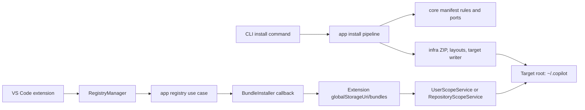
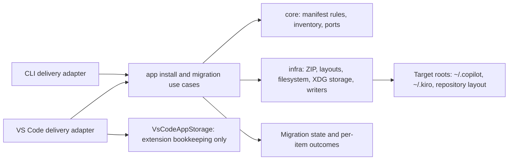

# Architecture

## Architecture Analysis

### System Overview

The repository is a TypeScript pnpm modular monolith with two delivery mechanisms: `@ai-primitives-hub/cli` and the `prompt-registry` VS Code extension. Its shared implementation follows a ports-and-adapters design across `core`, `infra`, and `app`. The active migration concerns the installation boundary: the CLI already uses the shared pipeline; the extension retains a legacy cache-then-sync implementation.

### Architectural Style

**Evidence:** `packages/core` defines pure domain rules and ports; `packages/infra` implements filesystem, ZIP, layout, and storage adapters; `packages/app` composes installation use cases; CLI and extension provide delivery-specific composition. This is a modular monolith with Clean Architecture boundaries, not a distributed system.

**Observed deviation:** `BundleInstaller`, `UserScopeService`, and `RepositoryScopeService` in the extension duplicate installation policy after app-level registry orchestration delegates a buffer installation back to the extension.

### Interaction Diagrams

#### Current installation paths

#### Recommended migration boundary

### Data Flow

1. The shared pipeline resolves or receives a bundle, extracts it to an in-memory byte map, validates the root manifest, filters installable files, preflights the selected target, writes bytes, and returns structured results.
2. The current extension path persists the received buffer locally, reopens the manifest, and separately syncs prompt entries to a user or repository target.
3. The recommended path gives both delivery adapters the same app use case and concrete infra writer. Extension-only notifications, command context, and bookkeeping remain at the delivery boundary.
4. A future migration reads legacy extension-local records and copies only verified content to the target. It records an outcome before any cleanup decision; a rerun resumes from durable outcomes and leaves unresolved conflicts non-destructive.

### Key Design Decisions

#### Proposed Decision: One target-write authority in `app`

**Recommendation:** Make the manifest-driven shared pipeline the single authority for installation and target writes. `core` stays pure and owns manifest/file-inventory rules and port contracts; `infra` adapts ZIP, filesystem, layouts, writers, and XDG storage; `app` owns install and migration orchestration; CLI and extension remain thin delivery adapters.

**Trade-off:** This removes duplicated policy and makes parity testable, but requires temporary extension adapters and compatibility coverage while the legacy path is retired.

**Security and compliance:** It preserves validation before writer construction, containment checks, binary integrity verification, and centralizes security-sensitive write policy rather than maintaining two implementations.

#### Proposed Decision: Treat extension global storage as bookkeeping, not target output

**Recommendation:** Retain `VsCodeAppStorage` for extension compatibility records during migration. Do not map it to `~/.copilot`; derive target output from declared layouts.

**Trade-off:** Legacy and target state coexist temporarily, increasing reconciliation work. It preserves the existing storage abstraction and avoids conflating installation output with private extension state.

#### Proposed Decision: Use a resumable, non-destructive migration

**Recommendation:** Add an app-layer migration use case with durable per-bundle or per-item outcomes, duplicate comparison, retryable interruption state, and explicit cleanup eligibility. Keep automatic cleanup disabled until its rules and tests exist.

**Trade-off:** The staged approach defers removal of obsolete storage and carries temporary state longer. A big-bang move would be shorter in code but cannot safely distinguish user files, transfer failures, and later update/uninstall semantics.

### Alternatives Considered

| Alternative | Assessment | Reason not recommended now |
| --- | --- | --- |
| Big-bang extension rewrite that replaces cache, sync, records, and cleanup together | Fewer transitional adapters | Combines manifest, target-layout, repository-scope, MCP, update/uninstall, and recovery changes; failure and rollback behavior are too broad for one reviewable PR. |
| Keep cache-then-sync and only change the extension target directory | Smaller local edit | Preserves duplicate parsing and target-write policy, and does not fix the `items[]` versus `prompts[]` compatibility gap. |
| Manifest-driven strangler migration through `app` | Incremental, parity-testable, reversible | Recommended. It costs compatibility adapters and temporary coexistence but keeps each change independently reviewable. |

### Improvement Opportunities

- Establish a governed `items[]`-only caller-parity fixture before extension switchover.
- Decide the supported policy for manifest-less archives explicitly; CLI rejects them while the extension currently synthesizes a fallback.
- Make migration outcomes sufficient for interrupted transfer recovery, duplicate equivalence, conflicts, updates, uninstalls, and future cleanup eligibility.
- Reconcile historical installation-flow documentation after policy decisions are approved.

### Uncertainty

The scan did not execute tests or inspect a real extension global-storage directory. Actual legacy record combinations, symlink states, and user-created target conflicts require controlled fixtures before migration implementation.