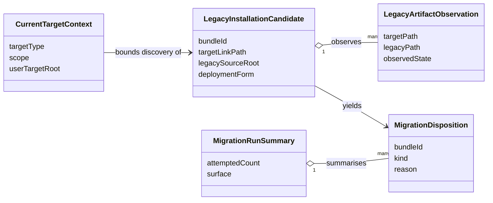

# Functional Specification — Activation Migration Compatibility (U4)

This file is the source of truth for U4's **workflows** — the ordered steps of the
activation-time migration pass — and its **state-free reporting** behaviour.
`entities.md` describes the transient values; `rules.md` describes the discovery,
scope, safety, and reporting constraints; ordered behaviour and the cleanup state
machine live here.

U4 is a bounded, disposable compatibility unit tagged
`@migration-cleanup(activation-migration)`. It defines no lifecycle and no durable
outcome state; it discovers legacy user-scope content for the current IDE, transfers
it through U1, drives U1's cleanup journal, and reports.

Two derived views are included for readability: an entity-relationship diagram
generated from `entities.md`, and a business-rules summary generated from
`rules.md`. The YAML in those files remains authoritative when views disagree.

## Requirement deviations (raise at the stage gate)

Two answered decisions narrow the approved requirements. They are recorded here so
the gate sees them explicitly:

- **FR3.7 (repository-scope migration parity) — dropped.** Repository-scope
  installs are carried by the committed repository lockfile and are never migrated
  from the extension cache. U4 migrates user scope only (BR2.2).
- **FR3.8 (versioned association mapping) — reinterpreted.** Association is "the
  IDE the extension is currently running as, at user scope, discovered from live
  target links," not a versioned table over the legacy record's provenance and item
  kinds (BR2.1, BR2.3).

## Actors

- **Extension activation (U3-owned sequencing)** — invokes the U4 migration pass
  before registering bundle command handlers.
- **Migration coordinator (U4)** — discovers, associates, transfers, cleans up,
  reports. The bounded VS Code exception permitted to read legacy internal storage.
- **Shared lifecycle and cleanup journal (U1)** — perform every target write, the
  transfer, and the restart-safe destructive cleanup.
- **Extension user** — answers overwrite prompts and reads the run summary.

## Boundary

U4 reads legacy internal storage and the current target install place; it calls U1
for every target write, the transfer, and the cleanup journal (BR4.1, BR5.1). It
holds no durable per-installation state (BR3.3) and writes no target bytes itself.
Repository scope and other targets are out of scope (BR2.1, BR2.2).

## Dependency on the shared foundation (contract delta)

U4 shares one delta with U2 and U3, recorded for the foundation repair at the stage
decision: the shared lifecycle must expose the **single `OverwriteDecision`
mechanism** (`confirmed | declined | unavailable`) that U4's conflict handling and
U3's normal-install prompt both consume (BR4.3). U4 depends on that one concept, not
a migration-only variant. U1's `MigrationCleanupJournal`, transfer, and verification
contracts already exist in U1's design and are consumed as-is.

## Activation migration pass

Runs inline during activation, before bundle command handlers are registered
(BR3.1), non-fatal (BR3.2). Steps:

1. **Resolve the current target context.** Determine the IDE the extension is
   running as — from the host application identity (product/app id) mapped to a
   `SupportedTarget` via U1 target routing — and its user-scope install root. This
   is the whole association rule: current target, user scope (BR2.1, BR2.3). When
   the host maps to no supported target, or that target has no user-scope layout,
   the pass ends with nothing to do (BR2.4).
2. **Discover candidates from live target links.** Inspect the current target's
   user-scope install place for live symlinks or copies that resolve into the legacy
   extension cache. Each such bundle becomes a `LegacyInstallationCandidate` with its
   `LegacyArtifactObservation` set read from current disk (BR1.1, BR1.2). A cache
   entry with no live target link is not a candidate. Repository-scope content is
   ignored (BR2.2).
3. **For each candidate, derive its disposition from current content** (BR3.3) and
   act, branching on `deploymentForm`:
   1. **Check the authoritative target via U1.** Ask the shared lifecycle to compare
      the resolved target against what a fresh install would write.
      - **Target absent** → transfer through U1's lifecycle (step 4).
      - **Target is a `symlink` into the legacy cache** → NOT a duplicate, even
        though the bytes match through the link. The target must be **materialized**:
        transfer through U1 (step 4) to replace the symlink with real installed
        files, and only then clean up the cache and the now-redundant symlink
        (step 5). Removing the cache while the target is still a symlink would strand
        a broken link, so cleanup never precedes materialization for a symlink
        (BR1.3).
      - **Target is a `copy` and byte-identical** → true verified duplicate; go to
        cleanup (step 5).
      - **Target present and different** → `conflict`; surface it and obtain the
        shared `OverwriteDecision` (BR4.2, BR4.3). On `confirmed`, transfer with the
        decision; on `declined`/`unavailable`, preserve both and record a deferred
        conflict with manual-cleanup guidance (BR6.2).
   2. Any unsafe path (escape or unsafe symlink traversal) blocks the candidate with
      a safety disposition (BR5.3).
4. **Transfer through the shared lifecycle.** U1 validates, writes the target,
   verifies read-back, and records the installation (BR4.1). U4 writes no bytes. On
   failure with no target artifact a retry would replace, preserve the legacy source
   and record `retry-required` (BR3.2, BR6.2).
5. **Journalled cleanup of the verified legacy duplicate.** Drive U1's
   `MigrationCleanupJournal` (BR5.1) through the state machine below: confirm every
   expected target artifact exists and is byte-identical, delete each legacy
   artifact, then confirm no managed legacy artifact remains (BR5.2). Every path is
   contained (BR5.3).
6. **Record the disposition** for this candidate (transferred,
   verified-duplicate-cleaned, preserved-conflict, retry-required, skipped,
   safety-blocked) from the current run only (BR3.3).
7. **Summarise the run** across dispositions in a notification or diagnostics
   (BR6.1); preserved and retry candidates remain eligible for a later activation
   (BR6.2). Nothing is persisted.

## Cleanup journal state machine (driven via U1)

U4 does not define this machine — U1 owns it — but drives it per candidate. Shown
for the reader; U1's `functional-spec.md` is authoritative.

```mermaid
stateDiagram-v2
    [*] --> prepared: candidate verified as duplicate, cleanup intended
    prepared --> target_verified: every expected target artifact present and byte-identical
    target_verified --> legacy_delete_pending: deletion authorised
    legacy_delete_pending --> committed: no managed legacy artifact remains
    prepared --> [*]: abandoned; legacy content intact
    target_verified --> [*]: abandoned; legacy content intact
    committed --> [*]: entry deleted in the same operation
```

Text fallback: cleanup enters `prepared` for a verified duplicate, advances to
`target_verified` only when every expected target artifact is present and identical,
then `legacy_delete_pending` when deletion is authorised, then `committed` after
every legacy artifact is gone and verified absent; the entry is deleted as the final
step. From `prepared` or `target_verified` it may abandon with legacy content intact.
On a later activation an interrupted entry re-verifies current bytes before resuming
(BR5.4).

## State-free recovery across activations

Because nothing is persisted (BR3.3), recovery is re-derivation:

- A candidate whose legacy source is **gone** (consumed by a prior verified cleanup)
  is not discovered again — that is what "done" means, not a recorded flag.
- A candidate that was **preserved** (conflict/decline/failure) still has its legacy
  source and live target link, so it is rediscovered and re-evaluated from current
  content, and reported again from this run's state (BR6.2).
- An **interrupted cleanup** leaves the legacy source present; the next activation
  rediscovers the candidate and re-verifies target and legacy bytes before resuming
  any deletion (BR5.4).

## Result semantics (as reported by U4)

| disposition kind | Meaning | Legacy source after |
| --- | --- | --- |
| `transferred` | Target had no install, or was a symlink into the cache that has now been materialized as real files by U1. | Removed after journalled cleanup. |
| `verified-duplicate-cleaned` | Target already held an identical `copy`; legacy removed via journal. | Removed. |
| `preserved-conflict` | Target differs and overwrite was declined/unavailable. | Preserved; reported with manual-cleanup guidance. |
| `retry-required` | Transfer or verification failed with no target artifact to replace. | Preserved; eligible next activation. |
| `skipped` | Out of scope, not a candidate, or unresolved association. | Untouched. |
| `safety-blocked` | A path escaped its root or required unsafe traversal. | Untouched. |

## Derived views

### Entity relationships (derived from `entities.md`)

Text fallback: a `CurrentTargetContext` (current IDE, user scope) bounds discovery of
`LegacyInstallationCandidate`s, each observing many `LegacyArtifactObservation`s and
yielding one `MigrationDisposition`; `MigrationRunSummary` summarises the run's
dispositions. All are transient.

### Business rules summary (derived from `rules.md`)

| Group | Focus | Representative rules |
| --- | --- | --- |
| 1 Discovery | Live target links, read-only | BR1.1 candidate needs a live target link; BR1.2 inspection never mutates. |
| 2 Association & scope | Current IDE, user scope only | BR2.1 current IDE + user scope; BR2.2 no repository-scope migration; BR2.3 no stored attribute mapping. |
| 3 Scheduling & state | Inline, non-fatal, state-free | BR3.1 inline before commands; BR3.2 non-fatal; BR3.3 no durable per-installation state. |
| 4 Transfer & consent | Through U1, explicit overwrite | BR4.1 all writes via U1; BR4.2 target authoritative until consent; BR4.3 the single shared OverwriteDecision. |
| 5 Cleanup safety | Journalled, verified, contained | BR5.1 cleanup via U1's journal; BR5.2 verify then confirm absence; BR5.3 contained paths; BR5.4 re-verify on resume. |
| 6 Reporting | Current-run only | BR6.1 summarise from this run; BR6.2 preserved conflicts reported and kept eligible. |
