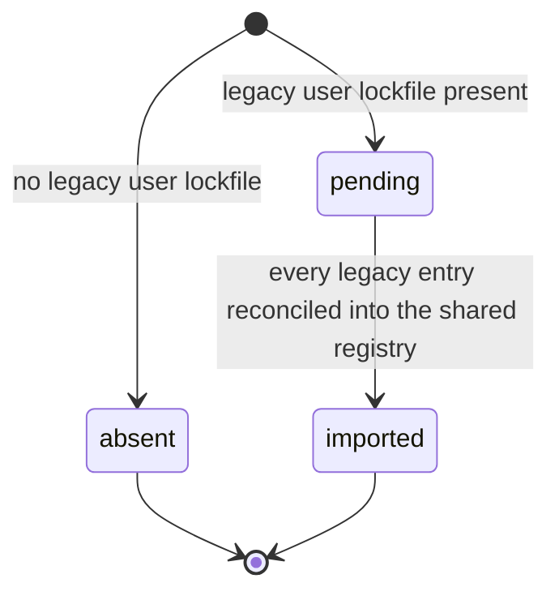
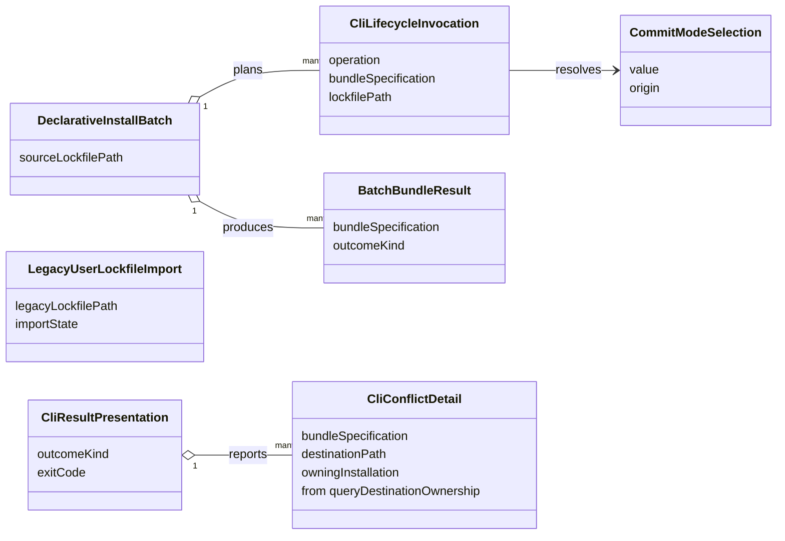

# Functional Specification — CLI Manifest Adoption (U2)

This file is the source of truth for U2's **workflows** — the ordered steps each
CLI lifecycle command follows to delegate to the shared lifecycle — and for the
**compatibility decision record** that FR4 requires before implementation relies
on an incompatibility. `entities.md` describes the translation values and
`rules.md` describes the delegation constraints; ordered behaviour lives here.

Two derived views are included for readability: an entity-relationship diagram
generated from `entities.md`, and a business-rules summary generated from
`rules.md`. The YAML in those files remains authoritative when views disagree.

## Actors

- **CLI user or script** — invokes a lifecycle command and reads its exit code.
- **CLI adapter (U2)** — parses argv, fills a shared request, maps the result.
- **Shared installation lifecycle (U1)** — the use cases U2 delegates to.

## Boundary

U2 is a delivery adapter. It touches the shared foundation only through the
`u1-to-u2-shared-lifecycle` contract defined in
`inception/contract-design/contract-summary.md`: `install`, `update`, and
`uninstall`, each taking a request and returning a `LifecycleResult`, plus the
`queryDestinationOwnership` read that contract also declares. U2 implements no
target write, no managed-artifact cleanup, no destination resolution, and no
lifecycle policy (BR1.1).

Upstream inputs this design rests on:
`inception/units-generation/unit-of-work.md` (U2's boundary and acceptance),
`inception/units-generation/unit-of-work-story-map.md` (the requirements assigned
to U2), `inception/requirements-analysis/requirements.md` (FR1–FR4.1),
`inception/domain-design/components.md` (the shared components U2 delegates to),
and `inception/contract-design/contract-summary.md` (the request, result, and
ownership schemas).

## Dependencies on the shared foundation (contract deltas)

Two U2 decisions required the shared foundation to expose behaviour its earlier
functional design did not describe. One is now closed by the amended contract in
`inception/contract-design/contract-summary.md`; the other remains open and is
recorded as a **delta to close at the next foundation pass**, not as U2-owned
work:

1. **Source resolution on the install request — CLOSED.** Q4 places bundle
   resolution and download inside the shared lifecycle. The amended Contract 1
   carries `bundle: GovernedBundleSource` on `InstallRequest` and `UpdateRequest`,
   and the U1 design now owns governed source resolution, download, archive
   reading, validation, and installation. U2 passes the specification and
   performs no fetch or extraction. No workflow step below is conditional on this.
2. **Commit-mode-aware repository registry and a git-exclude port — OPEN.**
   Q1/Q7 make commit mode select which repository lockfile holds the record and
   make git exclusion a shared side effect. The amended Contract 1 defines no
   commit-mode field on any request and does not include it in
   `ManagedInstallationIdentity` (`bundleId`, `target`, `scope`,
   `repositoryIdentity?`), and `components.md` models no git-exclude port.
   Closing this still requires amending the foundation rule that each registry
   adapter's file does not move and adding a shared git-exclude port that is a
   no-op under `commit`.

Consequence for this unit while delta 2 is open: `CommitModeSelection` is
resolved per invocation as BR6.1 states, but it is carried no further and U2
substitutes no adapter-side commit-mode behaviour — the special-case repository
writer stays retired rather than being reinstated. Where a workflow step below
depends on delta 2, it is marked `(delta 2, open)`.

**Marker convention for all open dependencies.** The same convention applies to
the three contract gaps recorded in "Carried-forward contract gaps" at the end of
this file. A workflow step or result row that depends on a surface the contract
does not yet declare is marked `(gap 1, open)` or `(gap 2, open)`. **A step
carrying such a marker is not implementable as written** until that gap closes;
it records intended behaviour, not behaviour a developer can build today.

## Imperative install workflow

Entry: `install <bundle> [--scope] [--commit-mode]`.

1. **Parse the invocation.** Build a `CliLifecycleInvocation` with
   `operation: install`, the bundle specification, the resolved target, and the
   scope. For repository scope, derive `repositoryIdentity` from the selected
   working tree (BR8.2) and resolve `CommitModeSelection` from the flag or the
   target default (BR6.1).
2. **Run the one-time legacy import if due.** For a user-scope operation, when a
   legacy user lockfile exists and import state is `pending`, run the legacy
   import workflow below before proceeding (BR3.2).
3. **Delegate.** Call the shared `install` with the request, passing the bundle
   specification as `bundle` for shared resolution and download. The commit-mode
   selection is not carried while `(delta 2, open)` stands. U2 performs no fetch,
   extraction, or target write (BR1.1, BR2.1), and sets no ownership hand-off
   (BR8.3).
4. **Map the result.** Build a `CliResultPresentation` from the returned
   `LifecycleResult`: exit zero only on `success`, listing any preserved
   artifacts it carries; otherwise exit with that kind's reserved non-zero code
   (BR4.1, BR4.2, BR4.3). On `conflict`, populate `CliConflictDetail` so the
   report names the bundle, destination path, and owning installation (BR8.3);
   the destination path and owning identity come from
   `queryDestinationOwnership`, which Contract 1 declares. Listing preserved
   artifacts on a `success` is `(gap 2, open)` — the result union declares no
   payload — so until that gap closes only the outcome kind and exit code are
   reliably available. Do not reinterpret the kind (BR1.2).

## Declarative install workflow

Entry: `install --lockfile <path>`.

1. **Expand the lockfile.** Build a `DeclarativeInstallBatch` whose
   `plannedInstallations` is one `CliLifecycleInvocation` per named bundle, in
   lockfile order (BR5.1).
2. **Run the one-time legacy import if due** (BR3.2), once for the batch.
3. **Install each member.** For each planned installation, run the imperative
   delegate-and-map steps (3–4 above) and record a `BatchBundleResult` with the
   copied outcome kind. Continue after a non-success member; do not stop (BR5.2).
4. **Report and exit.** Print a per-bundle result table. Exit zero only when
   every member returned `success`; otherwise exit non-zero (BR5.3).

## Update workflow

Entry: `update <bundle> [--scope] [--commit-mode]`.

1. Parse the invocation with `operation: update`; derive `repositoryIdentity` for
   repository scope (BR8.2) and resolve commit mode as for install (BR6.1).
2. Run the one-time legacy import if due (BR3.2).
3. Delegate to the shared `update`. The repository record location follows the
   shared repository adapter; selecting it by commit mode is `(delta 2, open)`.
4. Map the result exactly as install does (BR4.1–BR4.3, BR1.2). A `success`
   carrying preserved files exits zero and lists them; a `preserved-content`
   result exits non-zero and reports that the update did not proceed (BR4.3).

## Uninstall workflow

Entry: `uninstall <bundle> [--scope]`.

1. Parse the invocation with `operation: uninstall`, and derive
   `repositoryIdentity` for repository scope (BR8.2).
2. Run the one-time legacy import if due, so the shared registry holds the record
   the uninstall will act on (BR3.2).
3. **Resolve the bundle identity** `(gap 1, open)`. Contract 1's
   `UninstallRequest` requires a `bundleId` and declares no source resolution, so
   the adapter looks the user-typed reference up against the shared registry's
   managed installations for this target, scope, and repository identity. Exactly
   one match supplies `bundleId`; zero matches or more than one is reported and
   exits non-zero without delegating (BR8.1). No contract operation performs this
   lookup today, so this step is not implementable until gap 1 closes.
4. Delegate to the shared `uninstall` with that resolved `bundleId`; the shared
   lifecycle removes only managed artifacts and the record (BR1.1, BR3.1, BR3.3).
5. Map the result and exit (BR4.1, BR4.2, BR1.2).

## Init workflow

Entry: `init` — creates or updates a repository lockfile.

This whole workflow is `(gap 1, open)`: it depends on a shared registry write the
contract does not declare, so it is not implementable until gap 1 closes.

1. Parse the invocation and derive `repositoryIdentity` from the selected working
   tree (BR8.2).
2. Create or update the repository lockfile through the shared repository
   registry adapter, never by writing the file directly (BR3.3, BR8.4)
   `(gap 1, open)`.
3. Report the created or updated record location and exit zero; a shared
   validation or safety outcome maps to its reserved non-zero code
   (BR4.1, BR4.2).

Init records no installation content and performs no target write. Which
repository lockfile file the adapter selects by commit mode is
`(delta 2, open)`.

## Status workflow

Entry: `status [--scope]` — reports installation state.

Steps 2 and 3 are `(gap 1, open)`: they depend on a shared registry read the
contract does not declare, so they are not implementable until gap 1 closes.

1. Parse the invocation and derive `repositoryIdentity` for repository scope
   (BR8.2).
2. **Read from the shared registry** `(gap 1, open)`. Report user-scope records
   from the shared registry and repository-scope records from the repository
   lockfile through the shared adapter (BR3.1, BR3.3, BR8.4). The legacy user
   lockfile is never read as a live record store.
3. **Reflect pending import honestly** `(gap 1, open)`. When the legacy import state is
   `pending`, run the import first, then report from the shared registry; when it
   is `absent` or `imported`, report the shared registry as-is. A legacy entry
   that the import skipped as ambiguous is listed as unreconciled with its reason
   rather than shown as installed (BR3.4, BR8.4).
4. Print the report and exit zero; a shared read failure maps to its reserved
   non-zero code (BR4.1, BR4.2).

## Composition commands: apply and profile

`apply` and `profile activate` are **CLI composition** commands, not single-bundle
lifecycle commands, and they are the reason U2 is not merely a one-to-one wrapper.
`apply` resolves the currently active profile from the CLI's activation store,
optionally syncs the active hub, and re-activates that profile across **every**
configured target; `profile activate` does the same for a named profile. Each
expands into many (bundle, target) installations.

The division of responsibility is the same delegation rule applied at a higher
level (BR1.1, BR1.2):

- **Composition stays in the adapter.** Which profile is active, which bundles it
  names, which targets are configured, the hub sync, and the per-target failure
  roll-up are CLI-specific concerns U2 keeps. This is exactly the "CLI-specific
  composition" the unit boundary permits — it is not lifecycle policy.
- **Every write delegates.** For each (bundle, target) pair the profile expands
  to, U2 calls the shared single-bundle `install`; it performs no target write of
  its own. The result of each call is mapped as in the imperative workflow.
- **Roll-up.** `apply`/`profile activate` report a per-(bundle, target) result and
  exit non-zero if any activation did not succeed, mirroring the declarative-batch
  roll-up (BR5.2, BR5.3) rather than defining a second failure policy.

`apply` with no active profile is a usage error, not a lifecycle call. These
commands add no new lifecycle semantics; they compose the shared single-bundle
operation, so no rule beyond the delegation, batch-roll-up, and commit-mode rules
applies to them.

## Naming note

`inception/contract-design/contract-summary.md` names the returned type
`LifecycleResult`; U1's design prose calls the same value `LifecycleOutcome`.
They are the same six-kind union under two names. **This unit settles on the
contract name, `LifecycleResult`**, and uses it throughout its entities, rules,
and workflows. U1's design prose may keep its own name; no further U2 decision
depends on that.

## Legacy user-lockfile import workflow

Runs at most once, on the first user-scope operation, when a legacy user
lockfile exists and import state is `pending` (BR3.2).

1. **Read the legacy file once.** Load the CLI's user-config-root lockfile.
2. **Reconcile additively, resolving the target deterministically.** Each legacy
   user-scope entry is keyed by bundle only and carries no target, but the shared
   installation key needs a target (U1 BR3.1). For each legacy entry, resolve its
   target deterministically (BR3.4): use the entry's recorded target hint when it
   has one; otherwise associate it with the single configured target whose
   user-scope layout actually contains the entry's recorded managed files. When no
   target, or more than one, matches, do not import that entry — record it as
   skipped with the reason and leave the legacy file's copy untouched. For an
   entry whose target resolves uniquely, derive the full shared key and copy the
   record into the shared registry only when the shared registry has no record for
   that key; when a shared record already exists, leave it authoritative.
3. **Complete.** Mark import state `imported` and stop writing the legacy file
   for every later operation (BR3.1). No runtime content is read, written, or
   deleted during import; skipped entries stay tracked in the legacy file.

Text fallback: import state begins `pending` when a legacy user lockfile exists,
or `absent` when none does. From `pending`, after every legacy entry is
reconciled into the shared registry (additively, never overwriting a newer shared
record), the state becomes `imported` and the legacy file is never written again.
`absent` and `imported` are terminal.

## Compatibility decision record (FR4)

FR4 requires the compatibility policy, the affected workflows, and the rationale
to be documented before implementation relies on any incompatibility. The
decisions below are the record.

| # | Area | Decision | Compatibility | Rationale |
| --- | --- | --- | --- | --- |
| C1 | Repository destinations for Copilot-like targets | Resolved by shared layout data (the existing `.github` repository layout), retiring the special-case CLI writer | Compatible — same destinations | Destinations were already layout-driven; the writer added nothing to paths. |
| C2 | Commit mode | Intended: the shared repository registry adapter selects the lockfile file and a shared git-exclude port maintains exclusions. Not yet contractual — the amended Contract 1 carries no commit-mode field | Deferred — `(delta 2, open)`; U2 resolves the value but carries it no further and reinstates no adapter-side behaviour | Keeps a behaviour the extension offers by name while removing duplicated logic, once the foundation exposes it. |
| C3 | User-scope records | Shared registry becomes the only user-scope store; the legacy user lockfile is imported once, then abandoned | Compatible for tracked installs via one-time import; the legacy file stops being written | Single source of truth for user-scope state without losing existing installs. |
| C4 | Bundle resolution | Shared lifecycle owns source resolution and download; the CLI hands over the specification as Contract 1's `bundle: GovernedBundleSource` | Compatible — same sources, one implementation; delta 1 is closed | Source adapters already live in shared infrastructure; removes CLI/extension divergence. |
| C5 | Declarative install | Adapter-side loop over the single-bundle shared operation, continue-on-failure | Compatible — same command, richer reporting | Avoids a batch contract in the shared layer; failure semantics become explicit. |
| C6 | Exit codes | Only `success` exits zero; every other kind, including `preserved-content`, has its own non-zero code | **Incompatibility** — a prior convention that treated a preserved-content update as success now exits non-zero | A zero exit must mean the requested change happened; a script must be able to detect a declined update. |

C6 is the one documented incompatibility. It is intentional and its rationale is
recorded here per FR4, so downstream (delivery planning, U3, U4) can account for
it before any implementation depends on it.

## Result semantics (as mapped by U2)

| kind | CLI exit | CLI presentation |
| --- | --- | --- |
| `success` | zero | Report success; listing preserved artifacts is `(gap 2, open)` — the result union declares no payload to read them from. |
| `validation-error` | non-zero (own code) | Report the bundle was refused before any write. |
| `conflict` | non-zero (own code) | Report existing content needs a decision. |
| `preserved-content` | non-zero (own code) | Report the update did not proceed; content is intact. |
| `retryable-failure` | non-zero (own code) | Report a write or removal did not verify; a retry is possible. |
| `safety-blocked` | non-zero (own code) | Report a containment, traversal, symlink, or verification safety refusal. |

## Derived views

### Entity relationships (derived from `entities.md`)

Text fallback: a `CliLifecycleInvocation` resolves a `CommitModeSelection` for
repository scope. A `DeclarativeInstallBatch` plans many invocations and produces
one `BatchBundleResult` per bundle. `CliResultPresentation` is the
outcome-to-exit mapping and reports zero or more `CliConflictDetail` entries when
the outcome kind is `conflict`, each naming the bundle plus the destination path
and owning identity read from `queryDestinationOwnership`. `LegacyUserLockfileImport`
stands alone as the one-time record migration. Seven entities in total.

### Business rules summary (derived from `rules.md`)

| Group | Focus | Representative rules |
| --- | --- | --- |
| 1 Delegation | The adapter delegates and maps, never reproduces policy | BR1.1 write only through the shared lifecycle; BR1.2 map, do not reinterpret. |
| 2 Bundle handover | Shared lifecycle owns resolution and download | BR2.1 no CLI-side resolution or extraction. |
| 3 Record migration | One user-scope store; records stay in scope | BR3.1 user records in the shared registry; BR3.2 one-time additive import; BR3.3 repository records stay in the repository. |
| 4 Result and exit | Outcome kinds map to exit codes | BR4.1 only success is zero; BR4.2 distinct codes; BR4.3 preserved-content is non-zero. |
| 5 Declarative batch | Lockfile expands to single-bundle ops | BR5.1 expand in order; BR5.2 continue on failure; BR5.3 non-zero if any failed. |
| 6 Commit mode | Resolved per invocation; its shared consumers await open delta 2 | BR6.1 resolve from flag or target default; carry no further while delta 2 stands. |
| 8 Shared-foundation alignment | Request translation and negative constraints against the amended contract | BR8.1 resolve uninstall's bundle identity before delegating; BR8.2 supply repository identity; BR8.3 no ownership hand-off and no claim resolution; BR8.4 in-scope commands read state from the shared registry. |

## Shared-foundation amendment alignment

The shared foundation and its contract in
`inception/contract-design/contract-summary.md` were amended after this unit's
previous pass. U2 remains a delivery adapter; these are the consequences for its
behaviour. The deltas section above is the single record of what is closed and
what is open, and the workflows above carry the consequences inline.

### Explicit installation identity

`ManagedInstallation` exposes required `target` and `scope` attributes, so the
legacy user-lockfile import maps each entry onto a real identity. The
deterministic association rule is unchanged: use a recorded target hint, else
the single configured target whose user-scope layout contains the entry's
managed files, else skip and report (BR3.4). U2 never invents identity by
parsing a key, and it supplies `repositoryIdentity` on repository-scope requests
rather than leaving the contract field empty (BR8.2).

### Destination ownership is observed, never bypassed

Every governed write U2 requests passes U1's durable destination-ownership claim
keyed by target, scope, and destination path, whose states are `claimed`,
`pending-materialization`, `finalized`, and `rollback-required`.

1. When another installation owns a destination, the shared lifecycle returns
   `conflict` and writes nothing. U2 populates `CliConflictDetail` and reports the
   affected bundle, destination path, and owning identity, sourcing the latter two
   from `queryDestinationOwnership` — the declared read Contract 1 exposes for
   exactly this pre-check — rather than from the payload-free result union.
2. U2 supplies no `destinationOwnershipHandoff` on any request. Taking over a
   destination another installation manages is not a CLI capability in this unit,
   so there is no flag and no request attribute for it (BR8.3).
3. Any non-`finalized` claim state is a shared-layer concern. U2 surfaces the
   typed outcome and exit code rather than retrying a write, resolving a claim,
   or touching target files.

### Declarative install and exit behaviour

`install --lockfile` continues to loop the shared single-bundle operation, keep
going after a per-bundle failure, and print a per-bundle result table. An
ownership `conflict` is one of those per-bundle outcomes. Only `success` exits
zero, including when it carries preserved files; every other kind, `conflict`
and `preserved-content` included, is non-zero with its own exit code.

## Carried-forward contract gaps (accepted at the human's direction)

The second adversarial review raised three findings that cannot be closed inside
this unit, because each needs a shared surface
`inception/contract-design/contract-summary.md` does not declare. The human
directed that they be recorded and carried rather than reopening Contract Design.
They are open obligations on the next foundation pass, and the affected workflows
above are **not implementable until they close**.

### Gap 1 — no registry read or write operation for the adapter (review R-11, Critical)

Contract 1 exposes `install`, `update`, `uninstall`, and
`queryDestinationOwnership`, and declares no injectable registry port for U2.
Three workflows above therefore name a capability that does not exist:

| Workflow | What it needs | Why the current contract cannot serve it |
| --- | --- | --- |
| Uninstall step 3 (BR8.1) | Look a user-typed reference up against managed installations to obtain `bundleId` | Contract 3's `readManagedInstallation` takes an `InstallationKey`, which already contains the `bundleId` being resolved, so it cannot answer the lookup. Contract 1 has no equivalent at all. |
| Init step 2 | Create or update a repository lockfile through the shared registry | No contract operation writes a registry record outside a lifecycle call. |
| Status step 2 (BR8.4) | Read user-scope and repository-scope records for display | No contract operation reads records for an adapter. |

`components.md` reinforces the gap: `InstallationRegistry`'s declared dependents
are `InstallationLifecycle` and `ExtensionMigrationCoordinator` only, not a
delivery adapter. Closing this means adding an explicit, read-mostly registry
query surface (list or resolve by bundle reference within a target and scope, and
a repository-lockfile initialise operation) and listing U2 as a permitted
consumer. Until then this unit's Boundary paragraph — U2 touches the foundation
only through `u1-to-u2-shared-lifecycle` — is the binding statement, and
uninstall, init, and status stay unimplementable.

### Gap 2 — the shared result union carries no preserved-artifact payload (review R-12 as narrowed by R-16, Major)

`LifecycleResult` is declared as a bare six-kind discriminated union with no
payload fields. The narrowed consequence:

- **Genuinely missing: the preserved-artifact list.** BR4.1 and the result table
  say a `success` lists the artifacts it preserved, and no declared shared field
  carries them. Closing this means giving `success` a declared preserved-artifact
  payload. Every step and row that lists preserved artifacts is marked
  `(gap 2, open)`.
- **Not missing: the conflict detail.** Contract 1 declares
  `queryDestinationOwnership`, whose `DestinationOwnershipResult.conflicts`
  carries `destinationPath` and `owningInstallation`, and the contract states it is
  exposed so an adapter can pre-check a target and scope. `CliConflictDetail`
  therefore sources both fields from that declared read rather than from the
  result union, and this unit types `owningInstallation` as the contract does, as
  `ManagedInstallationIdentity`. The earlier claim that only `outcomeKind` and
  `exitCode` were available was too conservative and is corrected here.

### Gap 3 — `profile` record access is unspecified (review R-13, Major)

Q6 and BR8.4 place `profile` in this unit's scope alongside `init` and `status`,
and `apply` is designed as profile activation composition. How `profile` reads or
records installation state is not specified here, and it depends on the same
missing registry surface as Gap 1. BR8.4's `applies_to` is also mis-scoped to
`LegacyUserLockfileImport` when the rule governs every in-scope command; that
narrower defect is recorded here rather than corrected, to keep the rule's
identity stable for the next review. Closing Gap 1 is a prerequisite for
specifying `profile`.
