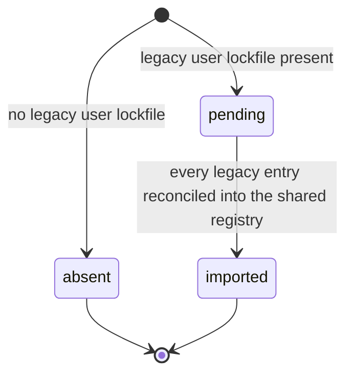
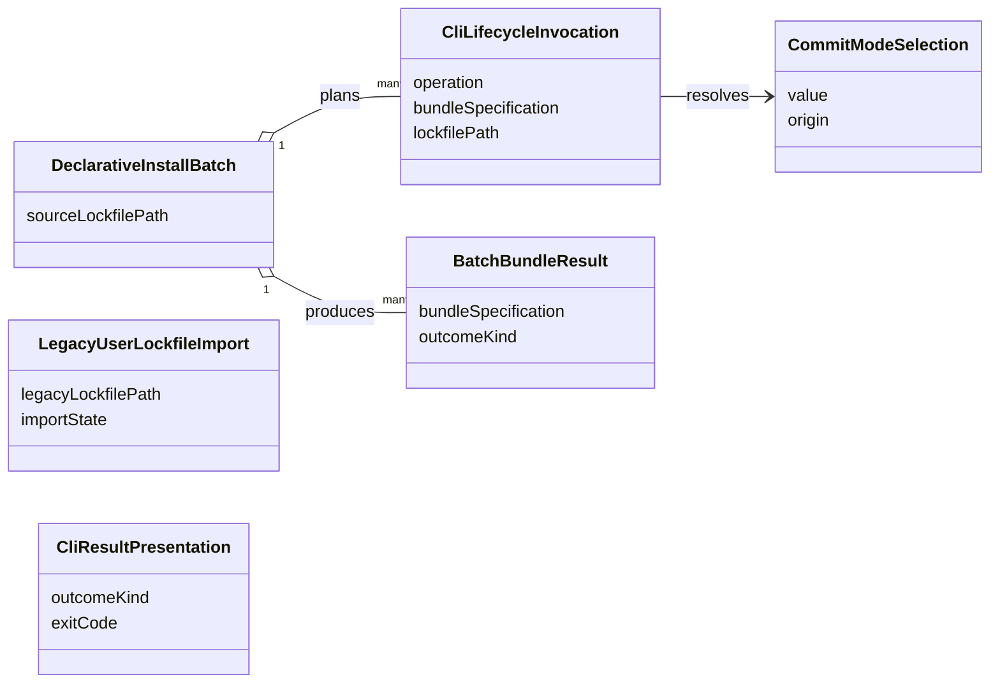

# Functional Specification — CLI Manifest Adoption (U2)

This file is the source of truth for U2's **workflows** — the ordered steps each
CLI lifecycle command follows to delegate to the shared lifecycle — and for the
**compatibility decision record** that FR4 requires before implementation relies
on an incompatibility. `entities.md` describes the translation values and
`rules.md` describes the delegation constraints; ordered behaviour lives here.

Two derived views are included for readability: an entity-relationship diagram
generated from `entities.md`, and a business-rules summary generated from
`rules.md`. The YAML in those files remains authoritative when views disagree.

## Actors

- **CLI user or script** — invokes a lifecycle command and reads its exit code.
- **CLI adapter (U2)** — parses argv, fills a shared request, maps the result.
- **Shared installation lifecycle (U1)** — the use cases U2 delegates to.

## Boundary

U2 is a delivery adapter. It touches the shared foundation only through the
`u1-to-u2-shared-lifecycle` contract: `install`, `update`, and `uninstall`, each
taking a request and returning a `LifecycleResult`. U2 implements no target
write, no managed-artifact cleanup, no destination resolution, and no lifecycle
policy (BR1.1).

## Dependencies on the shared foundation (contract deltas)

Two U2 decisions require the shared foundation to expose behaviour its current
functional design does not yet describe. These are recorded here as **deltas to
close when the foundation is repaired at the stage decision**, not as U2-owned
work:

1. **Source resolution on the install request.** Q4 places bundle resolution and
   download inside the shared lifecycle, but the foundation's install workflow
   starts from an already-validated archive and declares no source-resolution
   port. Closing this means the shared `InstallRequest` accepts a bundle
   specification and the foundation gains a source-resolution port over the
   existing GitHub/HTTP/ZIP infrastructure adapters.
2. **Commit-mode-aware repository registry and a git-exclude port.** Q1/Q7 make
   commit mode select which repository lockfile holds the record and make git
   exclusion a shared side effect. Closing this amends the foundation rule that
   each registry adapter's file does not move (the repository adapter picks one
   of two files by commit mode) and adds a shared git-exclude port that is a
   no-op under `commit`.

U2's design assumes the repaired contract. Where a workflow step below names one
of these, it is marked `(delta 1)` or `(delta 2)`.

## Imperative install workflow

Entry: `install <bundle> [--scope] [--commit-mode]`.

1. **Parse the invocation.** Build a `CliLifecycleInvocation` with
   `operation: install`, the bundle specification, the resolved target, and the
   scope. For repository scope, resolve `CommitModeSelection` from the flag or
   the target default (BR6.1).
2. **Run the one-time legacy import if due.** For a user-scope operation, when a
   legacy user lockfile exists and import state is `pending`, run the legacy
   import workflow below before proceeding (BR3.2).
3. **Delegate.** Call the shared `install` with the request, passing the bundle
   specification for shared resolution and download (delta 1) and the commit-mode
   selection (delta 2). U2 performs no fetch, extraction, or target write
   (BR1.1, BR2.1).
4. **Map the result.** Build a `CliResultPresentation` from the returned
   `LifecycleOutcome`: exit zero only on `success`, listing any preserved
   artifacts it carries; otherwise exit with that kind's reserved non-zero code
   (BR4.1, BR4.2, BR4.3). Do not reinterpret the kind (BR1.2).

## Declarative install workflow

Entry: `install --lockfile <path>`.

1. **Expand the lockfile.** Build a `DeclarativeInstallBatch` whose
   `plannedInstallations` is one `CliLifecycleInvocation` per named bundle, in
   lockfile order (BR5.1).
2. **Run the one-time legacy import if due** (BR3.2), once for the batch.
3. **Install each member.** For each planned installation, run the imperative
   delegate-and-map steps (3–4 above) and record a `BatchBundleResult` with the
   copied outcome kind. Continue after a non-success member; do not stop (BR5.2).
4. **Report and exit.** Print a per-bundle result table. Exit zero only when
   every member returned `success`; otherwise exit non-zero (BR5.3).

## Update workflow

Entry: `update <bundle> [--scope] [--commit-mode]`.

1. Parse the invocation with `operation: update`; resolve commit mode as for
   install (BR6.1).
2. Run the one-time legacy import if due (BR3.2).
3. Delegate to the shared `update` (delta 2 for the repository record location).
4. Map the result exactly as install does (BR4.1–BR4.3, BR1.2). A `success`
   carrying preserved files exits zero and lists them; a `preserved-content`
   result exits non-zero and reports that the update did not proceed (BR4.3).

## Uninstall workflow

Entry: `uninstall <bundle> [--scope]`.

1. Parse the invocation with `operation: uninstall`.
2. Run the one-time legacy import if due, so the shared registry holds the record
   the uninstall will act on (BR3.2).
3. Delegate to the shared `uninstall`; the shared lifecycle removes only managed
   artifacts and the record (BR1.1, BR3.1, BR3.3).
4. Map the result and exit (BR4.1, BR4.2, BR1.2).

## Composition commands: apply and profile

`apply` and `profile activate` are **CLI composition** commands, not single-bundle
lifecycle commands, and they are the reason U2 is not merely a one-to-one wrapper.
`apply` resolves the currently active profile from the CLI's activation store,
optionally syncs the active hub, and re-activates that profile across **every**
configured target; `profile activate` does the same for a named profile. Each
expands into many (bundle, target) installations.

The division of responsibility is the same delegation rule applied at a higher
level (BR1.1, BR1.2):

- **Composition stays in the adapter.** Which profile is active, which bundles it
  names, which targets are configured, the hub sync, and the per-target failure
  roll-up are CLI-specific concerns U2 keeps. This is exactly the "CLI-specific
  composition" the unit boundary permits — it is not lifecycle policy.
- **Every write delegates.** For each (bundle, target) pair the profile expands
  to, U2 calls the shared single-bundle `install`; it performs no target write of
  its own. The result of each call is mapped as in the imperative workflow.
- **Roll-up.** `apply`/`profile activate` report a per-(bundle, target) result and
  exit non-zero if any activation did not succeed, mirroring the declarative-batch
  roll-up (BR5.2, BR5.3) rather than defining a second failure policy.

`apply` with no active profile is a usage error, not a lifecycle call. These
commands add no new lifecycle semantics; they compose the shared single-bundle
operation, so no rule beyond the delegation, batch-roll-up, and commit-mode rules
applies to them.

## Naming note

Contract Design names the returned type `LifecycleResult`; U1's `entities.md` and
this specification call the same value `LifecycleOutcome`. They are the same type
under two names; this spec uses `LifecycleOutcome`. The foundation repair at the
stage decision should settle on one name across both documents.

## Legacy user-lockfile import workflow

Runs at most once, on the first user-scope operation, when a legacy user
lockfile exists and import state is `pending` (BR3.2).

1. **Read the legacy file once.** Load the CLI's user-config-root lockfile.
2. **Reconcile additively, resolving the target deterministically.** Each legacy
   user-scope entry is keyed by bundle only and carries no target, but the shared
   installation key needs a target (U1 BR3.1). For each legacy entry, resolve its
   target deterministically (BR3.4): use the entry's recorded target hint when it
   has one; otherwise associate it with the single configured target whose
   user-scope layout actually contains the entry's recorded managed files. When no
   target, or more than one, matches, do not import that entry — record it as
   skipped with the reason and leave the legacy file's copy untouched. For an
   entry whose target resolves uniquely, derive the full shared key and copy the
   record into the shared registry only when the shared registry has no record for
   that key; when a shared record already exists, leave it authoritative.
3. **Complete.** Mark import state `imported` and stop writing the legacy file
   for every later operation (BR3.1). No runtime content is read, written, or
   deleted during import; skipped entries stay tracked in the legacy file.

Text fallback: import state begins `pending` when a legacy user lockfile exists,
or `absent` when none does. From `pending`, after every legacy entry is
reconciled into the shared registry (additively, never overwriting a newer shared
record), the state becomes `imported` and the legacy file is never written again.
`absent` and `imported` are terminal.

## Compatibility decision record (FR4)

FR4 requires the compatibility policy, the affected workflows, and the rationale
to be documented before implementation relies on any incompatibility. The
decisions below are the record.

| # | Area | Decision | Compatibility | Rationale |
| --- | --- | --- | --- | --- |
| C1 | Repository destinations for Copilot-like targets | Resolved by shared layout data (the existing `.github` repository layout), retiring the special-case CLI writer | Compatible — same destinations | Destinations were already layout-driven; the writer added nothing to paths. |
| C2 | Commit mode | Travels on the shared request; the shared repository registry adapter selects the lockfile file, and a shared git-exclude port maintains exclusions | Compatible — same observable files and exclusions | Keeps a behaviour the extension offers by name while removing duplicated logic (delta 2). |
| C3 | User-scope records | Shared registry becomes the only user-scope store; the legacy user lockfile is imported once, then abandoned | Compatible for tracked installs via one-time import; the legacy file stops being written | Single source of truth for user-scope state without losing existing installs. |
| C4 | Bundle resolution | Shared lifecycle owns source resolution and download; the CLI hands over the specification | Compatible — same sources, one implementation | Source adapters already live in shared infrastructure; removes CLI/extension divergence (delta 1). |
| C5 | Declarative install | Adapter-side loop over the single-bundle shared operation, continue-on-failure | Compatible — same command, richer reporting | Avoids a batch contract in the shared layer; failure semantics become explicit. |
| C6 | Exit codes | Only `success` exits zero; every other kind, including `preserved-content`, has its own non-zero code | **Incompatibility** — a prior convention that treated a preserved-content update as success now exits non-zero | A zero exit must mean the requested change happened; a script must be able to detect a declined update. |

C6 is the one documented incompatibility. It is intentional and its rationale is
recorded here per FR4, so downstream (delivery planning, U3, U4) can account for
it before any implementation depends on it.

## Result semantics (as mapped by U2)

| kind | CLI exit | CLI presentation |
| --- | --- | --- |
| `success` | zero | Report success; list preserved artifacts when the outcome carries them. |
| `validation-error` | non-zero (own code) | Report the bundle was refused before any write. |
| `conflict` | non-zero (own code) | Report existing content needs a decision. |
| `preserved-content` | non-zero (own code) | Report the update did not proceed; content is intact. |
| `retryable-failure` | non-zero (own code) | Report a write or removal did not verify; a retry is possible. |
| `safety-blocked` | non-zero (own code) | Report a containment, traversal, symlink, or verification safety refusal. |

## Derived views

### Entity relationships (derived from `entities.md`)

Text fallback: a `CliLifecycleInvocation` resolves a `CommitModeSelection` for
repository scope. A `DeclarativeInstallBatch` plans many invocations and produces
one `BatchBundleResult` per bundle. `LegacyUserLockfileImport` and
`CliResultPresentation` stand alone: the first is the one-time record migration,
the second the outcome-to-exit mapping.

### Business rules summary (derived from `rules.md`)

| Group | Focus | Representative rules |
| --- | --- | --- |
| 1 Delegation | The adapter delegates and maps, never reproduces policy | BR1.1 write only through the shared lifecycle; BR1.2 map, do not reinterpret. |
| 2 Bundle handover | Shared lifecycle owns resolution and download | BR2.1 no CLI-side resolution or extraction. |
| 3 Record migration | One user-scope store; records stay in scope | BR3.1 user records in the shared registry; BR3.2 one-time additive import; BR3.3 repository records stay in the repository. |
| 4 Result and exit | Outcome kinds map to exit codes | BR4.1 only success is zero; BR4.2 distinct codes; BR4.3 preserved-content is non-zero. |
| 5 Declarative batch | Lockfile expands to single-bundle ops | BR5.1 expand in order; BR5.2 continue on failure; BR5.3 non-zero if any failed. |
| 6 Commit mode | Resolved per invocation, consumed by the shared layer | BR6.1 resolve from flag or target default and travel on the request. |
