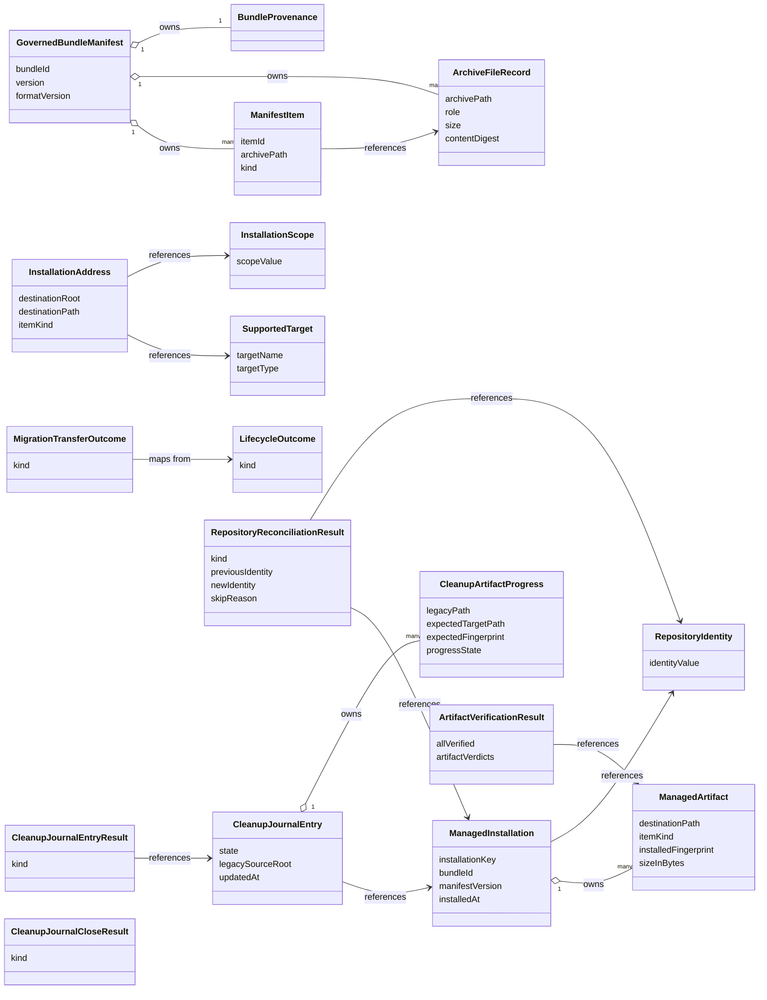

# Functional Specification — Shared Installation Foundation (U1)

This file is the source of truth for the shared lifecycle's **workflows** and
its **state machines**. Ordered behaviour and lifecycle transitions live here
because `entities.md` describes shape and `rules.md` describes decision logic.

Two derived views are included for readability: an entity-relationship diagram
generated from `entities.md`, and a business-rules summary generated from
`rules.md`. The YAML in those files remains authoritative when views disagree.

## Actors

- **Delivery adapter** — the CLI, or the VS Code extension. Translates its
  own input and output around the shared lifecycle.
- **Shared installation lifecycle** — the use cases in U1 that both delivery
  adapters call.
- **Migration coordinator** — U4 during activation. Calls the shared
  lifecycle for transfer and drives the cleanup journal.
- **Injected ports** — manifest governance, target routing, installation
  registry (two adapters), target artifact store, the cleanup journal, and the
  optional repository-redirect capability supplied by the VS Code adapter.

## Ports and boundaries

The lifecycle is expressed against injected ports so no adapter takes on I/O
concerns the shared foundation should own. Port names carry the `Port` suffix
throughout, matching Contract Design's contract 3.

- `ManifestGovernancePort` — validates the archive and returns the governed
  inventory as `GovernedBundleManifest` + `ArchiveFileRecord[]` + `ManifestItem[]`.
- `TargetRoutingPort` — resolves an `InstallationAddress` from a supported
  target, a scope, and an item kind.
- `InstallationRegistryPort` — reads and writes `ManagedInstallation` and its
  `ManagedArtifact` set. One shared schema. Two adapters:
  - **User-scope adapter** persists through the shared application-data path
    (`AppStoragePort`).
  - **Repository-scope adapter** persists through the repository lockfile
    within the selected repository.
  Neither adapter reaches into the other's storage.
- `TargetArtifactStorePort` — writes, reads, and removes target artifacts with
  containment and symbolic-link safety.
- `MigrationCleanupJournalPort` — U1 owns the data model, transitions, and
  persistence boundary as required by the unit definition; U4 owns the migration
  transaction that drives it. Contract 3 declares this port and its four
  operations, so U4 drives the state machine through a real boundary while U1
  guarantees each transition is durable before the action it authorises.
- `RepositoryRedirectPort` — an **injected, optional** capability supplied by the
  VS Code delivery adapter (U3), never by U1 and never by the CLI. Its single
  operation `resolveRedirect(query)` → `RedirectResolution`
  (`redirect-confirmed` | `no-redirect` | `unavailable`) is the only network call
  anywhere in this unit's behaviour, and U1 never performs it itself: an absent
  or `unavailable` port means reconciliation is skipped. This keeps every U1
  workflow offline-testable.

The shared foundation exposes these Contract 3 operations beyond install,
update, and uninstall:

- `transferThroughLifecycle(request)` → `MigrationTransferOutcome`.
- `verifyManagedArtifacts(request)` → `ArtifactVerificationResult`.
- `openCleanupJournalEntry(request)` → `CleanupJournalEntryResult`.
- `recordCleanupTransition(request)` → `CleanupJournalEntryResult`.
- `readCleanupJournalEntry(key)` → `CleanupJournalEntryResult`.
- `closeCleanupJournalEntry(request)` → `CleanupJournalCloseResult`.
- `reconcileRepositoryIdentity(request)` → `RepositoryReconciliationResult`.

`applyGovernedArtifacts` is deliberately **not** in that list. It is the
internal write-verify-record primitive the install, update, and migration
transfer workflows share; it is reached only through
`InstallationLifecyclePort` and is never exposed to U4 as a callable migration
operation.

Normal lifecycle operations return the shared result vocabulary from Contract
Design as `LifecycleOutcome.kind`: `success`, `validation-error`, `conflict`,
`preserved-content`, `retryable-failure`, `safety-blocked`. The migration
transfer boundary returns the separate `MigrationTransferOutcome` union.
Programmer defects are outside both unions.

## Upstream boundary

Contract 3 is the governing U1-to-U4 boundary. Its declared shared ports are
`ManifestGovernancePort`, `TargetRoutingPort`, `InstallationRegistryPort`,
`InstallationLifecyclePort`, `TargetArtifactStorePort`, and
`MigrationCleanupJournalPort`, plus the injected `RepositoryRedirectPort` that
U3 supplies. Every capability this unit's definition assigns to U1 now has a
declared operation behind it, so nothing in this design is deferred for want of
a contract shape.

Two capabilities were unimplementable in the previous pass and are specified
here because Contract 3 was amended to declare them:

- **The cleanup journal.** The unit definition makes U1 the owner of the
  journal's schema, transitions, and persistence boundary, and requires U4 to
  drive it. The four journal operations are now declared, so the state machine
  below is a real U1 workflow rather than a described-but-uncallable one.
- **Repository-rename reconciliation.** The confirmed decision — resolve the
  redirect when a stored record matches no open workspace, confirm the old URL
  now points at the current one, then re-key — is implementable without giving
  U1 a network dependency, because the network half is the injected
  `RepositoryRedirectPort` and the re-key half is U1's own
  `reconcileRepositoryIdentity` registry operation.

U4's legacy association and summary ownership remain unchanged, and U1 remains
the only normal target-write lifecycle.

## Fingerprinting model

Every `ManagedArtifact.installedFingerprint` covers the exact byte sequence
written to the target, and the same sequence is what the store reads back for
verification. There is only ever one canonical sequence per artifact:

- A **binary payload** is written verbatim. The fingerprinted sequence is the
  bytes from the archive.
- A **text payload** goes through the optional resource transformer before the
  write. The fingerprinted sequence is the UTF-8 encoding of the transformed
  content. When the transformer fails, the fallback content is what gets
  fingerprinted, so the record accurately describes what was actually written.

This model retires the archive-side lockfile checksum for local-change detection
and closes the case where a transformed file looks permanently user-edited.

## Install workflow

Entry point: `install(request)` where `request` names the bundle source, the
supported target, the installation scope, and an optional overwrite consent.

1. **Validate the bundle.** Call `ManifestGovernancePort.validate(bundleSource)`.
   Enforce BR1.1 through BR1.4. On failure return `validation-error` and stop
   before any target write.
2. **Derive the repository identity.** When the scope is `repository`, derive
   the `RepositoryIdentity` from local sources under BR3.2: the normalised
   canonical remote URL when the repository has one, otherwise the absolute
   workspace root path. No network call participates. When the scope is `user`,
   the identity is absent. This step runs before any registry access because
   BR3.1 makes the identity part of the installation key; update and uninstall
   derive it the same way at the same point in their own sequences.
3. **Resolve destinations.** For each `ManifestItem` whose `ArchiveFileRecord`
   role is `installable` (BR1.5), call
   `TargetRoutingPort.resolve(target, scope, kind)`. Reject any resolved path
   that escapes its destination root (BR2.2) and return `safety-blocked` when it
   does.
4. **Read the prior record.** Call `InstallationRegistryPort.get(installationKey)`
   using the key formed from bundle identity, target, scope, and the identity
   derived in step 2. When present, this is a re-installation of the same
   identity and the record feeds steps 5 and 8.
5. **Check still-named artifacts for local changes.** For every resolved
   destination the prior record already covers, compare the current bytes
   against the recorded fingerprint. Under BR4.7, when any differ and the
   request carries no overwrite consent, write nothing at all and return
   `conflict` identifying the bundle and the affected artifacts. This check
   precedes every write in the operation, so a locally changed file is never
   overwritten and then reported.
6. **Write and verify each artifact.** Steps 6 and 7 together are the internal
   `applyGovernedArtifacts` primitive, which update and the migration transfer
   workflow both reuse so there is exactly one governed write path.
   1. For a binary payload write the archive bytes verbatim.
   2. For a text payload apply the transformer, then write the encoded content.
   3. Read the written bytes back and compare against the intended sequence.
   4. When the compared sequences differ, return `retryable-failure` and stop.
   5. Compute the fingerprint over the same intended sequence.
7. **Record the artifacts.** Admit each verified artifact to a
   `ManagedInstallation` under BR3.5. Persist through the adapter selected by
   scope under BR3.4.
8. **Reconcile omitted artifacts.** Any prior artifact the new manifest no
   longer names is handled by the omitted-artifact rule (BR4.2): removed when
   unchanged, preserved and de-managed when changed (BR4.3).
9. **Return the outcome.** Success carries the set of preserved artifacts when
   any preservation occurred (BR4.4); `preserved-content` is reserved for an
   operation that could not proceed (BR4.8).

## Update workflow

Update is a specialisation of install and follows the same single policy for a
locally changed artifact the new manifest still names (BR4.7).

1. Steps 1 to 4 identical to install: validate, derive the repository identity,
   resolve destinations, read the prior record.
2. **Diff against the prior record.** Split the item set into three groups:
   still-managed identical, still-managed but changed on disk, and omitted.
3. **Apply BR4.7 to the changed group before writing anything.** When the
   still-managed-but-changed group is non-empty and the request carries no
   overwrite consent, write nothing and return `conflict` identifying the bundle
   and those artifacts. This is install step 5, reached by the same rule, so the
   two workflows cannot diverge on the case.
4. **Write the remaining items.** For every still-managed identical item — and,
   when consent was given, every changed one — invoke `applyGovernedArtifacts`
   (install steps 6 and 7) with the transformed sequence and refresh the
   fingerprint on a successful write.
5. **Handle omitted artifacts under BR4.2.** For every prior artifact the new
   manifest omits:
   - When current bytes match the fingerprint, remove the artifact (BR4.6),
     drop it from the record.
   - When they differ, preserve the file, drop it from the record so a later
     uninstall leaves it alone (BR4.3), add it to the preserved list.
6. **Return the outcome.** Success carries the preserved list (BR4.4), or
   `preserved-content` when preservation left the requested change unachievable
   (BR4.8).

## Uninstall workflow

1. **Resolve the record.** Derive the repository identity as in install step 2
   when the scope is `repository`, then read the `ManagedInstallation` for this
   bundle, target, scope, and identity. When no record exists, return a
   `success` outcome with an empty removal list.
2. **Remove each managed artifact.** For every artifact in the record, call
   `TargetArtifactStorePort.remove(destinationPath)`. Verify the path is absent
   after the call returns (BR4.6). On a verified removal drop the artifact
   from the record.
3. **Skip unmanaged content.** BR4.5 prohibits touching anything not in the
   record. A file present at a destination whose record was dropped by
   preservation earlier is not deleted.
4. **Delete the record when empty.** When every artifact is removed, delete
   the `ManagedInstallation` through the scope-appropriate adapter (BR3.4).
5. **Return the outcome.** Success reports the removed and skipped
   destinations. A verification failure returns `retryable-failure` and
   retains the record.

## Migration transfer workflow (support contract for U4)

The shared lifecycle exposes a `transferThroughLifecycle(request)` operation
so U4 never writes target bytes itself. Every exit returns a
`MigrationTransferOutcome` — never a bare `LifecycleOutcome`. An inner
lifecycle call's result is mapped to a member of that union at the boundary.

1. **Validate the legacy content.** Call `ManifestGovernancePort.validate` on
   the legacy source's governed bytes. On failure return `skipped` with the
   validation reason and preserve legacy content: an ungoverned legacy source is
   not transferable, and reporting it as a lifecycle `validation-error` would
   name a kind this boundary does not return.
2. **Resolve the target.** Call `TargetRoutingPort.resolve` for the recorded
   legacy target and scope. When resolution finds no supported layout, return
   `skipped` with the association reason. When a resolved path escapes its
   destination root (BR2.2), or a legacy path escapes its source root (BR5.7),
   return `safety-blocked`.
3. **Check the authoritative target.** Call `verifyManagedArtifacts` using the
   existing Contract 3 `VerificationRequest` and re-read every destination.
   Then select one deterministic branch:
   - `allVerified` — every expected artifact is `present-identical`: return
     `verified-duplicate`; U4 may start cleanup only after its required
     journaled verification sequence.
   - any `safety-blocked` verdict: return `safety-blocked`; preserve legacy
     content and do not request overwrite consent.
   - any `present-different`: without `overwriteDecision: confirmed`, return
     `preserved-conflict`; with confirmation, continue to step 4 only after a
     fresh verification still finds no safety block.
   - a mix of `present-identical` and `absent`, with no differing artifact:
     this is a **partial target**. Return `preserved-conflict` identifying the
     present and missing artifacts; write nothing and preserve legacy content.
     U4 may request explicit overwrite consent to complete this target only
     when the fresh verification still has that same safe mixture. A declined
     or unavailable decision remains `preserved-conflict`.
   - every verdict `absent`: continue to step 4 without consent.
4. **Perform a verified install through the inner lifecycle primitive.** With an
   empty destination, or with a confirmed decision permitted by step 3, invoke
   the internal primitive **`applyGovernedArtifacts`** — the same governed
   write-verify-record sequence install steps 6 and 7 define, reached through the
   declared `InstallationLifecyclePort`. It is an internal primitive, not a
   Contract 3 operation: `transferThroughLifecycle` is the only migration
   entry point U4 can call, and it never calls itself.

   `applyGovernedArtifacts` takes the governed item set resolved in step 1, the
   destinations resolved in step 2, the installation key for the legacy bundle's
   identity at the resolved target and scope, and the overwrite consent (absent
   for an empty destination; `confirmed` only on the step 3 branch that permits
   it). For each governed installable item it writes the payload binary-safely
   under BR3.3, reads the written bytes back and compares them against the
   intended sequence (BR4.1), computes the fingerprint over that same sequence,
   and admits the artifact to the `ManagedInstallation` only after its write
   verified (BR3.5). It returns a `LifecycleOutcome`. It performs no legacy
   deletion — cleanup is the journal's separate, later concern.

   Map the returned `LifecycleOutcome.kind` to a `MigrationTransferOutcome`
   member at this boundary:
   - `success` → `transferred`, carrying the verified artifacts.
   - `retryable-failure` → `retry-required`.
   - `conflict` → `preserved-conflict`.
   - `safety-blocked` → `safety-blocked`.
   - `validation-error` → `skipped`.
   - `preserved-content` → `preserved-conflict`, because a transfer that
     preservation left unachievable leaves both locations intact.
   A partial target is never eligible for legacy cleanup merely because consent
   was requested or transfer was attempted: U4 begins cleanup only after the
   resulting `transferred` value and a new full target verification establish
   every expected artifact as present and byte-identical.
5. **Return the outcome.** U4 maps the value into its current-run summary. No
   durable per-installation migration state is created here, and legacy content
   is intact for every kind except `transferred`.

## Managed-artifact verification workflow (support contract for U4)

`verifyManagedArtifacts(request)` answers one question — are these artifacts
present at the target with exactly the bytes the registry recorded — and returns
an `ArtifactVerificationResult`. It is the shared evidence behind U4's
verified-duplicate decision, its pre-deletion comparison, and the journal's
first-pass (BR5.6) and resumption (BR5.5) checks. It never writes or deletes.

The request names the installation key and the artifacts to check; each artifact
is identified by its destination path and the fingerprint expected for it.

1. **Resolve the installation.** Read the `ManagedInstallation` for the supplied
   key. When an artifact in the request is not in the record's managed set,
   verify it against the fingerprint supplied in the request rather than
   inventing one; the journal supplies expected fingerprints by reference
   (BR5.3).
2. **Check containment for every path.** A destination path outside its
   destination root (BR2.2), or a legacy path outside its verified source root
   (BR5.7), yields a `safety-blocked` verdict for that artifact and no read.
3. **Read and compare each artifact.** For each remaining artifact, read the
   current bytes at the path and compare with the expected fingerprint:
   - present and matching → `present-identical`
   - present and differing → `present-different`
   - not present → `absent`
4. **Aggregate.** `allVerified` is true only when every verdict is
   `present-identical`. A single `safety-blocked` verdict prevents `allVerified`
   regardless of the others.
5. **Return the result.** The verdicts describe bytes read during this call
   only. A caller may not carry them forward as standing authority for a later
   destructive action — BR5.5 requires a fresh call at resumption.

## Cleanup journal workflow (support contract for U4)

U4 drives the journal through four declared operations; U1 owns durability. Each
returns a `CleanupJournalEntryResult` (`created` | `resumed` | `absent` |
`source-root-mismatch` | `validation-error` | `retryable-failure` |
`safety-blocked`), except the close operation, which returns a
`CleanupJournalCloseResult` (`closed` | `absent` | `retryable-failure`).

1. **`openCleanupJournalEntry(request)`** — open or resume the single entry for
   an installation key. The request names the key, the verified
   `legacySourceRoot`, and the per-artifact progress set. With no live entry,
   create one in `prepared` and return `created`. With a live entry whose
   `legacySourceRoot` matches, return `resumed` carrying the persisted entry so
   U4 continues where it stopped. With a live entry naming a **different**
   legacy source root, return `source-root-mismatch` and grant no authority: two
   legacy roots resolving to one installation key is ambiguous, and returning
   the existing entry would hand deletion authority for one root to a
   transaction operating on another (BR5.8). Access is exclusive per
   installation key; a second concurrent holder receives `retryable-failure`
   rather than a shared entry (BR5.9).
2. **`recordCleanupTransition(request)`** — advance the entry, persisting before
   the filesystem action the new state authorises (BR5.2). Legal advances are
   `prepared` → `target-verified` (only on full first-pass verification, BR5.6),
   `target-verified` → `legacy-delete-pending`, and `legacy-delete-pending` →
   `committed` (only once no managed legacy artifact remains, BR4.6). A repeated
   transition to `legacy-delete-pending` is permitted and expected: it is how
   per-artifact deletion progress becomes durable one artifact at a time
   (BR5.10). Any other transition returns `validation-error`.
3. **`readCleanupJournalEntry(key)`** — read the current entry for resumption,
   returning `absent` when none is live. Reading grants no authority: a
   persisted `verified-identical` progress record is never sufficient to delete,
   and a resumed entry re-verifies through `verifyManagedArtifacts` immediately
   before each delete (BR5.5).
4. **`closeCleanupJournalEntry(request)`** — delete a `committed` entry as the
   final step of its operation (BR5.4), or release an abandoned one.
   `abandoned` is permitted only from `prepared` or `target-verified`, where no
   deletion has begun and legacy content is intact; abandoning from
   `legacy-delete-pending` is refused with `validation-error`, because deletion
   is already in flight and must reach `committed` through post-deletion absence
   verification (BR5.11).

### State machine

The journal describes one destructive operation in flight. It references
registry-owned identity and fingerprints (BR5.3) rather than copying
inventories. Every legacy path it touches stays inside the entry's verified
legacy source root (BR5.7).

Transitions between states are durable before the filesystem action they
authorise (BR5.2). A committed entry is deleted as the final step of the
operation (BR5.4). First-pass verification is governed by BR5.6; BR5.5 governs
the resumption path only.

```mermaid
stateDiagram-v2
    [*] --> prepared: create entry for one installation key
    prepared --> target_verified: every expected target artifact present and identical (BR5.6)
    target_verified --> legacy_delete_pending: deletion authorised
    legacy_delete_pending --> committed: no managed legacy artifact remains (BR4.6)
    legacy_delete_pending --> legacy_delete_pending: per-artifact delete progress (BR5.10)
    prepared --> [*]: abandoned permitted; legacy content intact (BR5.11)
    target_verified --> [*]: abandoned permitted; legacy content intact (BR5.11)
    committed --> [*]: entry deleted in the same operation (BR5.4)
```

Text fallback:

- Create the entry in `prepared` for one installation key.
- Advance to `target_verified` only after `verifyManagedArtifacts` reports every
  expected target artifact present and byte-identical (BR5.6). Persist the
  transition before the next action.
- Advance to `legacy_delete_pending` when deletion has been authorised.
  Deletion is attempted per artifact only from `verified-identical` progress,
  and a fresh `verifyManagedArtifacts` call runs immediately before the delete.
  On a resumed entry that fresh call is mandatory (BR5.5): a verification claim
  persisted by a previous run is never sufficient authority.
- Advance to `committed` after every legacy artifact is gone and the delete
  was verified absent (BR4.6).
- Delete the entry as the final step of the operation (BR5.4).
- From `prepared` or `target_verified` the entry may terminate as `abandoned`;
  legacy content is intact and the record continues to point at the legacy
  source until the next eligible attempt. From `legacy_delete_pending` it may
  not: deletion is in flight, so the entry must reach `committed` through
  post-deletion absence verification (BR5.11).
- Repeated transitions into `legacy_delete_pending` are the durability
  mechanism for per-artifact deletion progress, not an error (BR5.10).

## Repository identity reconciliation workflow

Local derivation of a repository identity remains limited to the normalized
canonical remote URL or, when no remote exists, the absolute workspace root
(BR3.2), and it never consults the network. Reconciliation is the one place a
stored identity may change, and it is a separate, caller-driven operation.

Entry point: `reconcileRepositoryIdentity(request)` where the request names the
`storedIdentity`, the `candidateIdentities` the caller believes may now be the
same repository, and the bundle, target, and scope that complete the record key.

1. **Validate the request.** The scope must be `repository` and at least one
   candidate must be supplied. An empty candidate list returns `skipped`: U1
   enumerates no workspaces and infers no candidate of its own (BR6.3).
2. **Resolve the record.** Read the `ManagedInstallation` for the stored
   identity at this bundle, target, and scope. When no record exists, return
   `skipped`.
3. **Ask the injected port, once per candidate.** When no
   `RepositoryRedirectPort` was supplied, return `skipped` without any network
   attempt. Otherwise call `resolveRedirect(storedIdentity, candidate)` for each
   candidate and collect the verdicts. An `unavailable` verdict is the offline
   case: return `skipped` and leave the record untouched (BR6.2).
4. **Require exactly one confirmation.** Re-keying happens only when precisely
   one candidate returns `redirect-confirmed`. Zero confirmations, or more than
   one, returns `skipped` — two repositories claiming the same predecessor is
   ambiguous, and guessing would move a record onto the wrong key (BR6.4).
5. **Re-key the record.** Persist the record under the installation key derived
   from the confirmed identity, through the scope-appropriate adapter (BR3.4),
   and remove the old key in the same operation so no duplicate remains
   (BR6.5). Managed artifacts and their fingerprints are unchanged: the target
   content did not move, only the record's identity.
6. **Return the outcome.** `rekeyed` names the old and new identity.
   `validation-error` covers a malformed request, and `retryable-failure` a
   persistence failure that left the original record in place.

This operation re-keys shared-registry records only. It never transfers,
overwrites, or deletes a legacy installation, and FR3.7's
skip-when-no-workspace-matches rule remains authoritative for legacy migration
candidates (BR6.6).

## Result semantics

`LifecycleOutcome.kind`, returned by install, update, and uninstall:

| kind | Meaning in U1 |
| --- | --- |
| `success` | Every write and removal in the operation was verified; a `preserved` list may accompany it (BR4.4). |
| `validation-error` | Governed inventory, integrity, or path safety refused the bundle before any write. |
| `conflict` | A still-named artifact's bytes no longer match its fingerprint and no overwrite consent was given (BR4.7); nothing was written. |
| `preserved-content` | Preservation left the requested change unachievable (BR4.8). Not used for a successful operation that preserved some artifacts. |
| `retryable-failure` | A write or removal did not verify; the caller may retry after rechecking current state. |
| `safety-blocked` | Containment, traversal, symlink, identity, or verification safety refused the action. |

`MigrationTransferOutcome.kind`, returned by `transferThroughLifecycle`:

| kind | Meaning in U1 | Mapped from |
| --- | --- | --- |
| `transferred` | Governed legacy content is installed and verified at the resolved target; legacy content is now eligible for journaled cleanup. | `success` |
| `verified-duplicate` | Every expected target artifact is already present and byte-identical; nothing was written. | `allVerified` verification result |
| `preserved-conflict` | Target content differs **or the target is partially populated** and no eligible confirmed overwrite decision was supplied; both locations remain intact. | `conflict`, a `present-different` verdict, or the partial-target branch |
| `retry-required` | A write or verification did not succeed; legacy content is intact and the transfer may be retried. | `retryable-failure` |
| `skipped` | The legacy source is not governed, or maps to no supported target layout; nothing was touched. | `validation-error`, unresolvable routing |
| `safety-blocked` | A destination or legacy path failed containment or symlink safety (BR2.2, BR5.7). | `safety-blocked` |

`ArtifactVerificationResult`, returned by `verifyManagedArtifacts`, carries
per-artifact verdicts (`present-identical`, `present-different`, `absent`,
`safety-blocked`) and the `allVerified` aggregate. It is evidence, not an
operation outcome, and authorises nothing by itself.

`CleanupJournalEntryResult.kind`, returned by the three entry-returning journal
operations:

| kind | Meaning in U1 |
| --- | --- |
| `created` | A new entry was opened in `prepared` for this installation key. |
| `resumed` | A live entry for this key and legacy source root was returned so the caller continues where it stopped. Reading grants no deletion authority (BR5.5). |
| `absent` | No live entry exists. Returned by read and close only; open never returns it. |
| `source-root-mismatch` | A live entry names a different `legacySourceRoot` than the request. No authority is granted (BR5.8). |
| `validation-error` | The request or the requested transition is illegal, including an `abandoned` close from `legacy-delete-pending` (BR5.11). |
| `retryable-failure` | Persistence failed, or another holder has this key exclusively (BR5.9). |
| `safety-blocked` | A legacy path escaped its verified source root (BR5.7). |

`CleanupJournalCloseResult.kind` is `closed`, `absent`, or `retryable-failure`.

`RepositoryReconciliationResult.kind`, returned by
`reconcileRepositoryIdentity`:

| kind | Meaning in U1 |
| --- | --- |
| `rekeyed` | Exactly one candidate was confirmed; the record now lives under the new identity's key and the old key is gone (BR6.5). |
| `skipped` | No record, no candidates, no confirmation, more than one confirmation, or no usable redirect port. The stored record is untouched (BR6.2, BR6.3, BR6.4). |
| `validation-error` | The request was malformed, or the scope was not `repository`. |
| `retryable-failure` | Persistence failed; the original record remains in place. |

`RedirectResolution` is the injected port's own value — `redirect-confirmed`,
`no-redirect`, or `unavailable` — and is evidence for step 4 above, never an
outcome U4 receives.

## Derived views

### Entity relationships (derived from `entities.md`)

Text fallback: manifest governance owns items, file records, and provenance;
items reference file records for their per-file integrity. Addresses reference
a target and a scope. `ManagedInstallation` owns its artifacts and references a
repository identity when repository-scope. A cleanup journal entry references
one installation and owns its per-artifact progress records. The migration
transfer outcome maps from a lifecycle outcome at the U4 boundary, and the
verification result references the managed artifacts it checked. The journal
result union references the entry it carries, and the reconciliation result
references the installation it re-keyed together with the identities it moved
between.

### Business rules summary (derived from `rules.md`)

| Group | Focus | Representative rules |
| --- | --- | --- |
| 1 Governance | Manifest, inventory, and path safety | BR1.1 single root manifest; BR1.3 installable-file digest check; BR1.4 containment and safe paths. |
| 2 Routing | Destination resolution and isolation | BR2.1 destinations from target, scope, kind; BR2.2 destinations inside their root; BR2.3 target and scope isolation. |
| 3 Registry | Record shape, identity, and persistence | BR3.1 identity by bundle/target/scope/repository; BR3.2 offline identity derivation; BR3.3 fingerprint the bytes as written; BR3.4 two adapters, one schema. |
| 4 Lifecycle | Install, update, uninstall behaviour | BR4.1 verify writes; BR4.2 preserve locally changed omitted artifacts; BR4.4 successful update carries the preserved list; BR4.6 verify removals; BR4.7 never overwrite a still-named changed artifact without consent; BR4.8 preserved-content is for stalled operations only. |
| 5 Journal | Restart-safe destructive cleanup | BR5.1 in-flight only; BR5.2 durable-before-action; BR5.4 committed entries do not outlive their operation; BR5.5 resumption re-verifies; BR5.6 first-pass verification precedes deletion authority; BR5.7 legacy paths stay inside their source root; BR5.8 a mismatched source root grants no authority; BR5.9 exclusive access per installation key; BR5.10 same-state transitions carry per-artifact durability; BR5.11 abandon only before deletion begins. |
| 6 Reconciliation | Identity across repository renames | BR6.1 re-key only on exactly one confirmed redirect; BR6.2 no network call in U1, injected optional port, skip when unavailable; BR6.3 caller supplies candidates; BR6.4 ambiguity is a skip; BR6.5 re-key moves the record without duplicating it; BR6.6 FR3.7 stays authoritative for legacy candidates. |
