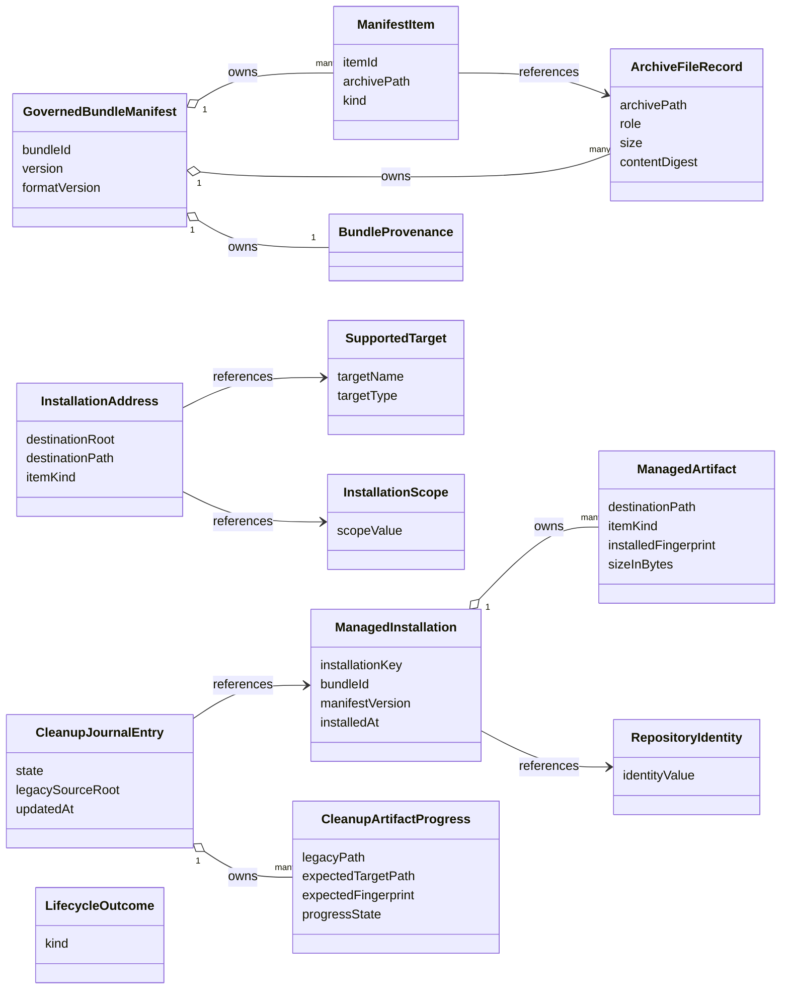

# Functional Specification — Shared Installation Foundation (U1)

This file is the source of truth for the shared lifecycle's **workflows** and
its **state machines**. Ordered behaviour and lifecycle transitions live here
because `entities.md` describes shape and `rules.md` describes decision logic.

Two derived views are included for readability: an entity-relationship diagram
generated from `entities.md`, and a business-rules summary generated from
`rules.md`. The YAML in those files remains authoritative when views disagree.

## Actors

- **Delivery adapter** — the CLI, or the VS Code extension. Translates its
  own input and output around the shared lifecycle.
- **Shared installation lifecycle** — the use cases in U1 that both delivery
  adapters call.
- **Migration coordinator** — U4 during activation. Calls the shared
  lifecycle for transfer and drives the cleanup journal.
- **Injected ports** — manifest governance, target routing, installation
  registry (two adapters), target artifact store, and a reconciliation port.

## Ports and boundaries

The lifecycle is expressed against injected ports so no adapter takes on I/O
concerns the shared foundation should own.

- `ManifestGovernance` — validates the archive and returns the governed
  inventory as `GovernedBundleManifest` + `ArchiveFileRecord[]` + `ManifestItem[]`.
- `TargetRouting` — resolves an `InstallationAddress` from a supported target,
  a scope, and an item kind.
- `InstallationRegistryPort` — reads and writes `ManagedInstallation` and its
  `ManagedArtifact` set. One shared schema. Two adapters:
  - **User-scope adapter** persists through the shared application-data path
    (`AppStorage` port).
  - **Repository-scope adapter** persists through the repository lockfile
    within the selected repository.
  Neither adapter reaches into the other's storage.
- `TargetArtifactStore` — writes, reads, and removes target artifacts with
  containment and symbolic-link safety.
- `MigrationCleanupJournalPort` — appends and reads journal entries and their
  per-artifact progress. Migration is its only caller; the contract is
  shaped so nothing about the entry is structurally migration-specific.
- `RepositoryIdentityReconciliationPort` — resolves a redirect between a
  stored identity value and a current one. Used only during reconciliation.
  The lifecycle acquires no direct network dependency.

Contracts follow the shared result vocabulary from Contract Design: `success`,
`validation-error`, `conflict`, `preserved-content`, `retryable-failure`,
`safety-blocked`. Programmer defects are outside this union.

## Fingerprinting model

Every `ManagedArtifact.installedFingerprint` covers the exact byte sequence
written to the target, and the same sequence is what the store reads back for
verification. There is only ever one canonical sequence per artifact:

- A **binary payload** is written verbatim. The fingerprinted sequence is the
  bytes from the archive.
- A **text payload** goes through the optional resource transformer before the
  write. The fingerprinted sequence is the UTF-8 encoding of the transformed
  content. When the transformer fails, the fallback content is what gets
  fingerprinted, so the record accurately describes what was actually written.

This model retires the archive-side lockfile checksum for local-change detection
and closes the case where a transformed file looks permanently user-edited.

## Install workflow

Entry point: `install(request)` where `request` names the bundle source, the
supported target, and the installation scope.

1. **Validate the bundle.** Call `ManifestGovernance.validate(bundleSource)`.
   Enforce BR1.1 through BR1.4. On failure return `validation-error` and stop
   before any target write.
2. **Resolve destinations.** For each `ManifestItem` whose `ArchiveFileRecord`
   role is `installable` (BR1.5), call `TargetRouting.resolve(target, scope, kind)`.
   Reject any resolved path that escapes its destination root (BR2.2) and
   return `safety-blocked` when it does.
3. **Read the prior record.** Call `InstallationRegistryPort.get(installationKey)`.
   When present, this is a re-installation of the same identity and the
   result feeds into step 6.
4. **Write and verify each artifact.**
   1. For a binary payload write the archive bytes verbatim.
   2. For a text payload apply the transformer, then write the encoded content.
   3. Read the written bytes back and compare against the intended sequence.
   4. When the compared sequences differ, return `retryable-failure` and stop.
   5. Compute the fingerprint over the same intended sequence.
5. **Record the artifacts.** Admit each verified artifact to a
   `ManagedInstallation` under BR3.5. Persist through the adapter selected by
   scope under BR3.4.
6. **Reconcile with the prior record.**
   - Any prior artifact whose current bytes match its recorded fingerprint AND
     that the new manifest still names may be replaced in place under BR3.5.
   - Any prior artifact the new manifest no longer names is handled by the
     omitted-artifact rule (BR4.2): removed when unchanged, preserved and
     de-managed when changed.
7. **Return the outcome.** Success carries the set of preserved artifacts when
   any preservation occurred (BR4.4).

## Update workflow

Update is a specialisation of install:

1. Steps 1 to 3 identical to install.
2. **Diff against the prior record.** Split the item set into three groups:
   still-managed identical, still-managed but changed on disk, and omitted.
3. **Write items unchanged on disk normally.** For every still-managed item,
   run install step 4 with the transformed sequence and refresh the
   fingerprint on a successful write.
4. **Preserve on-disk changes.** For every still-managed artifact whose
   current bytes differ from its recorded fingerprint AND that appears in the
   new manifest, treat the divergence as a `conflict` outcome. Do not write.
5. **Handle omitted artifacts under BR4.2.** For every prior artifact the new
   manifest omits:
   - When current bytes match the fingerprint, remove the artifact (BR4.6),
     drop it from the record.
   - When they differ, preserve the file, drop it from the record so a later
     uninstall leaves it alone (BR4.3), add it to the preserved list.
6. **Return the outcome.** Success carries the preserved list (BR4.4) or
   `preserved-content` when the operation could not proceed because the
   overall set of preserved artifacts made progress impossible.

## Uninstall workflow

1. **Resolve the record.** Read the `ManagedInstallation` for this bundle,
   target, scope, and repository identity. When no record exists, return a
   `success` outcome with an empty removal list.
2. **Remove each managed artifact.** For every artifact in the record, call
   `TargetArtifactStore.remove(destinationPath)`. Verify the path is absent
   after the call returns (BR4.6). On a verified removal drop the artifact
   from the record.
3. **Skip unmanaged content.** BR4.5 prohibits touching anything not in the
   record. A file present at a destination whose record was dropped by
   preservation earlier is not deleted.
4. **Delete the record when empty.** When every artifact is removed, delete
   the `ManagedInstallation` through the scope-appropriate adapter (BR3.4).
5. **Return the outcome.** Success reports the removed and skipped
   destinations. A verification failure returns `retryable-failure` and
   retains the record.

## Migration transfer workflow (support contract for U4)

The shared lifecycle exposes a `transferThroughLifecycle(request)` operation
so U4 never writes target bytes itself.

1. **Validate the legacy content.** Call `ManifestGovernance.validate` on the
   legacy source's governed bytes. On failure return `validation-error` and
   preserve legacy content.
2. **Resolve the target.** Call `TargetRouting.resolve` for the recorded
   legacy target and scope.
3. **Check the authoritative target.** Read the target artifact store at the
   resolved destination. When target content exists:
   - When byte-for-byte identical to what a fresh install would write, return
     `verified-duplicate` and let U4 drive cleanup.
   - When different, return `conflict` and let U4 request explicit consent.
4. **Perform a verified install.** When the destination is empty or an
   overwrite has been consented, run the install workflow (steps 4 to 6).
5. **Return a discriminated result** that U4 maps into its own summary. No
   durable per-installation migration state is created here.

## Cleanup journal state machine

The journal describes one destructive operation in flight. It references
registry-owned identity and fingerprints (BR5.3) rather than copying
inventories.

Transitions between states are durable before the filesystem action they
authorise (BR5.2). A committed entry is deleted as the final step of the
operation (BR5.4).

Text fallback:

- Create the entry in `prepared` for one installation key.
- Advance to `target_verified` only after every expected target artifact is
  present and byte-identical (BR5.5). Persist the transition before verifying
  the next artifact.
- Advance to `legacy_delete_pending` when deletion has been authorised.
  Deletion is attempted per artifact only from `verified-identical` progress
  (BR5.5), and a fresh byte check runs immediately before the delete.
- Advance to `committed` after every legacy artifact is gone and the delete
  was verified absent (BR4.6).
- Delete the entry as the final step of the operation (BR5.4).
- From `prepared` or `target_verified` the entry may terminate without
  progressing; legacy content is intact and the record continues to point at
  the legacy source until the next eligible attempt.

## Repository identity reconciliation

Reconciliation runs only when a stored record's identity value matches no
open workspace.

- The shared foundation calls `RepositoryIdentityReconciliationPort.resolveRedirect(storedIdentity, candidateWorkspaces)`.
- The port returns one of `matched(newIdentityValue)`, `no-match`, or
  `network-unavailable`. On `matched` the record is re-keyed to the new
  identity value in a single registry write (BR6.1). On `no-match` the record
  is untouched. On `network-unavailable` the record is untouched (BR6.2).
- Identity derivation itself never consults the port (BR3.2, BR6.1). Every
  install-time and update-time identity value is derived from local sources.

## Result semantics

| kind | Meaning in U1 |
| --- | --- |
| `success` | Every write and removal in the operation was verified; a `preserved` list may accompany it. |
| `validation-error` | Governed inventory, integrity, or path safety refused the bundle before any write. |
| `conflict` | Existing target content or a pending overwrite decision must be surfaced. |
| `preserved-content` | An update could not proceed because too much of the requested change would have overwritten locally changed content. Not used to describe a successful update that preserved some artifacts. |
| `retryable-failure` | A write or removal did not verify; the caller may retry after rechecking current state. |
| `safety-blocked` | Containment, traversal, symlink, identity, or verification safety refused the action. |

## Derived views

### Entity relationships (derived from `entities.md`)

Text fallback: manifest governance owns items, file records, and provenance;
items reference file records for their per-file integrity. Addresses reference
a target and a scope. `ManagedInstallation` owns its artifacts and references a
repository identity when repository-scope. A cleanup journal entry references
one installation and owns its per-artifact progress records.

### Business rules summary (derived from `rules.md`)

| Group | Focus | Representative rules |
| --- | --- | --- |
| 1 Governance | Manifest, inventory, and path safety | BR1.1 single root manifest; BR1.3 installable-file digest check; BR1.4 containment and safe paths. |
| 2 Routing | Destination resolution and isolation | BR2.1 destinations from target, scope, kind; BR2.2 destinations inside their root; BR2.3 target and scope isolation. |
| 3 Registry | Record shape, identity, and persistence | BR3.1 identity by bundle/target/scope/repository; BR3.3 fingerprint the bytes as written; BR3.4 two adapters, one schema. |
| 4 Lifecycle | Install, update, uninstall behaviour | BR4.1 verify writes; BR4.2 preserve locally changed omitted artifacts; BR4.4 successful update carries the preserved list; BR4.6 verify removals. |
| 5 Journal | Restart-safe destructive cleanup | BR5.1 in-flight only; BR5.2 durable-before-action; BR5.4 committed entries do not outlive their operation. |
| 6 Reconciliation | Identity across repository renames | BR6.1 offline derivation, port-driven reconciliation; BR6.2 skip on network unavailable. |
