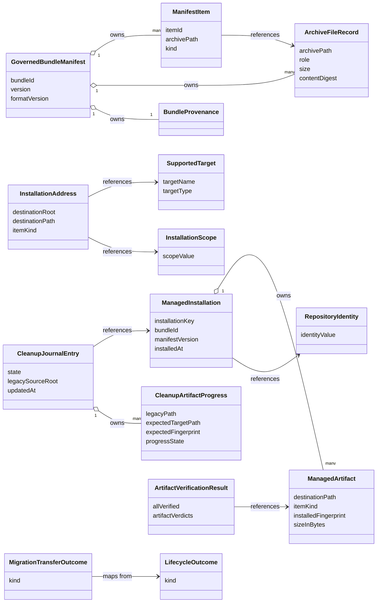

# Functional Specification — Shared Installation Foundation (U1)

This file is the source of truth for the shared lifecycle's **workflows** and
its **state machines**. Ordered behaviour and lifecycle transitions live here
because `entities.md` describes shape and `rules.md` describes decision logic.

Two derived views are included for readability: an entity-relationship diagram
generated from `entities.md`, and a business-rules summary generated from
`rules.md`. The YAML in those files remains authoritative when views disagree.

## Actors

- **Delivery adapter** — the CLI, or the VS Code extension. Translates its
  own input and output around the shared lifecycle.
- **Shared installation lifecycle** — the use cases in U1 that both delivery
  adapters call.
- **Migration coordinator** — U4 during activation. Calls the shared
  lifecycle for transfer and drives the cleanup journal.
- **Injected ports** — manifest governance, target routing, installation
  registry (two adapters), target artifact store, and a reconciliation port.

## Ports and boundaries

The lifecycle is expressed against injected ports so no adapter takes on I/O
concerns the shared foundation should own. Port names carry the `Port` suffix
throughout, matching Contract Design's contract 3.

- `ManifestGovernancePort` — validates the archive and returns the governed
  inventory as `GovernedBundleManifest` + `ArchiveFileRecord[]` + `ManifestItem[]`.
- `TargetRoutingPort` — resolves an `InstallationAddress` from a supported
  target, a scope, and an item kind.
- `InstallationRegistryPort` — reads and writes `ManagedInstallation` and its
  `ManagedArtifact` set. One shared schema. Two adapters:
  - **User-scope adapter** persists through the shared application-data path
    (`AppStoragePort`).
  - **Repository-scope adapter** persists through the repository lockfile
    within the selected repository.
  Neither adapter reaches into the other's storage.
- `TargetArtifactStorePort` — writes, reads, and removes target artifacts with
  containment and symbolic-link safety.
- `MigrationCleanupJournalPort` — appends and reads journal entries and their
  per-artifact progress. Migration is its only caller; the contract is
  shaped so nothing about the entry is structurally migration-specific.
- `RepositoryIdentityReconciliationPort` — resolves a redirect between a
  stored identity value and a current one. Used only during reconciliation.
  The lifecycle acquires no direct network dependency.

The shared foundation exposes two operations beyond install, update, and
uninstall, both required by Contract Design's contract 3:

- `transferThroughLifecycle(request)` → `MigrationTransferOutcome` — the
  migration transfer workflow below.
- `verifyManagedArtifacts(request)` → `ArtifactVerificationResult` — the
  verification workflow below.

Normal lifecycle operations return the shared result vocabulary from Contract
Design as `LifecycleOutcome.kind`: `success`, `validation-error`, `conflict`,
`preserved-content`, `retryable-failure`, `safety-blocked`. The migration
transfer boundary returns the separate `MigrationTransferOutcome` union.
Programmer defects are outside both unions.

## Boundary changes against upstream

Two elements of this design are additions to the upstream component catalogue
and contract summary. They are recorded here rather than left implicit, and each
needs the matching upstream edit before Code Generation relies on it.

| Addition | Absent from | Why it is needed | Follow-up |
| --- | --- | --- | --- |
| `RepositoryIdentity` entity | `components.md` defines no such entity | BR3.1 makes repository identity part of the managed installation key, and FR2.2 requires two repositories' records never to collide. Without a modelled identity the key is underspecified for repository scope. | Add the entity to `ManifestGovernance`'s peer set under `InstallationRegistry` ownership in the component catalogue. |
| `RepositoryIdentityReconciliationPort` | contract 3 lists five `shared_ports` without it | The recorded answer to this stage's Q7 follow-up chose network redirect resolution when a stored record matches no open workspace, then re-key. Derivation must stay offline (BR3.2), so the network call has to live behind an injected port rather than inside the foundation. | Add the port to contract 3's `shared_ports` with its `resolveRedirect` operation and the three-value result. |

Both additions are confined to repository-identity handling. Neither changes the
lifecycle result semantics, the ownership split between U1 and its adapters, or
any other declared boundary.

## Fingerprinting model

Every `ManagedArtifact.installedFingerprint` covers the exact byte sequence
written to the target, and the same sequence is what the store reads back for
verification. There is only ever one canonical sequence per artifact:

- A **binary payload** is written verbatim. The fingerprinted sequence is the
  bytes from the archive.
- A **text payload** goes through the optional resource transformer before the
  write. The fingerprinted sequence is the UTF-8 encoding of the transformed
  content. When the transformer fails, the fallback content is what gets
  fingerprinted, so the record accurately describes what was actually written.

This model retires the archive-side lockfile checksum for local-change detection
and closes the case where a transformed file looks permanently user-edited.

## Install workflow

Entry point: `install(request)` where `request` names the bundle source, the
supported target, the installation scope, and an optional overwrite consent.

1. **Validate the bundle.** Call `ManifestGovernancePort.validate(bundleSource)`.
   Enforce BR1.1 through BR1.4. On failure return `validation-error` and stop
   before any target write.
2. **Derive the repository identity.** When the scope is `repository`, derive
   the `RepositoryIdentity` from local sources under BR3.2: the normalised
   canonical remote URL when the repository has one, otherwise the absolute
   workspace root path. No network call participates. When the scope is `user`,
   the identity is absent. This step runs before any registry access because
   BR3.1 makes the identity part of the installation key; update and uninstall
   derive it the same way at the same point in their own sequences.
3. **Resolve destinations.** For each `ManifestItem` whose `ArchiveFileRecord`
   role is `installable` (BR1.5), call
   `TargetRoutingPort.resolve(target, scope, kind)`. Reject any resolved path
   that escapes its destination root (BR2.2) and return `safety-blocked` when it
   does.
4. **Read the prior record.** Call `InstallationRegistryPort.get(installationKey)`
   using the key formed from bundle identity, target, scope, and the identity
   derived in step 2. When present, this is a re-installation of the same
   identity and the record feeds steps 5 and 8.
5. **Check still-named artifacts for local changes.** For every resolved
   destination the prior record already covers, compare the current bytes
   against the recorded fingerprint. Under BR4.7, when any differ and the
   request carries no overwrite consent, write nothing at all and return
   `conflict` identifying the bundle and the affected artifacts. This check
   precedes every write in the operation, so a locally changed file is never
   overwritten and then reported.
6. **Write and verify each artifact.**
   1. For a binary payload write the archive bytes verbatim.
   2. For a text payload apply the transformer, then write the encoded content.
   3. Read the written bytes back and compare against the intended sequence.
   4. When the compared sequences differ, return `retryable-failure` and stop.
   5. Compute the fingerprint over the same intended sequence.
7. **Record the artifacts.** Admit each verified artifact to a
   `ManagedInstallation` under BR3.5. Persist through the adapter selected by
   scope under BR3.4.
8. **Reconcile omitted artifacts.** Any prior artifact the new manifest no
   longer names is handled by the omitted-artifact rule (BR4.2): removed when
   unchanged, preserved and de-managed when changed (BR4.3).
9. **Return the outcome.** Success carries the set of preserved artifacts when
   any preservation occurred (BR4.4); `preserved-content` is reserved for an
   operation that could not proceed (BR4.8).

## Update workflow

Update is a specialisation of install and follows the same single policy for a
locally changed artifact the new manifest still names (BR4.7).

1. Steps 1 to 4 identical to install: validate, derive the repository identity,
   resolve destinations, read the prior record.
2. **Diff against the prior record.** Split the item set into three groups:
   still-managed identical, still-managed but changed on disk, and omitted.
3. **Apply BR4.7 to the changed group before writing anything.** When the
   still-managed-but-changed group is non-empty and the request carries no
   overwrite consent, write nothing and return `conflict` identifying the bundle
   and those artifacts. This is install step 5, reached by the same rule, so the
   two workflows cannot diverge on the case.
4. **Write the remaining items.** For every still-managed identical item — and,
   when consent was given, every changed one — run install step 6 with the
   transformed sequence and refresh the fingerprint on a successful write.
5. **Handle omitted artifacts under BR4.2.** For every prior artifact the new
   manifest omits:
   - When current bytes match the fingerprint, remove the artifact (BR4.6),
     drop it from the record.
   - When they differ, preserve the file, drop it from the record so a later
     uninstall leaves it alone (BR4.3), add it to the preserved list.
6. **Return the outcome.** Success carries the preserved list (BR4.4), or
   `preserved-content` when preservation left the requested change unachievable
   (BR4.8).

## Uninstall workflow

1. **Resolve the record.** Derive the repository identity as in install step 2
   when the scope is `repository`, then read the `ManagedInstallation` for this
   bundle, target, scope, and identity. When no record exists, return a
   `success` outcome with an empty removal list.
2. **Remove each managed artifact.** For every artifact in the record, call
   `TargetArtifactStorePort.remove(destinationPath)`. Verify the path is absent
   after the call returns (BR4.6). On a verified removal drop the artifact
   from the record.
3. **Skip unmanaged content.** BR4.5 prohibits touching anything not in the
   record. A file present at a destination whose record was dropped by
   preservation earlier is not deleted.
4. **Delete the record when empty.** When every artifact is removed, delete
   the `ManagedInstallation` through the scope-appropriate adapter (BR3.4).
5. **Return the outcome.** Success reports the removed and skipped
   destinations. A verification failure returns `retryable-failure` and
   retains the record.

## Migration transfer workflow (support contract for U4)

The shared lifecycle exposes a `transferThroughLifecycle(request)` operation
so U4 never writes target bytes itself. Every exit returns a
`MigrationTransferOutcome` — never a bare `LifecycleOutcome`. An inner
lifecycle call's result is mapped to a member of that union at the boundary.

1. **Validate the legacy content.** Call `ManifestGovernancePort.validate` on
   the legacy source's governed bytes. On failure return `skipped` with the
   validation reason and preserve legacy content: an ungoverned legacy source is
   not transferable, and reporting it as a lifecycle `validation-error` would
   name a kind this boundary does not return.
2. **Resolve the target.** Call `TargetRoutingPort.resolve` for the recorded
   legacy target and scope. When resolution finds no supported layout, return
   `skipped` with the association reason. When a resolved path escapes its
   destination root (BR2.2), or a legacy path escapes its source root (BR5.7),
   return `safety-blocked`.
3. **Check the authoritative target.** Call `verifyManagedArtifacts` for the
   artifacts a fresh install would write. Then:
   - `allVerified` — every expected artifact is present and byte-identical:
     return `verified-duplicate` and let U4 drive journaled cleanup.
   - any `present-different` verdict, with no overwrite consent in the request:
     return `preserved-conflict` identifying the bundle and artifact, and let U4
     request explicit consent. Target content is untouched (BR4.7).
   - any `safety-blocked` verdict: return `safety-blocked`.
   - every verdict `absent`: the destination is empty; continue to step 4.
4. **Perform a verified install.** With an empty destination, or with consent
   recorded in the request, run the install workflow from step 5. Map its
   result:
   - `success` → `transferred`, carrying the verified artifacts.
   - `retryable-failure` → `retry-required`.
   - `conflict` → `preserved-conflict`.
   - `safety-blocked` → `safety-blocked`.
   - `validation-error` → `skipped`.
5. **Return the outcome.** U4 maps the value into its own summary. No durable
   per-installation migration state is created here, and legacy content is
   intact for every kind except `transferred`.

## Managed-artifact verification workflow (support contract for U4)

`verifyManagedArtifacts(request)` answers one question — are these artifacts
present at the target with exactly the bytes the registry recorded — and returns
an `ArtifactVerificationResult`. It is the shared evidence behind U4's
verified-duplicate decision, its pre-deletion comparison, and the journal's
first-pass (BR5.6) and resumption (BR5.5) checks. It never writes or deletes.

The request names the installation key and the artifacts to check; each artifact
is identified by its destination path and the fingerprint expected for it.

1. **Resolve the installation.** Read the `ManagedInstallation` for the supplied
   key. When an artifact in the request is not in the record's managed set,
   verify it against the fingerprint supplied in the request rather than
   inventing one; the journal supplies expected fingerprints by reference
   (BR5.3).
2. **Check containment for every path.** A destination path outside its
   destination root (BR2.2), or a legacy path outside its verified source root
   (BR5.7), yields a `safety-blocked` verdict for that artifact and no read.
3. **Read and compare each artifact.** For each remaining artifact, read the
   current bytes at the path and compare with the expected fingerprint:
   - present and matching → `present-identical`
   - present and differing → `present-different`
   - not present → `absent`
4. **Aggregate.** `allVerified` is true only when every verdict is
   `present-identical`. A single `safety-blocked` verdict prevents `allVerified`
   regardless of the others.
5. **Return the result.** The verdicts describe bytes read during this call
   only. A caller may not carry them forward as standing authority for a later
   destructive action — BR5.5 requires a fresh call at resumption.

## Cleanup journal state machine

The journal describes one destructive operation in flight. It references
registry-owned identity and fingerprints (BR5.3) rather than copying
inventories. Every legacy path it touches stays inside the entry's verified
legacy source root (BR5.7).

Transitions between states are durable before the filesystem action they
authorise (BR5.2). A committed entry is deleted as the final step of the
operation (BR5.4). First-pass verification is governed by BR5.6; BR5.5 governs
the resumption path only.

```mermaid
stateDiagram-v2
    [*] --> prepared: create entry for one installation key
    prepared --> target_verified: every expected target artifact present and identical (BR5.6)
    target_verified --> legacy_delete_pending: deletion authorised
    legacy_delete_pending --> committed: no managed legacy artifact remains (BR4.6)
    prepared --> [*]: abandoned; legacy content intact
    target_verified --> [*]: abandoned; legacy content intact
    committed --> [*]: entry deleted in the same operation (BR5.4)
```

Text fallback:

- Create the entry in `prepared` for one installation key.
- Advance to `target_verified` only after `verifyManagedArtifacts` reports every
  expected target artifact present and byte-identical (BR5.6). Persist the
  transition before the next action.
- Advance to `legacy_delete_pending` when deletion has been authorised.
  Deletion is attempted per artifact only from `verified-identical` progress,
  and a fresh `verifyManagedArtifacts` call runs immediately before the delete.
  On a resumed entry that fresh call is mandatory (BR5.5): a verification claim
  persisted by a previous run is never sufficient authority.
- Advance to `committed` after every legacy artifact is gone and the delete
  was verified absent (BR4.6).
- Delete the entry as the final step of the operation (BR5.4).
- From `prepared` or `target_verified` the entry may terminate without
  progressing; legacy content is intact and the record continues to point at
  the legacy source until the next eligible attempt.

## Repository identity reconciliation

Reconciliation runs only when a stored record's identity value matches no
open workspace.

- The shared foundation calls `RepositoryIdentityReconciliationPort.resolveRedirect(storedIdentity, candidateWorkspaces)`.
- The port returns one of `matched(newIdentityValue)`, `no-match`, or
  `network-unavailable`. On `matched` the record is re-keyed to the new
  identity value in a single registry write (BR6.1). On `no-match` the record
  is untouched. On `network-unavailable` the record is untouched (BR6.2).
- Identity derivation itself never consults the port (BR3.2, BR6.1). Every
  install-time and update-time identity value is derived from local sources.

## Result semantics

`LifecycleOutcome.kind`, returned by install, update, and uninstall:

| kind | Meaning in U1 |
| --- | --- |
| `success` | Every write and removal in the operation was verified; a `preserved` list may accompany it (BR4.4). |
| `validation-error` | Governed inventory, integrity, or path safety refused the bundle before any write. |
| `conflict` | A still-named artifact's bytes no longer match its fingerprint and no overwrite consent was given (BR4.7); nothing was written. |
| `preserved-content` | Preservation left the requested change unachievable (BR4.8). Not used for a successful operation that preserved some artifacts. |
| `retryable-failure` | A write or removal did not verify; the caller may retry after rechecking current state. |
| `safety-blocked` | Containment, traversal, symlink, identity, or verification safety refused the action. |

`MigrationTransferOutcome.kind`, returned by `transferThroughLifecycle`:

| kind | Meaning in U1 | Mapped from |
| --- | --- | --- |
| `transferred` | Governed legacy content is installed and verified at the resolved target; legacy content is now eligible for journaled cleanup. | `success` |
| `verified-duplicate` | Every expected target artifact is already present and byte-identical; nothing was written. | `allVerified` verification result |
| `preserved-conflict` | Target content differs and no consent was given; both locations are intact. | `conflict`, or a `present-different` verdict |
| `retry-required` | A write or verification did not succeed; legacy content is intact and the transfer may be retried. | `retryable-failure` |
| `skipped` | The legacy source is not governed, or maps to no supported target layout; nothing was touched. | `validation-error`, unresolvable routing |
| `safety-blocked` | A destination or legacy path failed containment or symlink safety (BR2.2, BR5.7). | `safety-blocked` |

`ArtifactVerificationResult`, returned by `verifyManagedArtifacts`, carries
per-artifact verdicts (`present-identical`, `present-different`, `absent`,
`safety-blocked`) and the `allVerified` aggregate. It is evidence, not an
operation outcome, and authorises nothing by itself.

## Derived views

### Entity relationships (derived from `entities.md`)

Text fallback: manifest governance owns items, file records, and provenance;
items reference file records for their per-file integrity. Addresses reference
a target and a scope. `ManagedInstallation` owns its artifacts and references a
repository identity when repository-scope. A cleanup journal entry references
one installation and owns its per-artifact progress records. The migration
transfer outcome maps from a lifecycle outcome at the U4 boundary, and the
verification result references the managed artifacts it checked.

### Business rules summary (derived from `rules.md`)

| Group | Focus | Representative rules |
| --- | --- | --- |
| 1 Governance | Manifest, inventory, and path safety | BR1.1 single root manifest; BR1.3 installable-file digest check; BR1.4 containment and safe paths. |
| 2 Routing | Destination resolution and isolation | BR2.1 destinations from target, scope, kind; BR2.2 destinations inside their root; BR2.3 target and scope isolation. |
| 3 Registry | Record shape, identity, and persistence | BR3.1 identity by bundle/target/scope/repository; BR3.2 offline identity derivation; BR3.3 fingerprint the bytes as written; BR3.4 two adapters, one schema. |
| 4 Lifecycle | Install, update, uninstall behaviour | BR4.1 verify writes; BR4.2 preserve locally changed omitted artifacts; BR4.4 successful update carries the preserved list; BR4.6 verify removals; BR4.7 never overwrite a still-named changed artifact without consent; BR4.8 preserved-content is for stalled operations only. |
| 5 Journal | Restart-safe destructive cleanup | BR5.1 in-flight only; BR5.2 durable-before-action; BR5.4 committed entries do not outlive their operation; BR5.5 resumption re-verifies; BR5.6 first-pass verification precedes deletion authority; BR5.7 legacy paths stay inside their source root. |
| 6 Reconciliation | Identity across repository renames | BR6.1 offline derivation, port-driven reconciliation; BR6.2 skip on network unavailable. |
