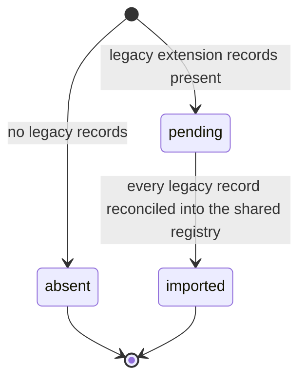
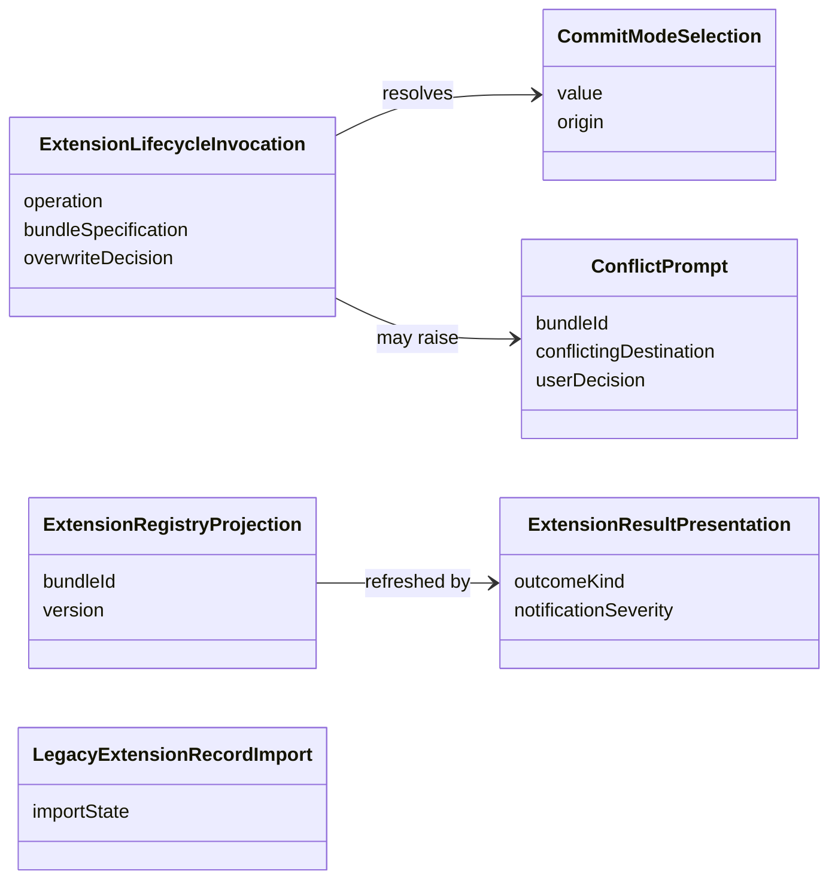

# Functional Specification — VS Code Shared-Lifecycle Adoption (U3)

This file is the source of truth for U3's **workflows** — the ordered steps each
extension lifecycle command follows to delegate to the shared lifecycle, retire
the cache-then-sync path, and present results in VS Code terms. `entities.md`
describes the translation and presentation values; `rules.md` describes the
delegation and storage constraints; ordered behaviour lives here.

Two derived views are included for readability: an entity-relationship diagram
generated from `entities.md`, and a business-rules summary generated from
`rules.md`. The YAML in those files remains authoritative when views disagree.

## Actors

- **Extension user** — invokes a command through the VS Code UI.
- **VS Code adapter (U3)** — composes the command, delegates, presents results.
- **Shared installation lifecycle (U1)** — the use cases U3 delegates to.
- **Shared registry (U1)** — the single source of truth for installations.

## Boundary

U3 touches the shared foundation through the `u1-to-u3-shared-lifecycle` contract:
`install`, `update`, `uninstall`, each returning a `LifecycleOutcome`. U3
implements no target write, no destination resolution, no managed-artifact
cleanup, and no lifecycle policy (BR1.1). It retires the extension's
extracted-files bundle cache and its cache-then-sync write (BR1.2).

## Dependencies on the shared foundation (contract deltas)

Two U3 decisions require shared behaviour the foundation's current functional
design does not yet describe. They are recorded here as **deltas to close in the
foundation repair at the stage decision**, not as U3-owned work:

1. **Conflict-on-existing-content with an overwrite decision (delta A).** Q4 has
   the extension prompt on a shared `conflict` and re-invoke with an explicit
   overwrite decision. U1's install/update workflow as written writes and verifies
   without detecting pre-existing non-managed target content or accepting an
   overwrite decision. Closing this means the shared `InstallRequest`/`UpdateRequest`
   accept an `overwriteDecision`, and the install/update workflow returns
   `conflict` (writing nothing) when target content exists and no decision was
   given. **This must reuse the single `OverwriteDecision` concept the migration
   path already defines** (`confirmed | declined | unavailable`, from the U1→U4
   migration-support contract), not a second parallel mechanism: one
   overwrite-decision on the shared lifecycle, consumed by both the extension's
   normal-install prompt (this unit) and U4's migration flow. The foundation
   repair should define it once.
2. **Source resolution on the request (delta B).** As for U2, the extension hands
   a bundle specification and the shared lifecycle owns resolution and download.
   U1's design starts from an already-fetched archive and declares no
   source-resolution port. This is the same delta U2 recorded; U3 depends on the
   same closure.

Where a workflow step below relies on one of these it is marked `(delta A)` or
`(delta B)`.

## Install workflow

Entry: the extension's install command with a selected bundle, target, and scope.

1. **Compose the invocation.** Build an `ExtensionLifecycleInvocation` with
   `operation: install`, the bundle specification, the resolved target and scope,
   and — for repository scope — a `CommitModeSelection` from the extension's scope
   UI or the target default. No `overwriteDecision` on the first call.
2. **Run the one-time legacy record import if due** (BR3.3), once per activation.
3. **Delegate.** Call the shared `install`, passing the bundle specification for
   shared resolution and download (delta B). The shared lifecycle validates,
   writes the target directly, verifies, and records the installation; the
   extension copies nothing into its own storage (BR1.1, BR1.2).
4. **Handle a conflict (delta A).** When the outcome is `conflict`, raise a
   `ConflictPrompt` for the identified bundle and destination (BR4.1). On
   `confirmed`, re-invoke `install` with `overwriteDecision: confirmed` (BR4.2);
   on `declined`/`unavailable`, leave target content unchanged and present the
   outcome.
5. **Present the result.** Build an `ExtensionResultPresentation` from the final
   outcome kind: notification severity from the kind alone, preserved artifacts
   surfaced when a `success` carries them, and a registry-tree refresh that reads
   the shared registry (BR5.1, BR5.2).

## Update workflow

Entry: the extension's update command for an installed bundle.

1. Compose the invocation with `operation: update`; resolve commit mode as for
   install.
2. Run the one-time legacy record import if due (BR3.3).
3. Delegate to the shared `update`. A `success` may carry preserved artifacts
   (locally changed files the update left alone); a `preserved-content` result
   means the update could not proceed.
4. Handle a `conflict` exactly as install does (delta A, BR4.1, BR4.2).
5. Present the result (BR5.1, BR5.2), surfacing preserved artifacts on a
   `success` and distinguishing a `preserved-content` outcome (the update did not
   proceed) in the notification text.

## Uninstall workflow

Entry: the extension's uninstall command for an installed bundle.

1. Compose the invocation with `operation: uninstall`.
2. Run the one-time legacy record import if due, so the shared registry holds the
   record the uninstall acts on (BR3.3).
3. Delegate to the shared `uninstall`. It removes only managed artifacts and the
   record; the extension removes no bundle-cache directory, because none exists
   after cache retirement (BR1.2).
4. Present the result and refresh the tree from the shared registry (BR5.1,
   BR5.2).

## Legacy extension-record import workflow

Runs at most once per activation, when legacy extension records exist and import
state is `pending` (BR3.3).

1. **Read the legacy records once.** Load the extension's existing installation
   records.
2. **Reconcile additively, resolving target and repository identity
   deterministically.** The extension's `InstalledBundle` record carries no
   explicit target (target is implied by `installPath`) and no repository
   identity, but the shared installation key needs both (BR3.5). For each legacy
   record, resolve the target from a recorded hint or its `installPath`, else the
   single configured target whose layout contains the record's files; resolve
   repository identity for a repository-scope record from the workspace the record
   belongs to. When the target or repository identity does not resolve uniquely,
   do not import that record — report it as skipped with the reason and leave it
   in place. For a record whose key resolves, when the shared registry has no
   record for that key, copy it in; when a shared record already exists, leave it
   authoritative.
3. **Complete.** Mark import state `imported`; from then on the extension registry
   manager only delegates to the shared registry (BR3.1, BR3.2). No runtime target
   content is read, written, or deleted during import.

Text fallback: import state begins `pending` when legacy extension records exist,
or `absent` when none do. From `pending`, after every legacy record is reconciled
into the shared registry (additively, never overwriting a newer shared record),
the state becomes `imported` and the manager delegates thereafter. `absent` and
`imported` are terminal.

## Conflict interaction (delta A)

The overwrite decision is the shared lifecycle's; the prompt is the extension's.

- The shared lifecycle returns `conflict` for existing target content, writing
  nothing (delta A).
- The extension raises a `ConflictPrompt` naming the bundle and the conflicting
  destination (BR4.1).
- On `confirmed`, the extension re-invokes the same shared operation carrying
  `overwriteDecision: confirmed`; the shared lifecycle performs the write (BR4.2).
  The `OverwriteDecision` value is the same one the migration path uses (delta A),
  not a U3-specific type.
- On `declined`, or `unavailable` when no interactive surface exists, target
  content is left unchanged and the outcome is presented as-is.

## Unit scope and installation-state readers

Q6 was answered C: every extension surface that reads or writes the bundle cache,
the extension registry, or the target tree is in this unit, so no stale reader of
the retired cache or a separate extension store survives. Concretely:

- **Lifecycle commands** — install, update, uninstall — delegate to the shared
  lifecycle (BR1.1) and present shared results (BR5.1).
- **Registry-manager and bundle-installer services** — the bundle-installer's
  cache-then-sync path is retired (BR1.2); the registry manager becomes a thin
  delegator over the shared registry (BR3.1).
- **Installation-state readers** — the registry tree view, the marketplace view's
  installed-state indicators, and the auto-update / update-checker services — read
  through the shared-registry read-only projection (BR3.6), never a retired cache
  or a separate extension store.

Activation-time migration is out of scope; it is U4.

## Naming note

Contract Design (contract 2) names the returned type `LifecycleResult`; U1's
`entities.md` and this specification call the same value `LifecycleOutcome`. They
are the same type under two names; this spec uses `LifecycleOutcome`, matching
U2's design. The foundation repair at the stage decision should settle on one
name across both documents.

## Result semantics (as presented by U3)| kind | Notification | Tree effect |
| --- | --- | --- |
| `success` | info; lists preserved artifacts when the outcome carries them | Refresh from the shared registry. |
| `validation-error` | error; the bundle was refused before any write | No change. |
| `conflict` | warning; prompt for an overwrite decision | No change until re-invocation. |
| `preserved-content` | warning; the update did not proceed, content is intact | No change. |
| `retryable-failure` | error; a write or removal did not verify, retry is possible | Refresh from the shared registry. |
| `safety-blocked` | error; a containment/traversal/symlink/verification refusal | No change. |

## Derived views

### Entity relationships (derived from `entities.md`)

Text fallback: an `ExtensionLifecycleInvocation` resolves a `CommitModeSelection`
for repository scope and may raise a `ConflictPrompt` when the shared result is a
conflict. `ExtensionRegistryProjection` is a read-only view of the shared record,
refreshed after an operation by `ExtensionResultPresentation`.
`LegacyExtensionRecordImport` is the one-time record migration.
`CommitModeSelection` is the same per-invocation value U2 defines.

### Business rules summary (derived from `rules.md`)

| Group | Focus | Representative rules |
| --- | --- | --- |
| 1 Delegation | Delegate and retire cache-then-sync | BR1.1 write only through the shared lifecycle; BR1.2 no cache-then-sync; BR1.3 prompts[] not required. |
| 2 Storage boundary | Shared data via AppStorage | BR2.1 resolve shared data through AppStorage; BR2.2 global storage holds only VS Code-local state. |
| 3 Registry adoption | Shared registry authoritative | BR3.1 single source of truth; BR3.2 read-only projection; BR3.3 one-time additive import; BR3.4 scope boundaries. |
| 4 Conflict interaction | Prompt in adapter, decide in shared layer | BR4.1 prompt only on a shared conflict; BR4.2 re-invoke with the decision. |
| 5 Result presentation | Message from the shared result | BR5.1 messaging from the result kind alone; BR5.2 tree reflects the shared registry. |
