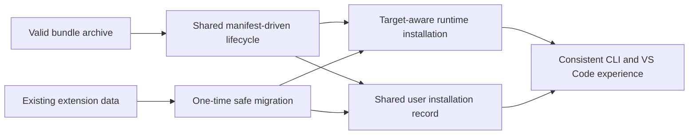

# Intent Backlog: Unified Bundle Installation Migration

The ordering below expresses priority, not implementation order. Detailed
architecture and dependency analysis will determine the sequence after the
design pull request. [Q1]

| ID | Proto-Unit | Priority | Value and acceptance boundary | Dependencies |
| --- | --- | --- | --- | --- |
| PB-01 | Define the shared installation lifecycle | Must | CLI and VS Code adapters use one install, update, and uninstall lifecycle with shared ownership boundaries. | Design pull request |
| PB-02 | Support manifest-driven archive installation | Must | A valid ZIP with exactly one root `deployment-manifest.yml` is interpreted from its manifest rather than a hardcoded internal path. | PB-01 |
| PB-03 | Route installation data by target and scope | Must | User and repository operations preserve target isolation; runtime content reaches the selected target's layout for the requested scope, while shared user cache and registry retain their XDG owners. | PB-01 |
| PB-04 | Migrate extension-managed user data | Must | First use can safely transfer legacy extension user-scope data to the selected target's user layout. Existing data there is authoritative; non-identical data is preserved and reported as a conflict. Repository installation remains governed by its selected target layout. | PB-03; detailed migration design |
| PB-05 | Deliver CLI and VS Code adapter adoption | Must | Both entry points invoke the shared lifecycle while retaining only their delivery-specific interactions. | PB-01 through PB-04 |
| PB-06 | Establish migration and lifecycle test evidence | Must | Each implementation pull request has focused evidence for its shared behavior; the final matrix covers the agreed lifecycle and migration boundaries. | Delivery planning |
| PB-07 | Document migration behavior for users and maintainers | Should | Users understand migration outcomes and conflicts; maintainers understand the shared ownership boundary. | PB-04; PB-05 |

## Prioritization Rationale

- **Must:** PB-01 through PB-06 are necessary to eliminate divergent behavior,
  fix the CLI archive failure through the shared path, preserve user data, and
  demonstrate the migration is safe.
- **Should:** PB-07 supports adoption and maintainability but follows the
  final migration design and adapter adoption.
- **Could:** Additional target-specific usability improvements discovered
  during detailed design, provided they do not broaden the shared lifecycle
  boundary.
- **Won't (this initiative):** Relocating repository data into user-scope
  storage, automatic conflict overwrite, and unrelated target/runtime
  redesign.

## Value Stream

Text alternative: a valid bundle, or legacy extension-managed user-scope data,
enters the shared lifecycle. The lifecycle resolves runtime content from the
selected target and requested scope, while maintaining shared user records so
CLI and VS Code users get the same result.

## Sequencing Guardrails

- The first implementation pull request must follow the approved design pull
  request and establish the dependency order for the remaining work.
- No component-specific implementation may recreate independent installation
  rules that bypass the shared lifecycle.
- The legacy-data migration cannot enable automatic cleanup until detailed
  design defines and tests interruption recovery and conflict verification.

## Open Backlog Refinement

- Split PB-01 through PB-05 into pull-request-sized units after reverse
  engineering and architecture work identify the existing ownership and
  dependencies.
- Attach a focused test matrix to each resulting unit during delivery
  planning.