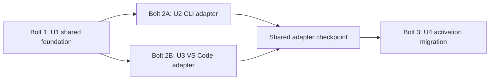

# Delivery Bolt Plan

## Plan Basis

A **Bolt** is one bounded Construction build pass that ends in a demonstrable,
tested result. This plan uses a risk-first heuristic while respecting the
approved dependency graph: U1 must precede U2 and U3, and U4 follows U3.

The plan does not change the active scope or the Construction stage set. It
records the intended economic sequence for the four Units of Work.

## Work Streams

| Stream | Unit(s) | Scope | Primary requirements | Dependency |
| --- | --- | --- | --- | --- |
| Shared lifecycle foundation | U1 | Manifest governance, routing, registry, lifecycle, safe artifact I/O, and shared result contracts | FR1-FR2.2, FR4, NFR1, NFR3 | None |
| Delivery adapter adoption | U2 and U3 | CLI and VS Code composition around the U1 lifecycle, with parity checks | FR1, FR1.1, FR1.2, FR2, FR4, FR4.1 | U1 contracts and core behavior |
| Activation migration compatibility | U4 | Legacy discovery, deterministic association, consent, verified transfer, cleanup, and restartable reporting | FR3-FR3.8, NFR1.1, NFR2, NFR4 | U1 and U3 |

## Implementation Sequence

### Bolt 1: Shared lifecycle foundation

- **Units:** U1 Shared installation foundation.
- **Walking skeleton:** No formal walking skeleton; the pass includes a minimal
  happy-path install through manifest validation, target routing, registry
  recording, binary-safe write, and read-back verification.
- **Definition of Done:**
  - The contract-review entry criteria are resolved or explicitly represented as
    implementation constraints: complete shared types and result payloads,
    repository identity rules, U3/U4 direction, and bounded retry semantics.
  - A root `deployment-manifest.yml` and canonical `items[]` inventory are
    validated before writes.
  - User and repository scope destinations are layout-derived and isolated.
  - Managed installation state records artifact hashes and preserves locally
    changed content during update and uninstall.
  - Focused tests cover validation, routing, registry isolation, safe writes,
    read-back verification, update, and uninstall.
- **Confidence hypothesis:** Shipping this pass proves that both delivery
  surfaces can rely on one target-aware lifecycle without duplicating write or
  cleanup policy.
- **Expected demo:** Install a small valid bundle, show the managed record and
  target content, then update and uninstall it while demonstrating preservation
  of locally changed content.

### Bolt 2: CLI and VS Code adapter adoption

- **Units:** U2 CLI manifest adoption and U3 VS Code shared-lifecycle adoption.
- **Walking skeleton:** No; this pass completes adapter adoption around the
  proven shared foundation.
- **Definition of Done:**
  - U2 routes CLI install, update, and uninstall through U1 and removes rigid
    archive-path assumptions.
  - U3 routes VS Code install, update, and uninstall through U1 and removes the
    cache-then-sync target-write path.
  - U2 and U3 are developed mostly in parallel after U1 contracts stabilize.
  - A shared checkpoint proves lifecycle parity, typed result mapping, target
    and scope isolation, and integration-test compatibility.
- **Confidence hypothesis:** Shipping this pass proves that the two delivery
  surfaces are thin adapters over one lifecycle and do not drift in behavior.
- **Expected demo:** Run the same manifest-driven install, update, and uninstall
  scenario through the CLI and VS Code entry points and compare their observable
  results.

### Bolt 3: Activation migration compatibility

- **Units:** U4 Activation migration compatibility.
- **Walking skeleton:** No; this pass extends the adopted VS Code lifecycle.
- **Definition of Done:**
  - Activation inspects legacy installations before bundle commands are enabled.
  - Legacy records map deterministically to one target and scope, or are
    preserved and reported as skipped when association is missing or ambiguous.
  - Target content remains authoritative until explicit overwrite consent.
  - Transfer, byte-for-byte verification, legacy cleanup, post-cleanup absence,
    retry, interruption, and repository-scope behavior are covered by focused
    tests.
  - Migration reports current-run outcomes without durable per-installation
    completion or conflict state.
- **Confidence hypothesis:** Shipping this pass proves that existing extension
  content can migrate safely without creating a second installation lifecycle.
- **Expected demo:** Activate with a legacy installation, show a verified
  transfer and cleanup, then show a preserved conflict and a restartable retry.

## Critical Path

U1 contract and foundation correctness is the critical path. U2 and U3 can
proceed in parallel after U1 contracts stabilize, but both must pass the shared
adapter checkpoint before U4 begins. U4 is intentionally last because its
activation behavior depends on the U3 command-readiness boundary.

<!-- Text fallback: Bolt 1 builds U1. U2 and U3 then proceed in parallel and converge at a shared adapter checkpoint. U4 follows that checkpoint. -->

## Construction Configuration

- **Staffing:** One in-session sequence with approval checkpoints.
- **Iteration:** Default stage-major Construction iteration.
- **Approval rhythm:** Preserve the workflow's stage-level approval gates.
- **External blockers:** None identified; internal review and packaging checks
  are checkpoints within the repository.

## Success Criteria

- One manifest-driven lifecycle is used by the CLI and VS Code entry points.
- U2 and U3 preserve equivalent lifecycle semantics and typed outcomes.
- U4 performs safe, deterministic, restartable activation migration.
- Target, scope, repository, and unmanaged-content isolation is demonstrated by
  focused tests.
- Every Bolt has a bounded Definition of Done, confidence hypothesis, and demo.
