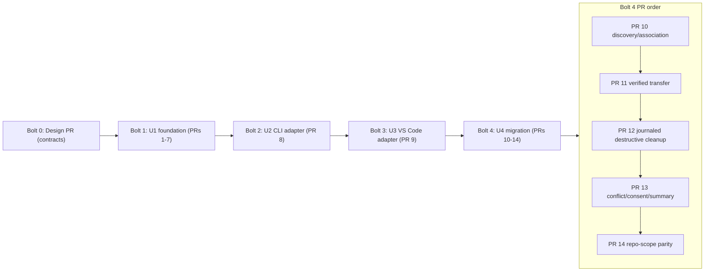

# Delivery Bolt Plan

## Plan Basis

A **Bolt** is one build pass over a slice of the work that ends in something that
runs and is tested. Inside each Bolt this plan also names the **pull requests
(PRs)** — the individual changes reviewed and merged on their own — because the
dominant delivery requirement here (FR4.1) is that the work arrive as a design
PR followed by small, independently reviewable implementation PRs.

The order is **risk-first**: build the shared foundation everything else depends
on before the two thin delivery adapters, and do the file-deleting migration
last. This respects the approved dependency graph (U1 before U2 and U3; U4 after
U1 and U3) and does not change the active scope or the Construction stage set;
it records the intended economic sequence and PR boundaries for the four Units
of Work.

A **walking skeleton** — a first pass that wires every architectural layer
end to end before features are added — is *not* run as a separate ceremony here;
instead, Bolt 1 includes a minimal happy-path install so the shared foundation
is demonstrable without pretending the first pass is a complete migration.

## Work Streams

| Stream | Unit(s) | Scope | Primary requirements | Dependency |
| --- | --- | --- | --- | --- |
| Shared lifecycle foundation | U1 | Manifest governance, target/scope routing, installation registry, install/update/uninstall lifecycle, safe artifact I/O, shared result contracts, the shared migration-cleanup journal contract, and offline repository-identity reconciliation | FR1–FR2.2, FR3.7 boundary, FR4, FR4.1, NFR1, NFR3 | None |
| CLI adapter adoption | U2 | CLI composition over the U1 lifecycle; remove the hardcoded archive path | FR1, FR1.1, FR1.2, FR2, FR4 | U1 contracts + core behavior |
| VS Code adapter adoption | U3 | Extension composition over the U1 lifecycle; retire cache-then-sync; supply the injected repository-redirect capability | FR1, FR1.3, FR2, FR2.1 | U1 contracts + core behavior |
| Activation migration compatibility | U4 | Legacy discovery, deterministic association, verified transfer, journaled destructive cleanup, consent, restartable reporting, repository-scope parity | FR3–FR3.8, NFR1.1, NFR2, NFR4 | U1 + U3 |

## Implementation Sequence

### Bolt 0: Shared design (design PR)

- **Units:** U1 (design only) establishing the boundaries all Units build on.
- **Walking skeleton:** N/A — no code ships.
- **Pull requests:**
  - **PR 0 — Design & contracts.** ADRs for the shared managed-installation
    lifecycle, the thin-adapter compatibility policy (FR4), and the journaled
    destructive-cleanup boundary; the four repository-internal boundary
    contracts and the shared TypeScript type/port file layout; the discriminated
    `LifecycleResult` shape; and the `MigrationCleanupJournal` states
    (prepared / target-verified / legacy-delete-pending / committed). Also fixes
    the two Contract 3 signatures added when the contract was amended: the
    `MigrationCleanupJournalPort` operations and the injected
    `RepositoryRedirectPort` (`resolveRedirect: RepositoryRedirectQuery ->
    RedirectResolution`) alongside U1's `reconcileRepositoryIdentity`. Resolves
    the open items Contract Design flagged so later PRs stay small and stable.
- **Definition of Done:** The shared types, ports, result payloads, repository
  identity rule, journal states, and the journal/reconciliation signatures are
  fixed in a merged design PR; no implementation PR begins before it merges.
- **Confidence hypothesis:** A locked contract surface lets U1, U2, U3, and U4
  proceed as small PRs without churning each other's interfaces.
- **Expected demo:** Walk the merged contracts and ADRs; show that each later PR
  maps to a named contract or component.

### Bolt 1: Shared lifecycle foundation (U1)

- **Units:** U1 Shared installation foundation.
- **Walking skeleton:** Includes a minimal happy-path install so the foundation
  is demonstrable end to end within U1.
- **Pull requests (component-level, each independently reviewable):**
  - **PR 1 — Manifest governance.** Accept an archive only with exactly one root
    `deployment-manifest.yml`, resolve the canonical `items[]` inventory,
    reject traversal and invalid governed inventory (FR1.1, FR1.2, NFR1).
  - **PR 2 — Target/scope routing.** Resolve the contained destination from
    target + scope + item kind; enforce destination containment; no hardcoded
    runtime root (FR2, FR2.2).
  - **PR 3 — Installation registry & storage ports.** Managed-installation and
    managed-artifact hash records; user-scope XDG data/cache and repository
    lockfile persistence through ports (FR2.1, FR2.2).
  - **PR 4 — Install lifecycle + artifact store.** Binary-safe write, read-back
    verification, and the happy-path install through the composed components
    (FR1, NFR1).
  - **PR 5 — Update & uninstall.** Apply current `items[]`, remove omitted
    artifacts only when bytes match the recorded hash, preserve locally changed
    content, and scope uninstall to managed artifacts (FR1.3).
  - **PR 6 — Shared migration-cleanup journal contract.** The U1-owned
    `MigrationCleanupJournalPort` with its four typed operations
    (`openCleanupJournalEntry`, `recordCleanupTransition`,
    `readCleanupJournalEntry`, `closeCleanupJournalEntry`), the entry/progress
    schemas, the four transition states, and the persistence boundary U4 will
    consume — including the durable-before-action rule, per-installation-key
    exclusivity, `source-root-mismatch` refusal, and `abandoned` permitted only
    from `prepared` or `target-verified` (contract plus persistence only; no
    extension discovery) (NFR1.1 foundation).
  - **PR 7 — Repository-identity reconciliation (U1 half).** The U1-owned
    `reconcileRepositoryIdentity` registry operation: re-key a
    `ManagedInstallation` from a stored identity to a confirmed current one
    against the caller-supplied candidate list, with the skip rules (zero
    candidates, more than one confirmation, or an absent/unavailable redirect
    port all leave the record untouched). Offline-only — U1 performs no network
    call and enumerates no workspaces — so this PR is reviewable without the
    network capability, which arrives with U3 in Bolt 3. FR3.7's
    skip-when-no-workspace-matches rule stays authoritative for legacy migration
    candidates and is unaffected here (FR2.1, FR3.7 boundary).
- **Definition of Done:** Each PR is independently reviewable and green; a small
  valid bundle installs, updates, and uninstalls with preservation of locally
  changed content; scope isolation holds; the journal contract and the
  reconciliation operation are published for U4.
- **Confidence hypothesis:** Both delivery surfaces can rely on one
  target-aware lifecycle without duplicating write or cleanup policy.
- **Expected demo:** Install a small bundle, show the managed record and target
  content, then update and uninstall while showing a locally changed file is
  preserved.

### Bolt 2: CLI adapter adoption (U2)

- **Units:** U2 CLI manifest adoption. Lands **before** U3 (serialized adapters).
- **Walking skeleton:** No; completes CLI adoption over the proven foundation.
- **Pull requests:**
  - **PR 8 — CLI lifecycle adoption.** Route CLI install/update/uninstall
    through the U1 use cases; remove the rigid ZIP-internal path assumption; map
    CLI input/output and typed results; add no CLI-specific target-write path
    (FR1, FR1.1, FR1.2, FR2, FR4).
- **Definition of Done:** The CLI performs manifest-driven install/update/
  uninstall through U1 with no duplicated lifecycle policy; integration tests
  cover the CLI entry point.
- **Confidence hypothesis:** The CLI is a thin adapter over the shared lifecycle.
- **Expected demo:** Install/update/uninstall a bundle through the CLI and show
  it uses the layout-derived destination and shared registry.

### Bolt 3: VS Code adapter adoption (U3)

- **Units:** U3 VS Code shared-lifecycle adoption. Follows U2, applying its
  integration lessons.
- **Walking skeleton:** No.
- **Pull requests:**
  - **PR 9 — Extension lifecycle adoption.** Route extension install/update/
    uninstall through U1; retire cache-then-sync target writes; keep VS
    Code-specific commands, notifications, workspace context, and bookkeeping at
    the delivery edge (FR1, FR1.3, FR2, FR2.1). Includes a parity check that the
    CLI and extension produce equivalent observable results and typed outcomes.
    Also supplies the injected `RepositoryRedirectPort` — the extension host is
    the composition root that constructs it and passes it with U1's other ports —
    so the reconciliation operation from PR 7 becomes reachable. The CLI supplies
    no such port and never reaches that operation.
- **Definition of Done:** The extension performs manifest-driven lifecycle
  through U1 with no second sync path; CLI/VS Code parity is demonstrated; the
  redirect port is wired at the extension composition root.
- **Confidence hypothesis:** The two delivery surfaces share one lifecycle and
  do not drift in behavior.
- **Expected demo:** Run the same install/update/uninstall scenario through the
  extension and compare its observable result to the CLI.

### Bolt 4: Activation migration compatibility (U4)

- **Units:** U4 Activation migration compatibility. Last, because it depends on
  the U3 command-readiness boundary and is the only destructive work.
- **Walking skeleton:** No.
- **Pull requests (non-destructive work precedes destructive work, which is
  isolated in its own separately reviewed PR):**
  - **PR 10 — Legacy discovery, association & activation gating.** Inspect legacy
    extension-managed installations at activation before bundle commands run;
    deterministically associate each with exactly one target and scope; skip and
    report ambiguous/unsupported associations; gate command readiness on the run
    (FR3, FR3.8; U3 boundary).
  - **PR 11 — Verified transfer (non-destructive).** Transfer governed legacy
    content through the U1 shared lifecycle to the resolved target/scope, with
    read-back and identity/content comparison; target content stays
    authoritative; no legacy deletion yet (FR3.1, FR3.6).
  - **PR 12 — Journaled destructive cleanup (isolated, separately reviewed).**
    Remove verified legacy duplicates using the U1 journal contract: per-artifact
    byte verification, post-cleanup absence check, and restart-safe recovery from
    prepared/target-verified/legacy-delete-pending/committed states, re-verifying
    on resumption rather than trusting a persisted claim (FR3.2, FR3.4, NFR1.1,
    NFR2). This is the only PR that deletes user files and is reviewed on its own.
  - **PR 13 — Conflict, consent & run summary.** Conflict notice and explicit
    overwrite decision, deferred-conflict manual-cleanup guidance, and the
    activation-time migration summary with no durable per-installation outcome
    state (FR3.3, FR3.5, NFR4).
  - **PR 14 — Repository-scope migration parity.** Apply the same authoritative-
    target, verification, cleanup, and consent rules to repository-scope
    installations only when exactly one open workspace folder matches; skip and
    report otherwise; keep user- and repository-scope isolated (FR3.7).
- **Definition of Done:** Activation migration is safe, deterministic, and
  restartable; destructive cleanup is isolated and gated on full verification;
  conflicts and failures preserve legacy data and report current-run outcomes;
  repository-scope parity holds; focused transfer/cleanup/retry/interruption/
  repository tests pass.
- **Confidence hypothesis:** Existing extension content migrates to the unified
  target safely without a second installation lifecycle.
- **Expected demo:** Activate with a legacy install, show a verified transfer
  then a separately-gated cleanup, then show a preserved conflict and a
  restartable retry.

## Critical Path

U1 (design then foundation) is the critical path. U2 lands next, then U3, then
U4. Within U4, the destructive cleanup PR (PR 12) is deliberately downstream of
the non-destructive transfer PR (PR 11) so the risky delete is reviewed and
gated on its own.

The reconciliation capability spans two Bolts by design: U1's offline re-keying
(PR 7) is reviewable on its own, and the network capability that triggers it
arrives with the extension composition root (PR 9). Until PR 9 lands, the
operation exists and is exercised with no redirect port, which is the same path
taken when the port is unavailable at runtime.

<!-- Text fallback: Bolt 0 is the design PR. Bolt 1 builds U1 as PRs 1-7,
including the journal contract (PR 6) and U1's offline repository-identity
reconciliation (PR 7). Bolt 2 is the CLI adapter (PR 8). Bolt 3 is the VS Code
adapter (PR 9), after the CLI, and supplies the injected redirect port. Bolt 4 is
the migration as PRs 10-14, with the destructive cleanup (PR 12) after the
non-destructive transfer (PR 11). -->

## Construction Configuration

- **Staffing:** One in-session sequence with the normal approval at each stage.
- **Iteration:** Default stage-major Construction iteration.
- **Approval rhythm:** Preserve the workflow's stage-level approval gates.
- **External blockers:** None; internal review and packaging checks are
  in-repository checkpoints.

## Success Criteria

- One manifest-driven lifecycle is used by both the CLI and VS Code entry points.
- Every PR has a bounded responsibility, stated dependencies, and focused tests.
- The design PR merges before any implementation PR.
- The destructive migration cleanup ships and is reviewed as its own PR.
- U1's repository-identity reconciliation is reviewable and green with no network
  access; the redirect capability is supplied only by the extension.
- Target, scope, repository, and unmanaged-content isolation is demonstrated by
  focused tests.
