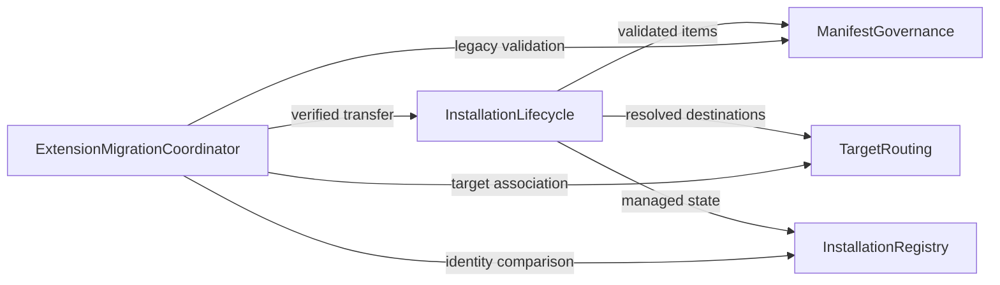

# Component Catalogue


```yaml
components:
  - name: ManifestGovernance
    summary: Validates root manifests and derives the governed archive inventory.
    behaviour: >
      Accepts an archive only when exactly one root deployment-manifest.yml is
      present, resolves archive-relative item paths, and rejects traversal or
      invalid governed inventory before target writes begin.
    responsibilities:
      - Root-manifest discovery and validation
      - Canonical items[] inventory selection
      - Archive path containment and content-integrity checks
    depends_on: []
    dependents:
      - component: InstallationLifecycle
        interaction: Supplies the validated manifest and governed artifact inventory.
      - component: ExtensionMigrationCoordinator
        interaction: Validates legacy governed content before comparison or transfer.
    external_dependencies:
      - name: ArchiveReader
        kind: other
        purpose: Reads ZIP entries as binary-safe archive content.
    entities:
      - name: BundleManifest
        identifier: bundleId
        attributes: [bundleId, version, items]
      - name: ManifestItem
        identifier: archivePath
        attributes: [archivePath, kind, contentHash]

  - name: TargetRouting
    summary: Resolves the target-and-scope destination for each governed item.
    behaviour: >
      Maps a selected supported target, installation scope, and manifest item
      kind to a contained runtime destination without making a runtime root or
      another target's layout part of lifecycle policy.
    responsibilities:
      - Target and scope isolation
      - Item-kind destination resolution
      - Destination containment validation
    depends_on: []
    dependents:
      - component: InstallationLifecycle
        interaction: Supplies the destination for each artifact write, update, and removal.
      - component: ExtensionMigrationCoordinator
        interaction: Resolves authoritative target locations for legacy comparison and transfer.
    external_dependencies:
      - name: TargetLayoutProvider
        kind: other
        purpose: Provides data-driven supported target and repository layouts.
    entities:
      - name: InstallationAddress
        identifier: targetScopeKey
        attributes: [target, scope, repositoryIdentity, destinationRoot]

  - name: InstallationRegistry
    summary: Owns shared installation identity and the managed artifact inventory.
    behaviour: >
      Stores and retrieves managed installations keyed by bundle identity,
      target, and scope. It records the destination path and installed hash of
      every managed artifact so update, uninstall, and cleanup preserve locally
      modified or unmanaged content.
    responsibilities:
      - Managed installation identity and isolation
      - Managed artifact hash inventory
      - User-scope XDG registry and repository lockfile persistence through ports
    depends_on: []
    dependents:
      - component: InstallationLifecycle
        interaction: Reads prior managed state and commits lifecycle results.
      - component: ExtensionMigrationCoordinator
        interaction: Compares legacy installation identity against target-managed state.
    external_dependencies:
      - name: AppStorage
        kind: other
        purpose: Resolves shared XDG cache and data roots for user-scope records.
      - name: RepositoryLockfileStore
        kind: other
        purpose: Persists repository-scope records within the selected repository.
    entities:
      - name: ManagedInstallation
        identifier: installationKey
        attributes: [bundleId, target, scope, repositoryIdentity, manifestVersion]
      - name: ManagedArtifact
        identifier: destinationPath
        attributes: [destinationPath, itemKind, installedHash]
        references:
          - entity: ManagedInstallation
            owned_by: InstallationRegistry
            relationship: each ManagedArtifact belongs to one ManagedInstallation

  - name: InstallationLifecycle
    summary: Executes the shared manifest-driven install, update, and uninstall use cases.
    behaviour: >
      Uses a governed manifest inventory, resolved target destinations, and the
      managed artifact record to write and verify binary content. On update it
      removes an omitted artifact only when its current bytes match the recorded
      hash; on uninstall it removes only artifacts still managed by the selected
      installation.
    responsibilities:
      - Shared install, update, and uninstall orchestration
      - Binary-safe write and read-back verification
      - Safe omitted-artifact and uninstall cleanup
    depends_on:
      - component: ManifestGovernance
        interaction: Obtains the validated canonical inventory.
        style: sync
      - component: TargetRouting
        interaction: Resolves contained target destinations.
        style: sync
      - component: InstallationRegistry
        interaction: Reads and updates managed installation state.
        style: sync
    dependents:
      - component: ExtensionMigrationCoordinator
        interaction: Performs verified transfers from legacy extension content.
    external_dependencies:
      - name: TargetArtifactStore
        kind: other
        purpose: Writes, reads, and removes target artifacts with containment and symlink safety.
    entities: []

  - name: ExtensionMigrationCoordinator
    summary: Temporarily coordinates activation-time migration of legacy extension installations.
    behaviour: >
      Runs before extension bundle commands, deterministically associates legacy
      records with one target and scope, checks the authoritative target before
      any transfer, and uses the shared lifecycle for transfer. It deletes legacy
      artifacts only after identity, byte-for-byte target, and post-cleanup
      verification; conflicts and retry-required outcomes preserve legacy data.
    responsibilities:
      - Legacy installation association and reconciliation
      - Authoritative-target comparison and verified duplicate cleanup
      - Conflict, overwrite, retry, and run-summary coordination
      - Temporary extension-owned migration policy marked for later extraction
    depends_on:
      - component: ManifestGovernance
        interaction: Validates legacy governed content before reconciliation.
        style: sync
      - component: TargetRouting
        interaction: Resolves the associated target and scope destinations.
        style: sync
      - component: InstallationRegistry
        interaction: Reads target installation identity and managed artifact hashes.
        style: sync
      - component: InstallationLifecycle
        interaction: Transfers content through the canonical shared lifecycle.
        style: sync
    dependents: []
    external_dependencies:
      - name: LegacyExtensionStore
        kind: other
        purpose: Reads and removes extension-managed legacy files within their verified root.
      - name: MigrationInteraction
        kind: other
        purpose: Presents VS Code notifications and obtains explicit overwrite decisions.
    entities:
      - name: LegacyInstallationCandidate
        identifier: legacyRecordId
        attributes: [legacyRecordId, bundleId, scope, repositoryIdentity, managedArtifacts]
```

## Component Diagram



## Component Summary

| Component | Purpose | Depends On | Dependents | Entities Owned |
| --- | --- | --- | --- | --- |
| ManifestGovernance | Root-manifest validation and governed inventory | None | InstallationLifecycle, ExtensionMigrationCoordinator | BundleManifest, ManifestItem |
| TargetRouting | Target/scope/item-kind destination resolution | None | InstallationLifecycle, ExtensionMigrationCoordinator | InstallationAddress |
| InstallationRegistry | Isolated installation and artifact records | None | InstallationLifecycle, ExtensionMigrationCoordinator | ManagedInstallation, ManagedArtifact |
| InstallationLifecycle | Shared install, update, and uninstall | ManifestGovernance, TargetRouting, InstallationRegistry | ExtensionMigrationCoordinator | None |
| ExtensionMigrationCoordinator | Activation-time legacy migration compatibility | ManifestGovernance, TargetRouting, InstallationRegistry, InstallationLifecycle | None | LegacyInstallationCandidate |

## Entity Ownership

| Entity | Owning Component | Identifier | Attributes | References |
| --- | --- | --- | --- | --- |
| BundleManifest | ManifestGovernance | bundleId | bundleId, version, items | None |
| ManifestItem | ManifestGovernance | archivePath | archivePath, kind, contentHash | None |
| InstallationAddress | TargetRouting | targetScopeKey | target, scope, repositoryIdentity, destinationRoot | None |
| ManagedInstallation | InstallationRegistry | installationKey | bundleId, target, scope, repositoryIdentity, manifestVersion | None |
| ManagedArtifact | InstallationRegistry | destinationPath | destinationPath, itemKind, installedHash | ManagedInstallation |
| LegacyInstallationCandidate | ExtensionMigrationCoordinator | legacyRecordId | legacyRecordId, bundleId, scope, repositoryIdentity, managedArtifacts | None |

## External Dependencies

| Component | Dependency | Kind | Purpose |
| --- | --- | --- | --- |
| ManifestGovernance | ArchiveReader | other | Binary-safe ZIP entry access |
| TargetRouting | TargetLayoutProvider | other | Data-driven runtime and repository layout data |
| InstallationRegistry | AppStorage | other | Shared XDG cache and data roots |
| InstallationRegistry | RepositoryLockfileStore | other | Repository-local installation records |
| InstallationLifecycle | TargetArtifactStore | other | Contained target writes, reads, and removals |
| ExtensionMigrationCoordinator | LegacyExtensionStore | other | Verified legacy extension storage access |
| ExtensionMigrationCoordinator | MigrationInteraction | other | VS Code conflict notification and explicit overwrite decision |

## Rationale

| Component | Why It Is Separate | Alternatives Rejected |
| --- | --- | --- |
| ManifestGovernance | Archive validation and manifest inventory change independently from target writes and migration. | Per-delivery archive parsing would preserve the current CLI/extension divergence. |
| TargetRouting | Layout rules change by supported target and scope, while lifecycle policy remains target-neutral. | A fixed runtime root would violate target-aware routing and repository isolation. |
| InstallationRegistry | Managed state has an independent lifecycle and supplies the proof required for safe update and uninstall cleanup. | Inferring state from current files cannot distinguish managed from locally modified content. |
| InstallationLifecycle | One reusable operation boundary prevents CLI and VS Code target-write policy from diverging. | A shared helper under separate lifecycle implementations would leave update and uninstall behavior duplicated. |
| ExtensionMigrationCoordinator | Legacy reconciliation is activation-specific and must keep VS Code interaction at the delivery edge during transition. | Immediate shared migration extraction broadens the first implementation PR; permanent extension ownership would retain policy duplication. |