# Prompt Registry Architecture

**Version:** 2.1  
**Last Updated:** November 9, 2025  
**Status:** Active Development

---

## Table of Contents

1. [System Overview](#system-overview)
2. [Architecture Principles](#architecture-principles)
3. [Component Architecture](#component-architecture)
4. [Data Flow](#data-flow)
5. [Adapter Pattern](#adapter-pattern)
6. [Authentication Model](#authentication-model)
7. [Installation Flow](#installation-flow)
8. [Update System](#update-system)
9. [UI Components](#ui-components)
10. [Cross-Platform Support](#cross-platform-support)
11. [Security Model](#security-model)
12. [Extension Points](#extension-points)

---

## System Overview

The Prompt Registry is a VS Code extension that provides a marketplace-style interface for discovering, installing, and managing GitHub Copilot prompt libraries from multiple sources (GitHub, GitLab, HTTP, local files, and curated collections).

### Key Features

- 🎨 **Visual Marketplace** - Browse and install prompts with rich metadata
- 🔌 **Multi-Source Support** - GitHub, GitLab, HTTP, local, and curated collections
- 📦 **Bundle Management** - Install, update, and uninstall prompt bundles
- 🔄 **Auto-Sync** - Automatic synchronization with GitHub Copilot
- 🌍 **Cross-Platform** - macOS, Linux, and Windows support
- 🔍 **Search & Filter** - Discover prompts by tags, content type, installed status, and keywords
- 🔐 **Private Repository Support** - VSCode auth, gh CLI, or explicit tokens
- ✅ **Collection Validation** - YAML validation and scaffolding tools

---

## Architecture Principles

### 1. **Separation of Concerns**
- **UI Layer**: WebView-based marketplace and tree views
- **Service Layer**: Business logic (installation, sync, registry management)
- **Adapter Layer**: Source-specific implementations
- **Storage Layer**: Persistent state management

### 2. **Adapter Pattern**
- Unified interface for different prompt sources
- Easy to extend with new source types
- Source-agnostic core services

### 3. **Event-Driven**
- React to bundle installations/uninstallations
- Update UI dynamically
- Fire events for extensibility

### 4. **Cross-Platform by Design**
- OS-specific path handling
- Platform-agnostic file operations
- Consistent behavior across environments

---

## Component Architecture

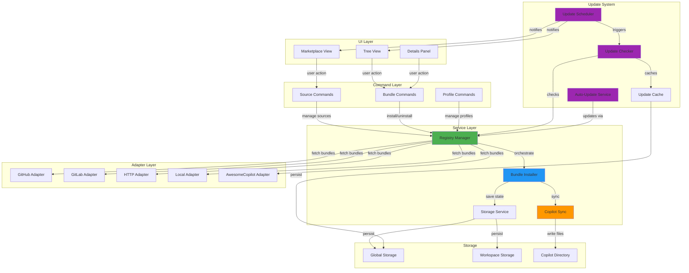
```mermaid
graph TB
    subgraph "UI Layer"
        MV[Marketplace View]
        TV[Tree View]
        DP[Details Panel]
    end
    
    subgraph "Command Layer"
        SC[Source Commands]
        BC[Bundle Commands]
        PC[Profile Commands]
    end
    
    subgraph "Service Layer"
        RM[Registry Manager]
        BI[Bundle Installer]
        CS[Copilot Sync]
        SS[Storage Service]
    end
    
    subgraph "Update System"
        US[Update Scheduler]
        UC[Update Checker]
        AUS[Auto-Update Service]
        UCA[Update Cache]
    end
    
    subgraph "Adapter Layer"
        GHA[GitHub Adapter]
        GLA[GitLab Adapter]
        HTA[HTTP Adapter]
        LCA[Local Adapter]
        ACA[AwesomeCopilot Adapter]
    end
    
    subgraph "Storage"
        GS[Global Storage]
        WS[Workspace Storage]
        CP[Copilot Directory]
    end
    
    MV -->|user action| SC
    TV -->|user action| BC
    DP -->|user action| BC
    
    SC -->|manage sources| RM
    BC -->|install/uninstall| RM
    PC -->|manage profiles| RM
    
    RM -->|orchestrate| BI
    RM -->|fetch bundles| GHA
    RM -->|fetch bundles| GLA
    RM -->|fetch bundles| HTA
    RM -->|fetch bundles| LCA
    RM -->|fetch bundles| ACA
    
    US -->|triggers| UC
    UC -->|checks| RM
    UC -->|caches| UCA
    AUS -->|updates via| RM
    US -->|notifies| MV
    US -->|notifies| TV
    
    BI -->|sync| CS
    BI -->|save state| SS
    
    CS -->|write files| CP
    SS -->|persist| GS
    SS -->|persist| WS
    UCA -->|persist| GS
    
    style RM fill:#4CAF50
    style BI fill:#2196F3
    style CS fill:#FF9800
    style US fill:#9C27B0
    style UC fill:#9C27B0
    style AUS fill:#9C27B0
```

### Component Responsibilities

#### **UI Layer**

| Component | Responsibility |
|-----------|---------------|
| **MarketplaceViewProvider** | Visual marketplace with tiles, search, filters |
| **RegistryTreeProvider** | Hierarchical tree view of sources and bundles |
| **Details Panel** | Full bundle information with content breakdown |

#### **Service Layer**

| Component | Responsibility |
|-----------|---------------|
| **RegistryManager** | Orchestrates sources, bundles, and installations |
| **BundleInstaller** | Handles bundle extraction, validation, and installation (includes MCP integration) |
| **McpServerManager** | Manages MCP server installation, uninstallation, and tracking |
| **McpConfigService** | Reads/writes VS Code's mcp.json configuration with atomic operations |
| **CopilotSyncService** | Syncs installed bundles to Copilot directories |
| **StorageService** | Manages persistent state (sources, installations, profiles) |
| **UpdateScheduler** | Manages timing of update checks (startup, daily/weekly/manual) |
| **UpdateChecker** | Detects available updates by comparing installed vs latest versions |
| **AutoUpdateService** | Performs background bundle updates with rollback on failure |
| **UpdateCache** | Caches update check results with configurable TTL |
| **NotificationManager** | Central service for user notifications |

#### **Adapter Layer**

| Component | Source Type | Capabilities |
|-----------|------------|--------------|
| **GitHubAdapter** | GitHub repos | Fetches releases, assets, with authentication |
| **GitLabAdapter** | GitLab repos | Fetches releases, raw files |
| **HTTPAdapter** | HTTP/HTTPS | Downloads zip bundles from URLs |
| **LocalAdapter** | File system | Installs from local directories |
| **AwesomeCopilotAdapter** | GitHub collections | Fetches YAML collections with authentication, builds zips on-the-fly |

---

## Authentication Model

### Overview

Both `GitHubAdapter` and `AwesomeCopilotAdapter` support private GitHub repositories through a three-tier authentication fallback chain implemented in November 2025.

### Authentication Chain

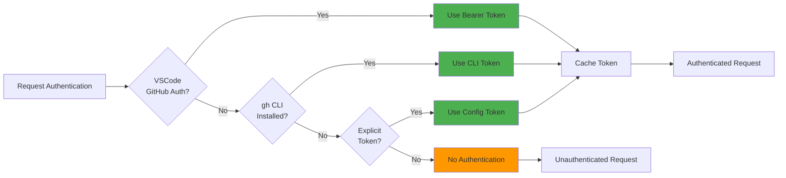
```mermaid
graph LR
    START[Request Authentication]
    
    START --> VSCODE{VSCode<br/>GitHub Auth?}
    VSCODE -->|Yes| USE_VS[Use Bearer Token]
    VSCODE -->|No| GHCLI{gh CLI<br/>Installed?}
    
    GHCLI -->|Yes| USE_GH[Use CLI Token]
    GHCLI -->|No| EXPLICIT{Explicit<br/>Token?}
    
    EXPLICIT -->|Yes| USE_EX[Use Config Token]
    EXPLICIT -->|No| NONE[No Authentication]
    
    USE_VS --> CACHE[Cache Token]
    USE_GH --> CACHE
    USE_EX --> CACHE
    
    CACHE --> AUTH[Authenticated Request]
    NONE --> UNAUTH[Unauthenticated Request]
    
    style USE_VS fill:#4CAF50
    style USE_GH fill:#4CAF50
    style USE_EX fill:#4CAF50
    style NONE fill:#FF9800
```

### Implementation Details

**Method**: `getAuthenticationToken()`  
**Location**: `src/adapters/GitHubAdapter.ts`, `src/adapters/AwesomeCopilotAdapter.ts`

```typescript
private async getAuthenticationToken(): Promise<string | undefined> {
    // 1. Try VSCode GitHub authentication
    const session = await vscode.authentication.getSession('github', ['repo'], { silent: true });
    if (session) return session.accessToken;
    
    // 2. Try GitHub CLI
    const { stdout } = await execAsync('gh auth token');
    if (stdout.trim()) return stdout.trim();
    
    // 3. Try explicit token from source config
    const explicitToken = this.getAuthToken();
    if (explicitToken) return explicitToken;
    
    // 4. No authentication
    return undefined;
}
```

### Token Format

**Bearer Token** (OAuth 2.0 standard):
```typescript
headers['Authorization'] = `Bearer ${token}`;
```

**Not** the deprecated format:
```typescript
// ❌ Deprecated
headers['Authorization'] = `token ${token}`;
```

### Logging

Authentication status is logged for debugging:

```
[GitHubAdapter] Attempting authentication...
[GitHubAdapter] ✓ Using VSCode GitHub authentication
[GitHubAdapter] Token preview: gho_abc12...
[GitHubAdapter] Request to https://api.github.com/... with auth (method: vscode)
```

Failures are also logged:

```
[GitHubAdapter] ✗ No authentication available
[GitHubAdapter] HTTP 404: Not Found - Repository not found or not accessible
```

### Token Caching

Tokens are cached after first successful retrieval:
- Reduces authentication overhead
- Persists for adapter instance lifetime
- Tracks which method was successful

---

## Data Flow

### Bundle Discovery Flow

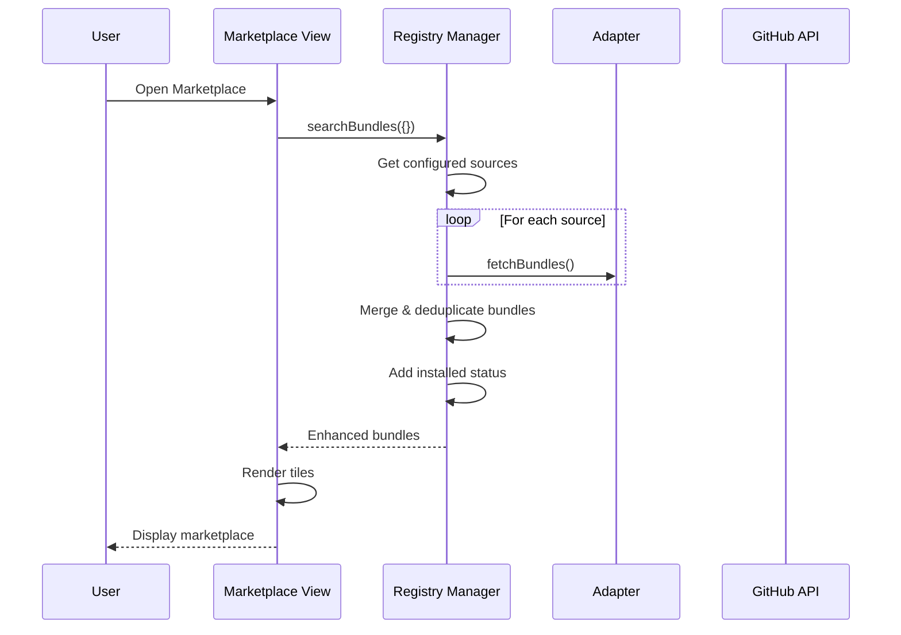
```mermaid
sequenceDiagram
    participant U as User
    participant MV as Marketplace View
    participant RM as Registry Manager
    participant A as Adapter
    participant GH as GitHub API
    
    U->>MV: Open Marketplace
    MV->>RM: searchBundles({})
    RM->>RM: Get configured sources
    
    loop For each source
        RM->>A: fetchBundles()
    end
    
    RM->>RM: Merge & deduplicate bundles
    RM->>RM: Add installed status
    RM-->>MV: Enhanced bundles
    MV->>MV: Render tiles
    MV-->>U: Display marketplace
```

### Bundle Installation Flow (AwesomeCopilot)

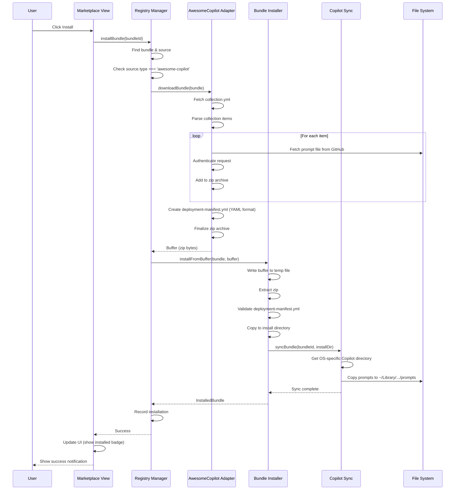
```mermaid
sequenceDiagram
    participant U as User
    participant MV as Marketplace View
    participant RM as Registry Manager
    participant ACA as AwesomeCopilot Adapter
    participant BI as Bundle Installer
    participant CS as Copilot Sync
    participant FS as File System
    
    U->>MV: Click Install
    MV->>RM: installBundle(bundleId)
    RM->>RM: Find bundle & source
    RM->>RM: Check source.type === 'awesome-copilot'
    
    RM->>ACA: downloadBundle(bundle)
    ACA->>ACA: Fetch collection.yml
    ACA->>ACA: Parse collection items
    
    loop For each item
        ACA->>FS: Fetch prompt file from GitHub
        ACA->>ACA: Authenticate request
        ACA->>ACA: Add to zip archive
    end
    
    ACA->>ACA: Create deployment-manifest.yml (YAML format)
    ACA->>ACA: Finalize zip archive
    ACA-->>RM: Buffer (zip bytes)
    
    RM->>BI: installFromBuffer(bundle, buffer)
    BI->>BI: Write buffer to temp file
    BI->>BI: Extract zip
    BI->>BI: Validate deployment-manifest.yml
    BI->>BI: Copy to install directory
    BI->>CS: syncBundle(bundleId, installDir)
    
    CS->>CS: Get OS-specific Copilot directory
    CS->>FS: Copy prompts to ~/Library/.../prompts
    CS-->>BI: Sync complete
    
    BI-->>RM: InstalledBundle
    RM->>RM: Record installation
    RM-->>MV: Success
    MV->>MV: Update UI (show installed badge)
    MV-->>U: Show success notification
```

### Bundle Installation Flow (URL-based)

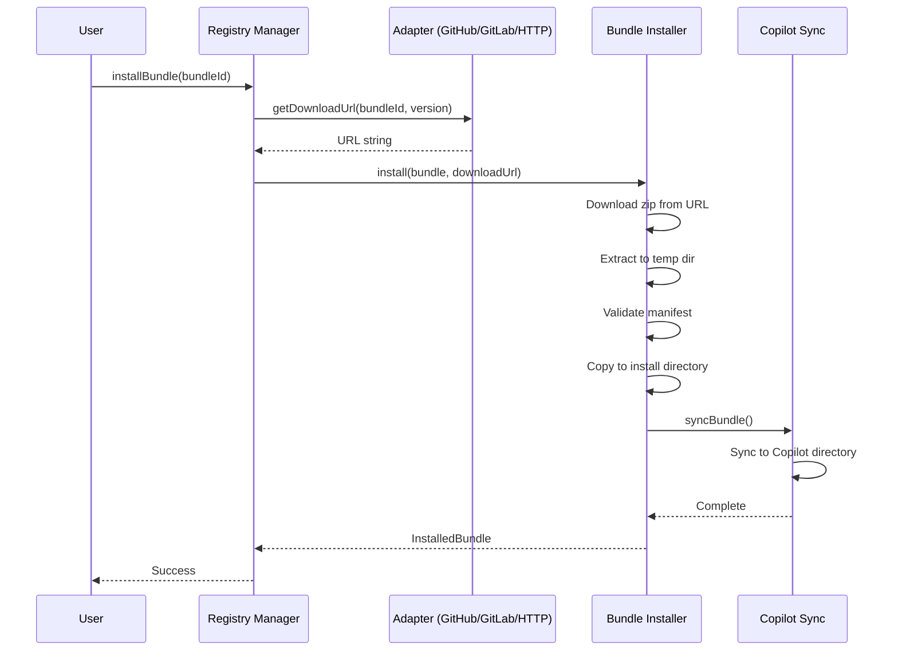
```mermaid
sequenceDiagram
    participant U as User
    participant RM as Registry Manager
    participant A as Adapter (GitHub/GitLab/HTTP)
    participant BI as Bundle Installer
    participant CS as Copilot Sync
    
    U->>RM: installBundle(bundleId)
    RM->>A: getDownloadUrl(bundleId, version)
    A-->>RM: URL string
    
    RM->>BI: install(bundle, downloadUrl)
    BI->>BI: Download zip from URL
    BI->>BI: Extract to temp dir
    BI->>BI: Validate manifest
    BI->>BI: Copy to install directory
    BI->>CS: syncBundle()
    CS->>CS: Sync to Copilot directory
    CS-->>BI: Complete
    BI-->>RM: InstalledBundle
    RM-->>U: Success
```

---

## Adapter Pattern

### IRepositoryAdapter Interface

```typescript
interface IRepositoryAdapter {
    // Fetch all bundles from this source
    fetchBundles(): Promise<Bundle[]>;
    
    // Download a specific bundle (returns zip Buffer)
    downloadBundle(bundle: Bundle): Promise<Buffer>;
    
    // Get metadata about the source
    fetchMetadata(): Promise<SourceMetadata>;
    
    // Validate source configuration
    validate(): Promise<ValidationResult>;
    
    // Get URLs for bundles
    getManifestUrl(bundleId: string, version: string): string;
    getDownloadUrl(bundleId: string, version: string): string;
}
```

### Adapter Comparison

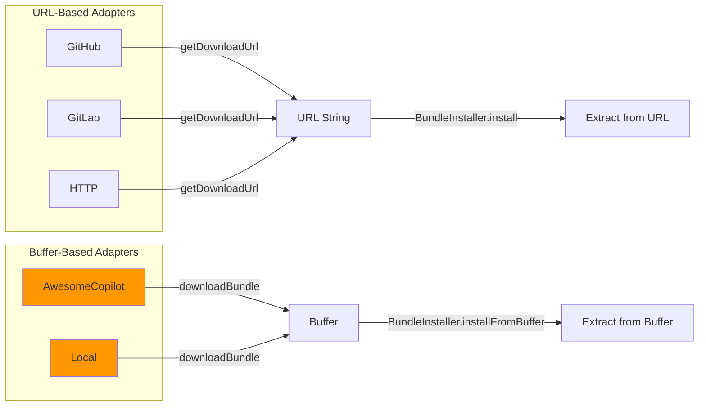
```mermaid
graph LR
    subgraph "URL-Based Adapters"
        GHA[GitHub]
        GLA[GitLab]
        HTA[HTTP]
    end
    
    subgraph "Buffer-Based Adapters"
        ACA[AwesomeCopilot]
        LCA[Local]
    end
    
    GHA -->|getDownloadUrl| URL[URL String]
    GLA -->|getDownloadUrl| URL
    HTA -->|getDownloadUrl| URL
    
    ACA -->|downloadBundle| BUF[Buffer]
    LCA -->|downloadBundle| BUF
    
    URL -->|BundleInstaller.install| EXTRACT[Extract from URL]
    BUF -->|BundleInstaller.installFromBuffer| EXTRACT2[Extract from Buffer]
    
    style ACA fill:#FF9800
    style LCA fill:#FF9800
```

### Why Two Installation Paths?

**URL-Based Installation** (`install()`):
- For pre-packaged zip bundles on remote servers
- Direct download from URL
- Used by: GitHub, GitLab, HTTP adapters

**Buffer-Based Installation** (`installFromBuffer()`):
- For dynamically created bundles
- Builds zip in memory
- Used by: AwesomeCopilot (builds from YAML), Local (zips directory)

---

## Installation Flow

### Directory Structure

```
Extension Storage
├── bundles/                          # Installed bundles
│   ├── testing-automation/
│   │   ├── deployment-manifest.yml
│   │   └── prompts/
│   │       └── testing-prompt.prompt.md
│   └── code-review/
│       ├── deployment-manifest.yml
│       └── prompts/
│           ├── review.prompt.md
│           └── checklist.instructions.md
└── registry.json                     # Sources and installation records

Copilot Directory (macOS)
~/Library/Application Support/Code/User/prompts/
├── testing-automation/
│   └── testing-prompt.prompt.md
└── code-review/
    ├── review.prompt.md
    └── checklist.instructions.md
```

### Installation Steps

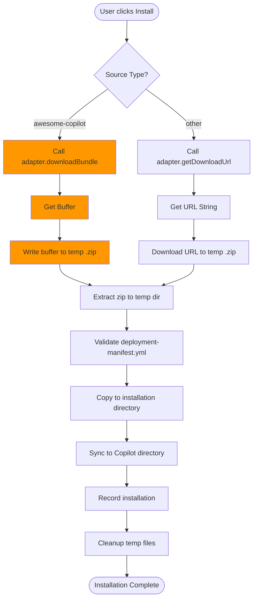
```mermaid
graph TD
    START([User clicks Install])
    
    START --> CHECK{Source Type?}
    
    CHECK -->|awesome-copilot| DL1[Call adapter.downloadBundle]
    CHECK -->|other| DL2[Call adapter.getDownloadUrl]
    
    DL1 --> BUF[Get Buffer]
    DL2 --> URL[Get URL String]
    
    BUF --> WRITE[Write buffer to temp .zip]
    URL --> DOWN[Download URL to temp .zip]
    
    WRITE --> EXTRACT[Extract zip to temp dir]
    DOWN --> EXTRACT
    
    EXTRACT --> VALID[Validate deployment-manifest.yml]
    VALID --> COPY[Copy to installation directory]
    COPY --> SYNC[Sync to Copilot directory]
    SYNC --> RECORD[Record installation]
    RECORD --> CLEANUP[Cleanup temp files]
    CLEANUP --> DONE([Installation Complete])
    
    style DL1 fill:#FF9800
    style BUF fill:#FF9800
    style WRITE fill:#FF9800
```

---

## Update System

The Update System provides automatic detection and installation of bundle updates with configurable scheduling and notifications.

### Update System Architecture

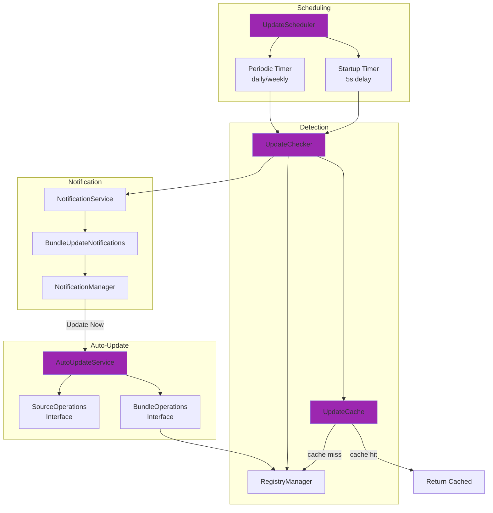
```mermaid
graph TB
    subgraph "Scheduling"
        US[UpdateScheduler]
        ST[Startup Timer<br/>5s delay]
        PT[Periodic Timer<br/>daily/weekly]
    end
    
    subgraph "Detection"
        UC[UpdateChecker]
        UCA[UpdateCache]
        RM[RegistryManager]
    end
    
    subgraph "Notification"
        NS[NotificationService]
        BN[BundleUpdateNotifications]
        NM[NotificationManager]
    end
    
    subgraph "Auto-Update"
        AUS[AutoUpdateService]
        BO[BundleOperations<br/>Interface]
        SO[SourceOperations<br/>Interface]
    end
    
    US --> ST
    US --> PT
    ST --> UC
    PT --> UC
    
    UC --> UCA
    UC --> RM
    UCA -->|cache hit| RET[Return Cached]
    UCA -->|cache miss| RM
    
    UC --> NS
    NS --> BN
    BN --> NM
    
    NM -->|Update Now| AUS
    AUS --> BO
    AUS --> SO
    BO --> RM
    
    style US fill:#9C27B0
    style UC fill:#9C27B0
    style AUS fill:#9C27B0
    style UCA fill:#9C27B0
```

### Update Check Flow

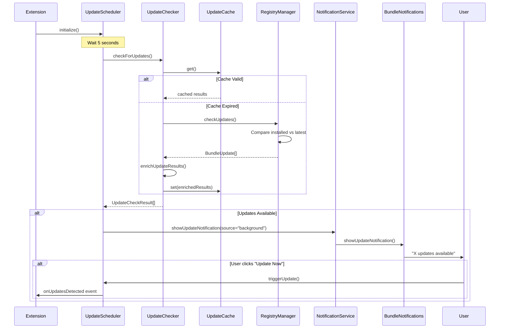
```mermaid
sequenceDiagram
    participant EXT as Extension
    participant US as UpdateScheduler
    participant UC as UpdateChecker
    participant UCA as UpdateCache
    participant RM as RegistryManager
    participant NS as NotificationService
    participant BN as BundleNotifications
    participant USER as User
    
    EXT->>US: initialize()
    Note over US: Wait 5 seconds
    US->>UC: checkForUpdates()
    
    UC->>UCA: get()
    alt Cache Valid
        UCA-->>UC: cached results
    else Cache Expired
        UC->>RM: checkUpdates()
        RM->>RM: Compare installed vs latest
        RM-->>UC: BundleUpdate[]
        UC->>UC: enrichUpdateResults()
        UC->>UCA: set(enrichedResults)
    end
    
    UC-->>US: UpdateCheckResult[]
    
    alt Updates Available
        US->>NS: showUpdateNotification(source="background")
        NS->>BN: showUpdateNotification()
        BN->>USER: "X updates available"
        
        alt User clicks "Update Now"
            USER->>US: triggerUpdate()
            US->>EXT: onUpdatesDetected event
        end
    end
```

### Auto-Update Flow

The auto-update system uses a **hybrid approach**: the global `autoUpdate` setting acts as a gate, and only bundles with per-bundle auto-update enabled will install automatically in the background.

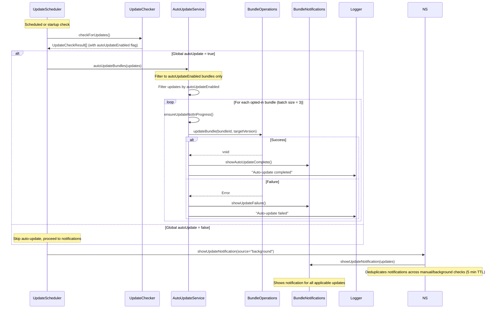
```mermaid
sequenceDiagram
    participant US as UpdateScheduler
    participant UC as UpdateChecker
    participant AUS as AutoUpdateService
    participant BO as BundleOperations
    participant BN as BundleNotifications
    participant LOG as Logger
    
    Note over US: Scheduled or startup check
    
    US->>UC: checkForUpdates()
    UC-->>US: UpdateCheckResult[] (with autoUpdateEnabled flag)
    
    alt Global autoUpdate = true
        US->>AUS: autoUpdateBundles(updates)
        
        Note over AUS: Filter to autoUpdateEnabled bundles only
        AUS->>AUS: Filter updates by autoUpdateEnabled
        
        loop For each opted-in bundle (batch size = 3)
            AUS->>AUS: ensureUpdateNotInProgress()
            AUS->>BO: updateBundle(bundleId, targetVersion)
            
            alt Success
                BO-->>AUS: void
                AUS->>BN: showAutoUpdateComplete()
                AUS->>LOG: "Auto-update completed"
            else Failure
                BO-->>AUS: Error
                AUS->>BN: showUpdateFailure()
                AUS->>LOG: "Auto-update failed"
            end
        end
    else Global autoUpdate = false
        Note over US: Skip auto-update, proceed to notifications
    end
    
    US->>NS: showUpdateNotification(source="background")
    NS->>BN: showUpdateNotification(updates)
    Note over NS: Deduplicates notifications across manual/background checks (5 min TTL)
    Note over BN: Shows notification for all applicable updates
```

### Configuration Options

| Setting | Type | Default | Description |
|---------|------|---------|-------------|
| `updateCheck.enabled` | boolean | `true` | Enable automatic update checks |
| `updateCheck.frequency` | enum | `daily` | Check frequency: `daily`, `weekly`, `manual` |
| `updateCheck.notificationPreference` | enum | `all` | Notifications: `all`, `critical`, `none` |
| `updateCheck.autoUpdate` | boolean | `false` | Global gate for background auto-updates |
| `updateCheck.cacheTTL` | number | `300000` | Cache TTL in milliseconds (5 min default) |

**Important:** For a bundle to auto-update in the background, **both** conditions must be true:
1. Global `updateCheck.autoUpdate` must be `true` (read by `AutoUpdatePreferenceManager.isGlobalAutoUpdateEnabled()` and `UpdateScheduler`)
2. Per-bundle auto-update preference must be enabled (managed by `AutoUpdatePreferenceManager` and surfaced via UI toggles)

Per-bundle preferences are stored in `RegistryStorage` and exposed to UI components through `AutoUpdateService.getAllAutoUpdatePreferences()` so that tree views and the marketplace can render auto-update status without per-bundle storage calls.

### Dependency Injection Pattern

To avoid circular dependencies between `AutoUpdateService` and `RegistryManager`, the service uses interface-based dependency injection:

```typescript
// Focused interfaces for DI
interface BundleOperations {
    updateBundle(bundleId: string, version?: string): Promise<void>;
    listInstalledBundles(): Promise<InstalledBundle[]>;
    getBundleDetails(bundleId: string): Promise<Bundle>;
}

interface SourceOperations {
    listSources(): Promise<RegistrySource[]>;
    syncSource(sourceId: string): Promise<void>;
}

// AutoUpdateService receives operations, not RegistryManager
class AutoUpdateService {
    constructor(
        private readonly bundleOps: BundleOperations,
        private readonly sourceOps: SourceOperations,
        private readonly bundleNotifications: BundleUpdateNotifications,
        private readonly storage: RegistryStorage
    ) {}
}
```

### Concurrency Control

- **Batch Size**: 3 concurrent updates (prevents API rate limiting)
- **Active Updates Set**: Prevents duplicate update operations for same bundle
- **Check-in-Progress Flag**: Prevents overlapping update check cycles

---

## UI Components

### Marketplace View Architecture

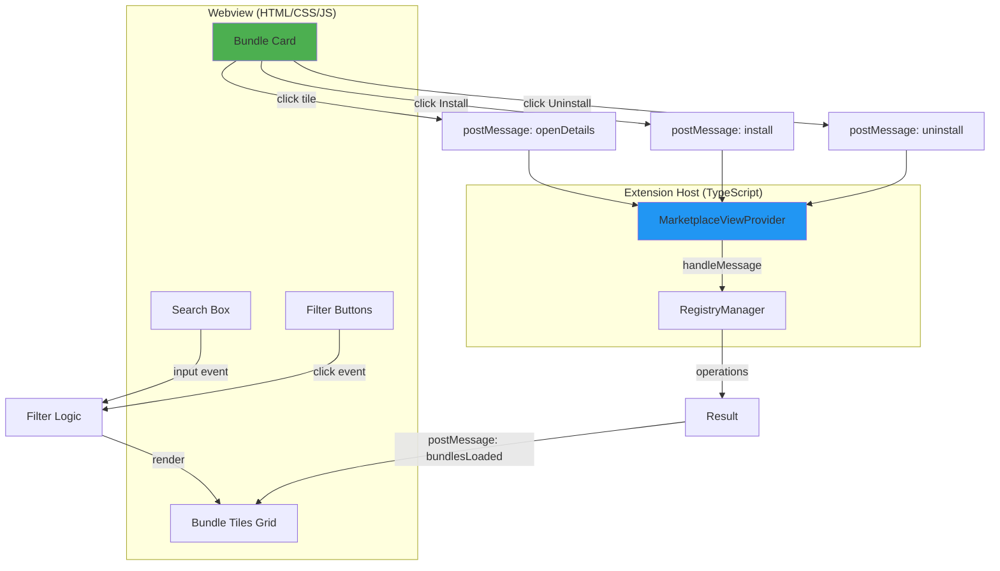
```mermaid
graph TB
    subgraph "Webview (HTML/CSS/JS)"
        SEARCH[Search Box]
        FILTERS[Filter Buttons]
        GRID[Bundle Tiles Grid]
        TILE[Bundle Card]
    end
    
    subgraph "Extension Host (TypeScript)"
        MVP[MarketplaceViewProvider]
        RM[RegistryManager]
    end
    
    SEARCH -->|input event| FILTER_LOGIC[Filter Logic]
    FILTERS -->|click event| FILTER_LOGIC
    FILTER_LOGIC -->|render| GRID
    
    TILE -->|click tile| MSG1[postMessage: openDetails]
    TILE -->|click Install| MSG2[postMessage: install]
    TILE -->|click Uninstall| MSG3[postMessage: uninstall]
    
    MSG1 --> MVP
    MSG2 --> MVP
    MSG3 --> MVP
    
    MVP -->|handleMessage| RM
    RM -->|operations| RESULT[Result]
    RESULT -->|postMessage: bundlesLoaded| GRID
    
    style TILE fill:#4CAF50
    style MVP fill:#2196F3
```

### Marketplace Interactions

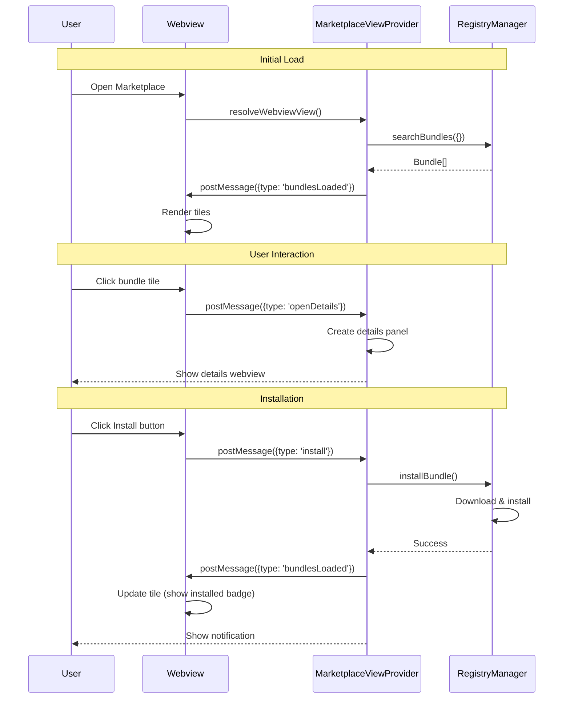
```mermaid
sequenceDiagram
    participant U as User
    participant WV as Webview
    participant MVP as MarketplaceViewProvider
    participant RM as RegistryManager
    
    Note over U,RM: Initial Load
    U->>WV: Open Marketplace
    WV->>MVP: resolveWebviewView()
    MVP->>RM: searchBundles({})
    RM-->>MVP: Bundle[]
    MVP->>WV: postMessage({type: 'bundlesLoaded'})
    WV->>WV: Render tiles
    
    Note over U,RM: User Interaction
    U->>WV: Click bundle tile
    WV->>MVP: postMessage({type: 'openDetails'})
    MVP->>MVP: Create details panel
    MVP-->>U: Show details webview
    
    Note over U,RM: Installation
    U->>WV: Click Install button
    WV->>MVP: postMessage({type: 'install'})
    MVP->>RM: installBundle()
    RM->>RM: Download & install
    RM-->>MVP: Success
    MVP->>WV: postMessage({type: 'bundlesLoaded'})
    WV->>WV: Update tile (show installed badge)
    MVP-->>U: Show notification
```

### Tree View Structure

```
PROMPT REGISTRY
├── 📦 MARKETPLACE (virtual node)
├── 🌍 REGISTRY EXPLORER
│   ├── 📁 My Profiles
│   │   ├── 🏢 Work Projects
│   │   │   ├── ✅ testing-automation (v1.0.0)
│   │   │   └── ✅ code-review (v1.2.0)
│   │   └── 🏠 Personal
│   └── 📁 QA
│       └── ✅ awesome-copilot (Awesome Copilot Collection)
└── 🔧 Sources
    ├── ✅ awesome-copilot (Awesome Copilot Collection)
    └── ✅ local-prompts (Local Directory)
```

---

## Cross-Platform Support

### Path Resolution Strategy

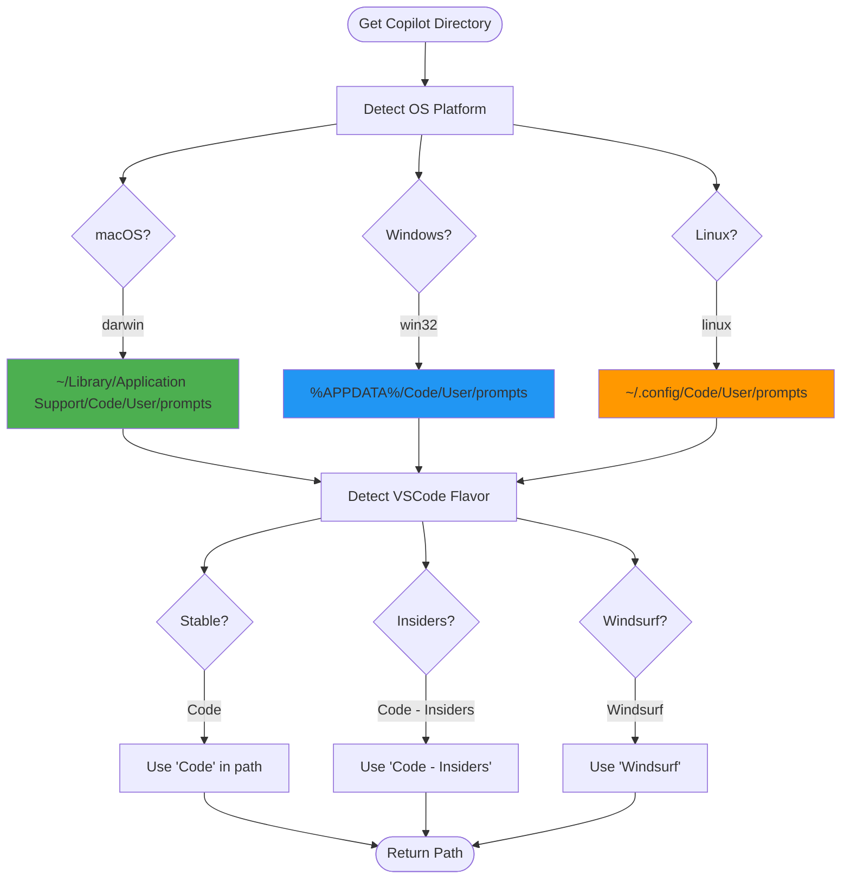
```mermaid
graph TD
    START([Get Copilot Directory])
    START --> DETECT[Detect OS Platform]
    
    DETECT --> MAC{macOS?}
    DETECT --> WIN{Windows?}
    DETECT --> LIN{Linux?}
    
    MAC -->|darwin| MACPATH["~/Library/Application Support/Code/User/prompts"]
    WIN -->|win32| WINPATH["%APPDATA%/Code/User/prompts"]
    LIN -->|linux| LINPATH["~/.config/Code/User/prompts"]
    
    MACPATH --> FLAVOR[Detect VSCode Flavor]
    WINPATH --> FLAVOR
    LINPATH --> FLAVOR
    
    FLAVOR --> STABLE{Stable?}
    FLAVOR --> INSIDERS{Insiders?}
    FLAVOR --> WINDSURF{Windsurf?}
    
    STABLE -->|Code| PATH1[Use 'Code' in path]
    INSIDERS -->|Code - Insiders| PATH2[Use 'Code - Insiders']
    WINDSURF -->|Windsurf| PATH3[Use 'Windsurf']
    
    PATH1 --> DONE([Return Path])
    PATH2 --> DONE
    PATH3 --> DONE
    
    style MACPATH fill:#4CAF50
    style WINPATH fill:#2196F3
    style LINPATH fill:#FF9800
```

### Platform-Specific Considerations

| Platform | Base Directory | Path Separator | Special Handling |
|----------|---------------|----------------|------------------|
| **macOS** | `~/Library/Application Support/` | `/` | Space in path requires proper escaping |
| **Windows** | `%APPDATA%/` | `\` or `/` | Use `path.join()` for cross-compatibility |
| **Linux** | `~/.config/` | `/` | Standard Unix paths |

---

## Security Model

### Trust Boundaries

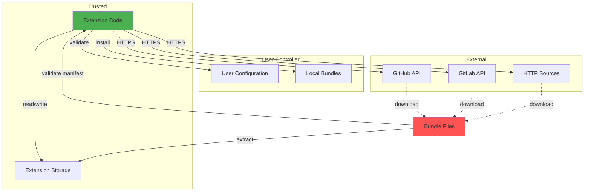
```mermaid
graph TB
    subgraph "Trusted"
        EXT[Extension Code]
        STORAGE[Extension Storage]
    end
    
    subgraph "User Controlled"
        CONFIG[User Configuration]
        LOCAL[Local Bundles]
    end
    
    subgraph "External"
        GH[GitHub API]
        GL[GitLab API]
        HTTP[HTTP Sources]
    end
    
    EXT -->|read/write| STORAGE
    EXT -->|validate| CONFIG
    EXT -->|install| LOCAL
    
    EXT -->|HTTPS| GH
    EXT -->|HTTPS| GL
    EXT -->|HTTPS| HTTP
    
    GH -.->|download| BUNDLE[Bundle Files]
    GL -.->|download| BUNDLE
    HTTP -.->|download| BUNDLE
    
    BUNDLE -->|validate manifest| EXT
    BUNDLE -->|extract| STORAGE
    
    style BUNDLE fill:#FF5252
    style EXT fill:#4CAF50
```

### Validation Steps

1. **Source Validation**
   - Verify URL format
   - Check repository accessibility
   - Validate authentication tokens

2. **Bundle Validation**
   - Verify zip archive integrity
   - Validate `deployment-manifest.yml` schema
   - Check for required fields
   - Verify file paths (no `../` escaping)

3. **Content Validation**
   - Validate file extensions (`.prompt.md`, `.instructions.md`, etc.)
   - Check file size limits
   - Scan for malicious content patterns

4. **Installation Validation**
   - Verify installation directory permissions
   - Check disk space availability
   - Ensure no conflicts with existing bundles

---

## Extension Points

### Adding a New Adapter

```typescript
// 1. Implement IRepositoryAdapter
export class MyCustomAdapter implements IRepositoryAdapter {
    constructor(private config: MyAdapterConfig) {}
    
    async fetchBundles(): Promise<Bundle[]> {
        // Fetch from your source
    }
    
    async downloadBundle(bundle: Bundle): Promise<Buffer> {
        // Return zip Buffer or throw for URL-based
    }
    
    // ... implement other methods
}

// 2. Register in RegistryManager
RepositoryAdapterFactory.register('my-custom', MyCustomAdapter);

// 3. Add to SourceType union
export type SourceType = 'github' | 'gitlab' | 'http' | 'local' | 'awesome-copilot' | 'my-custom';
```

### Custom Bundle Format

```yaml
# deployment-manifest.yml (YAML format, not JSON)
version: "1.0"
id: "my-bundle"
name: "My Custom Bundle"
prompts:
  - id: "my-prompt"
    name: "My Prompt"
    type: "prompt"
    file: "prompts/my-prompt.prompt.md"
    tags: ["custom", "example"]
```

**Note**: The manifest uses YAML format (`.yml`), not JSON.

### Event Hooks

```typescript
// Listen for bundle installations
registryManager.onBundleInstalled((installed: InstalledBundle) => {
    console.log(`Bundle installed: ${installed.bundleId}`);
});

// Listen for bundle uninstallations
registryManager.onBundleUninstalled((bundleId: string) => {
    console.log(`Bundle uninstalled: ${bundleId}`);
});
```

---

## Performance Considerations

### Caching Strategy

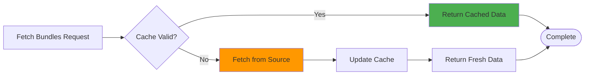
```mermaid
graph LR
    REQUEST[Fetch Bundles Request]
    
    REQUEST --> CACHE_CHECK{Cache Valid?}
    
    CACHE_CHECK -->|Yes| CACHE[Return Cached Data]
    CACHE_CHECK -->|No| FETCH[Fetch from Source]
    
    FETCH --> UPDATE[Update Cache]
    UPDATE --> RETURN[Return Fresh Data]
    
    CACHE --> END([Complete])
    RETURN --> END
    
    style CACHE fill:#4CAF50
    style FETCH fill:#FF9800
```

### Cache Settings

- **TTL**: 5 minutes for bundle listings
- **Invalidation**: Manual refresh or source changes
- **Storage**: In-memory cache + persistent storage

### Optimization Techniques

1. **Lazy Loading**: Load bundle details only when needed
2. **Parallel Fetching**: Fetch from multiple sources concurrently
3. **Incremental Search**: Filter locally before remote search
4. **Debounced Search**: Wait for user to finish typing
5. **Virtual Scrolling**: Render only visible tiles (for large lists)

---

## Error Handling

### Error Categories

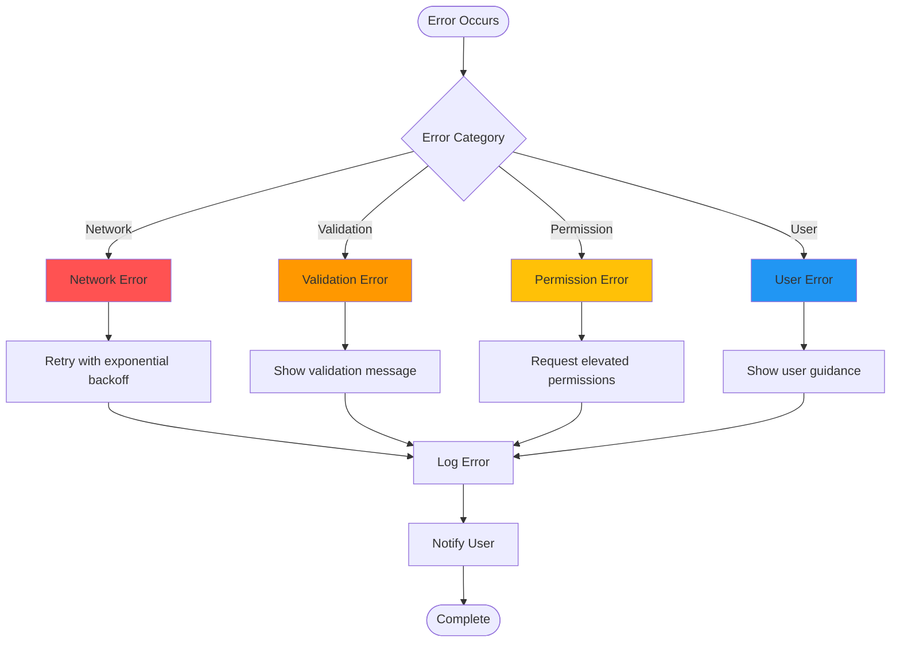
```mermaid
graph TD
    ERROR([Error Occurs])
    
    ERROR --> CAT{Error Category}
    
    CAT -->|Network| NET[Network Error]
    CAT -->|Validation| VAL[Validation Error]
    CAT -->|Permission| PERM[Permission Error]
    CAT -->|User| USER[User Error]
    
    NET --> RETRY[Retry with exponential backoff]
    VAL --> SHOW[Show validation message]
    PERM --> ESCALATE[Request elevated permissions]
    USER --> GUIDE[Show user guidance]
    
    RETRY --> LOG[Log Error]
    SHOW --> LOG
    ESCALATE --> LOG
    GUIDE --> LOG
    
    LOG --> NOTIFY[Notify User]
    NOTIFY --> DONE([Complete])
    
    style NET fill:#FF5252
    style VAL fill:#FF9800
    style PERM fill:#FFC107
    style USER fill:#2196F3
```

### Error Recovery

- **Transient Errors**: Automatic retry with backoff
- **Permanent Errors**: Clear error message + recovery steps
- **Partial Failures**: Continue with successful operations
- **Rollback**: Cleanup on installation failure

---

## Testing Strategy

### Test Pyramid

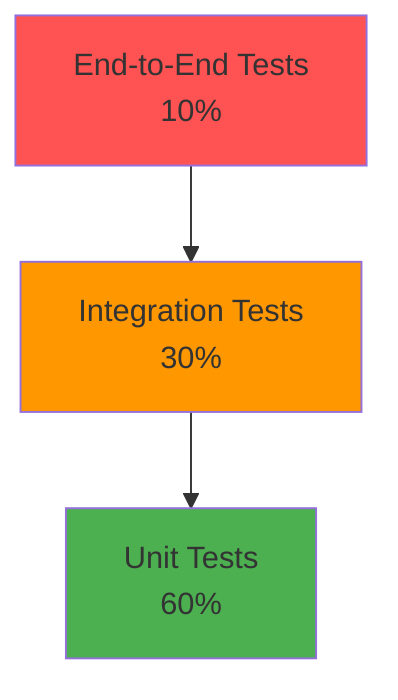
```mermaid
graph TD
    E2E[End-to-End Tests<br/>10%]
    INT[Integration Tests<br/>30%]
    UNIT[Unit Tests<br/>60%]
    
    E2E --> INT
    INT --> UNIT
    
    style E2E fill:#FF5252
    style INT fill:#FF9800
    style UNIT fill:#4CAF50
```

### Test Coverage

- **Unit Tests**: Adapters, services, utilities
- **Integration Tests**: Full installation flow, sync operations
- **UI Tests**: Webview interactions, command execution
- **Platform Tests**: macOS, Linux, Windows paths

---

## Deployment

### Release Process

1. **Version Bump**: Update `package.json` version
2. **Changelog**: Update `CHANGELOG.md`
3. **Build**: `npm run compile`
4. **Test**: `npm test`
5. **Package**: `vsce package`
6. **Publish**: `vsce publish` or manual upload

### Distribution Channels

- **VS Code Marketplace**: Primary distribution
- **Open VSX**: Alternative marketplace
- **GitHub Releases**: Manual installation
- **Enterprise**: Private registry

---
## MCP (Model Context Protocol) Integration

### Overview

The Prompt Registry extension provides seamless integration with the Model Context Protocol (MCP), allowing bundles to include MCP servers that extend Copilot's capabilities with custom tools, resources, and prompts.

### Key Features

- **Automatic Installation**: MCP servers defined in bundle manifests are automatically installed to VS Code's MCP configuration when the bundle is installed
- **Lifecycle Management**: MCP servers are tracked and automatically removed when the bundle is uninstalled
- **Visual Display**: MCP server configurations are displayed in the Marketplace detail view
- **Variable Substitution**: Supports dynamic variables like `${bundlePath}`, `${bundleId}`, and `${env:VAR_NAME}`
- **Scope Support**: MCP servers can be installed at user or workspace scope

### Architecture

```
Bundle Installation Flow:
┌─────────────────┐
│ Bundle Manifest │
│  mcpServers:    │
│   - server-1    │
│   - server-2    │
└────────┬────────┘
         │
         v
┌─────────────────────┐
│  BundleInstaller    │
│  installMcpServers()│
└────────┬────────────┘
         │
         v
┌─────────────────────┐
│ McpServerManager    │
│ - installServers()  │
│ - tracking metadata │
└────────┬────────────┘
         │
         v
┌─────────────────────┐
│  McpConfigService   │
│ - Write to mcp.json │
│ - Name mangling     │
│ - Conflict handling │
└─────────────────────┘
```

### Component Responsibilities

#### **BundleInstaller** (`src/services/BundleInstaller.ts`)
- Calls `installMcpServers()` after bundle files are extracted
- Calls `uninstallMcpServers()` during bundle removal
- Passes manifest's `mcpServers` configuration to McpServerManager

#### **McpServerManager** (`src/services/McpServerManager.ts`)
- Orchestrates MCP server installation/uninstallation
- Manages server naming (adds bundle prefix to avoid conflicts)
- Maintains tracking metadata for installed servers
- Handles variable substitution in commands and arguments

#### **McpConfigService** (`src/services/McpConfigService.ts`)
- Reads/writes VS Code's `mcp.json` configuration
- Implements atomic write operations with backup/rollback
- Handles server name conflicts and overwrites
- Performs variable substitution with bundle context

#### **MarketplaceViewProvider** (`src/ui/MarketplaceViewProvider.ts`)
- Displays MCP servers in bundle detail view
- Shows server configuration (command, args, env vars)
- Indicates enabled/disabled status with badges
- Provides visual feedback about MCP integration

### Bundle Manifest Schema

```yaml
mcpServers:
  server-name:
    command: string          # Required: executable command
    args: string[]           # Optional: command arguments
    env: Record<string, string>  # Optional: environment variables
    disabled: boolean        # Optional: disable server (default: false)
    description: string      # Optional: human-readable description
```

### Example Configuration

```yaml
id: my-bundle
name: My Bundle with MCP
version: 1.0.0

mcpServers:
  time-server:
    command: npx
    args:
      - "-y"
      - "@modelcontextprotocol/server-sequential-thinking"
    description: Provides current time information
    
  custom-server:
    command: node
    args:
      - "${bundlePath}/servers/custom.js"
    env:
      BUNDLE_ID: "${bundleId}"
      API_KEY: "${env:MY_API_KEY}"
    description: Custom operations for this bundle
```

### Variable Substitution

The following variables are supported in `command`, `args`, and `env` values:

| Variable | Description | Example |
|----------|-------------|---------|
| `${bundlePath}` | Absolute path to bundle installation directory | `/home/user/.vscode/...` |
| `${bundleId}` | Bundle identifier | `my-bundle` |
| `${bundleVersion}` | Bundle version | `1.0.0` |
| `${env:VAR_NAME}` | Environment variable value | `${env:API_KEY}` |

### Marketplace Display

The bundle detail view includes an **MCP Servers** section that shows:

1. **Server Count**: Number of MCP servers included
2. **Server Cards**: Each server displays:
   - Server name with ⚡ icon
   - Enabled/Disabled badge
   - Description (if provided)
   - Full command with arguments
   - Environment variables (if defined)

### CSS Styling

Custom CSS classes for MCP display:
- `.mcp-server-card` - Server card container
- `.mcp-server-header` - Server name and status
- `.mcp-server-command` - Command display with code block styling
- `.mcp-env-vars` - Environment variables section
- `.mcp-status-badge` - Status badge (enabled/disabled)
- `.mcp-status-enabled` - Green badge for enabled servers
- `.mcp-status-disabled` - Gray badge for disabled servers

### Installation Flow

1. **Bundle Install**: User installs bundle from Marketplace
2. **File Extraction**: BundleInstaller extracts bundle files
3. **Manifest Validation**: Validates `mcpServers` configuration
4. **Server Installation**: McpServerManager processes each server:
   - Adds bundle prefix to server name (e.g., `mybundle:time-server`)
   - Substitutes variables in command, args, and env
   - Writes configuration to `mcp.json`
   - Creates tracking metadata
5. **VS Code Integration**: MCP servers are immediately available to Copilot

### Uninstallation Flow

1. **Bundle Uninstall**: User removes bundle
2. **Server Cleanup**: McpServerManager:
   - Reads tracking metadata to find bundle's servers
   - Removes servers from `mcp.json`
   - Updates tracking metadata
3. **Atomic Operations**: All changes use backup/rollback for safety

### Testing

MCP integration is covered by:
- **Unit Tests**: `test/services/McpServerManager.test.ts`
- **Schema Validation**: `test/services/SchemaValidator.test.ts` (MCP-specific tests)
- **Integration Tests**: Bundle install/uninstall with MCP servers

### Error Handling

- **Missing Command**: Server installation fails if `command` is not provided
- **Invalid Variables**: Undefined variables are left as-is (not substituted)
- **Conflicts**: Server name conflicts can be handled with overwrite or skip options
- **Disabled Servers**: Servers with `disabled: true` are skipped during installation
- **Rollback**: Failed installations trigger automatic rollback of `mcp.json` changes

### Best Practices

1. **Naming**: Use descriptive server names that indicate functionality
2. **Descriptions**: Always provide `description` for user clarity
3. **Variables**: Use `${bundlePath}` for bundle-relative paths
4. **Environment**: Document required environment variables in bundle README
5. **Testing**: Test MCP servers independently before bundling
6. **Disabled**: Use `disabled: true` for optional or experimental servers

---


## Future Enhancements

### Roadmap

1. **Phase 1** (Current)
   - ✅ Multi-source support
   - ✅ Visual marketplace
   - ✅ Profile management
   - ✅ Cross-platform support

2. **Phase 2** (Planned)
   - 🔄 Automatic updates
   - 🔄 Bundle versioning
   - 🔄 Dependency management
   - 🔄 Bundle analytics

3. **Phase 3** (Future)
   - 📋 Bundle authoring tools
   - 📋 Community ratings/reviews
   - 📋 AI-powered recommendations
   - 📋 Collaborative prompt sharing

---

## Glossary

| Term | Definition |
|------|------------|
| **Bundle** | A package containing prompts, instructions, chat modes, and/or agents |
| **Source** | A configured repository or location for fetching bundles |
| **Adapter** | Implementation for a specific source type (GitHub, GitLab, etc.) |
| **Profile** | A collection of installed bundles grouped by project or team |
| **Manifest** | YAML file describing bundle contents and metadata |
| **Sync** | Copying installed bundles to GitHub Copilot's native directory |

---

## References

- [VS Code Extension API](https://code.visualstudio.com/api)
- [GitHub Copilot Documentation](https://docs.github.com/copilot)
- [Awesome Copilot Collection Spec](https://github.com/github/awesome-copilot)
- [Developer Guide](./DEVELOPER_GUIDE.md)
- [Quick Start Guide](./QUICK_START.md)
- [Testing Strategy](./TESTING_STRATEGY.md)

---

**Document Maintained By**: Development Team  
**For Questions**: See [CONTRIBUTING.md](./CONTRIBUTING.md)

---

## Scaffolding Architecture

### Overview

The scaffolding system provides project templates for creating GitHub Copilot prompt projects. It uses a flexible template engine with variable substitution and supports multiple scaffold types.

### Components

#### ScaffoldCommand

**File**: `src/commands/ScaffoldCommand.ts`

Orchestrates the scaffolding process:
- Prompts user for project details
- Loads the appropriate template
- Substitutes variables
- Copies files to target location

```typescript
export enum ScaffoldType {
    AwesomeCopilot = 'awesome-copilot',
    Basic = 'basic',
    Enterprise = 'enterprise'
}

class ScaffoldCommand {
    constructor(
        templateRoot?: string,
        scaffoldType: ScaffoldType = ScaffoldType.AwesomeCopilot
    );
    
    async execute(): Promise<void>;
}
```

#### TemplateEngine

**File**: `src/services/TemplateEngine.ts`

Handles template loading, rendering, and copying:
- Loads template manifests
- Renders templates with variable substitution
- Copies templates to target directories
- Creates directory structures

```typescript
interface TemplateManifest {
    id: string;
    name: string;
    version: string;
    description: string;
    author: string;
    templates: TemplateMetadata[];
}

class TemplateEngine {
    async loadManifest(): Promise<TemplateManifest>;
    async renderTemplate(templateId: string, variables: Record<string, string>): Promise<string>;
    async copyTemplate(templateId: string, targetPath: string, variables: Record<string, string>): Promise<void>;
    async scaffoldProject(projectPath: string, variables: Record<string, string>): Promise<void>;
}
```

### Template Structure

Templates are organized by type:

```
templates/scaffolds/{type}/
├── manifest.json              # Template metadata
├── package.json              # Project package template
├── README.md                 # Documentation template
├── prompts/                  # Sample prompts
├── instructions/             # Sample instructions
├── chatmodes/               # Sample chat modes
├── collections/             # Sample collections
└── workflows/               # Validation scripts
```

### Variable Substitution

Templates support variables in the format `{{VARIABLE_NAME}}`:

- `{{PROJECT_NAME}}` - Project name
- `{{PROJECT_DESCRIPTION}}` - Project description
- `{{AUTHOR}}` - Author name
- `{{VERSION}}` - Version (default: 1.0.0)
- `{{DATE}}` - Current date

The TemplateEngine replaces these variables during rendering.

---

## Validation Architecture

### Overview

The validation system uses JSON Schema for declarative validation with detailed error messages and best practice warnings.

### Components

#### SchemaValidator Service

**File**: `src/services/SchemaValidator.ts`

Provides JSON schema validation using AJV (Another JSON Validator):

```typescript
interface ValidationResult {
    valid: boolean;
    errors: string[];
    warnings: string[];
}

interface ValidationOptions {
    checkFileReferences?: boolean;
    workspaceRoot?: string;
}

class SchemaValidator {
    async validate(data: any, schemaPath: string, options?: ValidationOptions): Promise<ValidationResult>;
    async validateCollection(data: any, options?: ValidationOptions): Promise<ValidationResult>;
    clearCache(): void;
}
```

**Key Features:**
- **Schema Caching**: Compiled schemas are cached for performance
- **Custom Error Formatting**: AJV errors are converted to user-friendly messages
- **File Reference Checking**: Optional verification of referenced files
- **Best Practice Warnings**: Suggests improvements (e.g., missing version, long descriptions)

#### Collection Schema

**File**: `schemas/collection.schema.json`

JSON Schema (Draft-07) defining the collection structure:

```json
{
  "$schema": "http://json-schema.org/draft-07/schema#",
  "type": "object",
  "required": ["id", "name", "description", "items"],
  "properties": {
    "id": {
      "type": "string",
      "pattern": "^[a-z0-9-]+$"
    },
    "name": {
      "type": "string",
      "minLength": 1,
      "maxLength": 100
    },
    "description": {
      "type": "string",
      "minLength": 1,
      "maxLength": 500
    },
    "items": {
      "type": "array",
      "minItems": 0,
      "maxItems": 50,
      "items": {
        "type": "object",
        "required": ["path", "kind"],
        "properties": {
          "kind": {
            "enum": ["prompt", "instruction", "chat-mode", "agent"]
          }
        }
      }
    }
  }
}
```

#### ValidateCollectionsCommand

**File**: `src/commands/ValidateCollectionsCommand.ts`

Command for validating collection files:
- Iterates through collection files
- Uses SchemaValidator for validation
- Displays results in output channel
- Creates diagnostics for VS Code Problems panel

**Refactoring Benefit**: Previously had ~60 lines of manual validation logic. Now delegates to SchemaValidator, making the code cleaner and more maintainable.

### Validation Flow

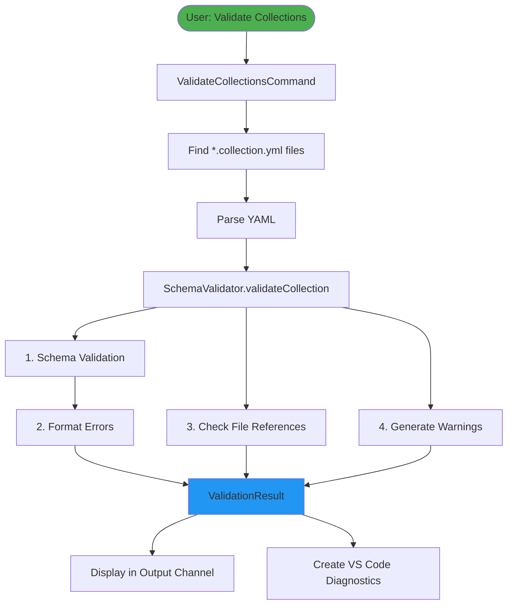
```mermaid
flowchart TD
    START([User: Validate Collections])
    CMD[ValidateCollectionsCommand]
    FIND[Find *.collection.yml files]
    PARSE[Parse YAML]
    VALIDATE[SchemaValidator.validateCollection]
    
    START --> CMD
    CMD --> FIND
    FIND --> PARSE
    PARSE --> VALIDATE
    
    VALIDATE --> SCHEMA[1. Schema Validation]
    SCHEMA --> FORMAT[2. Format Errors]
    VALIDATE --> FILES[3. Check File References]
    VALIDATE --> WARNINGS[4. Generate Warnings]
    
    FORMAT --> RESULT[ValidationResult]
    FILES --> RESULT
    WARNINGS --> RESULT
    
    RESULT --> DISPLAY[Display in Output Channel]
    RESULT --> DIAGNOSTICS[Create VS Code Diagnostics]
    
    style START fill:#4CAF50
    style RESULT fill:#2196F3
```

### Error Formatting

The SchemaValidator provides user-friendly error messages:

| Error Type | Example |
|------------|---------|
| Required field | `Missing required field: description` |
| Pattern mismatch | `/id: must match pattern ^[a-z0-9-]+$ (expected pattern: ^[a-z0-9-]+$)` |
| Type error | `/items/0/kind: must be string` |
| Enum violation | `kind: must be one of: prompt, instruction, chat-mode, agent` |
| Length violation | `description: must be at most 500 characters` |

### Performance Optimizations

1. **Schema Caching**: Compiled schemas are cached in a Map to avoid recompilation
2. **Lazy Loading**: Schemas are only loaded when first used
3. **Efficient File Checking**: File existence is checked only when `checkFileReferences` is enabled

