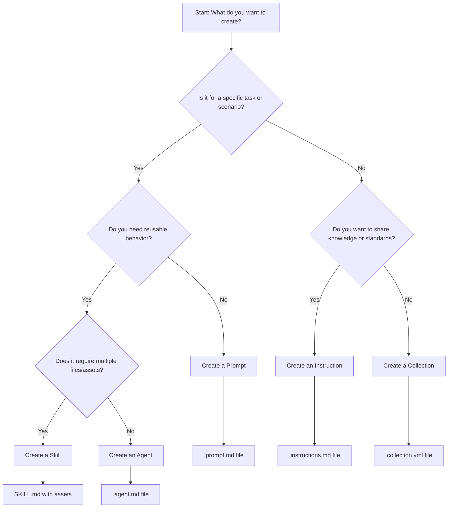
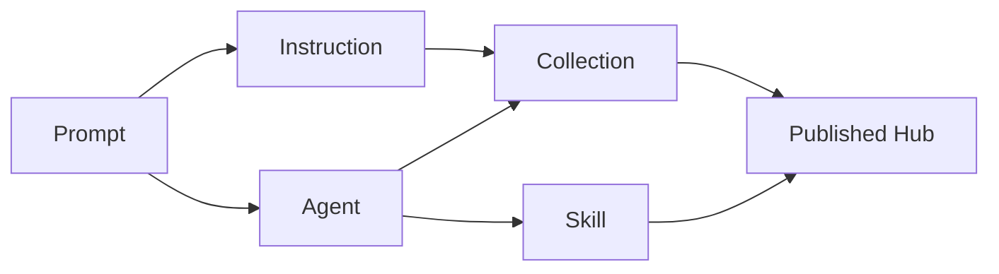

# Agentic Primitives Guide

This guide helps you choose the right type of agentic primitive for your use case in the Prompt Registry ecosystem.

## Decision Tree



## Primitive Types Comparison

| Primitive | Purpose | Complexity | When to Use | File Format | Key Features |
|-----------|---------|------------|-------------|-------------|--------------|
| **Prompt** | Single-task instructions | Low | Quick, specific tasks | `.prompt.md` | Simple, focused, reusable |
| **Instruction** | Team standards & guidelines | Medium | Sharing best practices | `.instructions.md` | Contextual, educational |
| **Agent** | AI persona with behavior | Medium-High | Specialized AI roles | `.agent.md` | Personality, expertise areas |
| **Skill** | Complex capabilities with assets | High | Multi-file functionality | `SKILL.md` + assets | Bundled resources, tools |
| **Collection** | Organized groups of primitives | Variable | Curating related content | `.collection.yml` | Metadata-driven grouping |

## Detailed Guide

### 🎯 Prompts (.prompt.md)

**Use when you need:**
- Quick, task-specific instructions
- Reusable single-purpose prompts
- Simple formatting without complex behavior

**Examples:**
- "Generate unit tests for this function"
- "Explain this code in simple terms"
- "Convert this SQL to MongoDB query"

**Structure:**
```markdown
# Code Review Prompt

You are a senior developer reviewing code for:
- Performance issues
- Security vulnerabilities
- Code style violations

Please analyze the provided code and suggest improvements.
```

### 📚 Instructions (.instructions.md)

**Use when you need:**
- Team coding standards
- Best practices documentation
- Educational content for developers
- Process guidelines

**Examples:**
- "JavaScript coding standards for our team"
- "Security review checklist"
- "API design guidelines"

**Structure:**
```markdown
# React Component Standards

## Overview
Guidelines for creating React components in our projects.

## Rules
- Use functional components with hooks
- Implement proper TypeScript types
- Follow naming conventions

## Examples
[Code examples and patterns]
```

### 🤖 Agents (.agent.md)

**Use when you need:**
- Specialized AI personas
- Domain-specific expertise
- Consistent behavior patterns
- Role-based interactions

**Examples:**
- "Senior React Architect"
- "Security Auditor"
- "Performance Optimization Expert"

**Structure:**
```markdown
# React Architect Agent

You are a senior React architect with 10+ years experience.

## Expertise
- React ecosystem
- Performance optimization
- Architecture patterns

## Behavior
- Ask clarifying questions about requirements
- Suggest multiple implementation approaches
- Consider scalability and maintainability

## Limitations
- Focus on React/JavaScript solutions
- Ask for business context when needed
```

### 🛠️ Skills (SKILL.md)

**Use when you need:**
- Complex multi-file functionality
- External tool integration
- Custom workflows with assets
- Advanced capabilities

**Examples:**
- "Database Migration Tool"
- "API Documentation Generator"
- "Test Suite Builder"

**Structure:**
```
skills/my-skill/
├── SKILL.md
├── assets/
│   ├── templates/
│   ├── scripts/
│   └── config/
└── examples/
```

**SKILL.md Example:**
```markdown
---
name: api-doc-generator
description: Generates API documentation from code
version: 1.0.0
metadata:
  author: Team Name
  license: MIT
---

# API Documentation Generator

Automatically generates comprehensive API documentation from source code.

## Features
- Parses JSDoc comments
- Generates Markdown docs
- Creates interactive examples
- Supports multiple frameworks

## Usage
1. Point to your source directory
2. Configure output format
3. Generate documentation

## Assets
- Templates for different output formats
- Parsers for various languages
- Example configurations
```

### 📦 Collections (.collection.yml)

**Use when you need:**
- Group related primitives
- Share themed content sets
- Organize by domain or purpose
- Create curated experiences

**Examples:**
- "React Development Starter Kit"
- "Security Review Collection"
- "Frontend Performance Tools"

**Structure:**
```yaml
name: react-starter-kit
description: Essential prompts and tools for React development
version: 1.0.0
author: Team Name

items:
  - type: prompt
    path: prompts/component-review.prompt.md
    name: Component Review
    description: Review React components for best practices
  
  - type: instruction
    path: instructions/react-standards.instructions.md
    name: React Standards
    description: Team coding standards for React
  
  - type: agent
    path: agents/react-architect.agent.md
    name: React Architect
    description: Expert React architect for guidance

tags:
  - react
  - frontend
  - javascript
  - development

category: Development
```

## Best Practices

### 1. Start Simple
- Begin with prompts for specific tasks
- Evolve to instructions for team standards
- Create agents for specialized roles
- Build skills for complex workflows

### 2. Naming Conventions
- Use descriptive, action-oriented names
- Include purpose in the filename
- Follow consistent patterns:
  - `task-name.prompt.md`
  - `standard-name.instructions.md`
  - `role-name.agent.md`
  - `capability-name/` (for skills)

### 3. Content Quality
- Provide clear examples
- Include edge cases
- Document limitations
- Test with real scenarios

### 4. Organization
- Group related items in collections
- Use tags for discoverability
- Provide meaningful descriptions
- Version your content

## Migration Path



1. **Start with Prompts** - Test individual use cases
2. **Create Instructions** - Document successful patterns
3. **Build Agents** - Encapsulate expert behavior
4. **Develop Skills** - Handle complex scenarios
5. **Organize Collections** - Group related content
6. **Publish to Hub** - Share with your team

## Common Use Cases

| Scenario | Recommended Primitive | Why |
|----------|---------------------|-----|
| Code review checklist | Instruction | Educational, reusable standards |
- Bug investigation assistant | Agent | Specialized expertise, consistent behavior |
- API documentation generation | Skill | Complex, multi-file functionality |
- React component templates | Collection | Grouped related content |
- SQL query optimization | Prompt | Simple, specific task |
- Security audit workflow | Skill | Multiple steps, tools, and assets |

## Resources

- [Prompt Registry Documentation](../README.md)
- [Collection Authoring Guide](creating-collections.md)
- [Skill Development Guide](creating-skills.md)
- [Hub Configuration Guide](../reference/hub-config.md)
