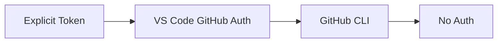

# Authentication

GitHubAdapter and AwesomeCopilotAdapter support private repos via a three-tier auth chain.

## Authentication Chain



## Implementation

```typescript
private async performAuthentication(): Promise<string | undefined> {
    // 1. Explicit token from source configuration (highest priority)
    const explicitToken = this.getAuthToken();
    if (explicitToken?.trim()) return explicitToken.trim();
    
    // 2. VS Code GitHub authentication
    const session = await vscode.authentication.getSession('github', ['repo'], { createIfNone: true });
    if (session) return session.accessToken;
    
    // 3. GitHub CLI
    const { stdout } = await execAsync('gh auth token');
    if (stdout.trim()) return stdout.trim();
    
    // 4. No authentication
    return undefined;
}
```

## Token Format

Uses GitHub token format:
```typescript
headers['Authorization'] = `token ${token}`;
```

## Logging

Success:
```
[GitHubAdapter] ✓ Using explicit token from configuration
[GitHubAdapter] Token preview: ghp_abc1...
```

Or:
```
[GitHubAdapter] ✓ Using VSCode GitHub authentication
[GitHubAdapter] Token preview: gho_abc1...
```

Failure:
```
[GitHubAdapter] ✗ No authentication available - API rate limits will apply and private repos will be inaccessible
[GitHubAdapter] HTTP 404: Not Found
```

## Token Caching

- Cached after first successful retrieval
- Persists for adapter instance lifetime
- Tracks which method was successful

## Account Selection on First Run

When Prompt Registry is installed for the first time (setup state
`NOT_STARTED`), `Extension.initializeHub()` calls
`promptGitHubAccountSelection` before the hub selector opens. That helper
invokes:

```typescript
vscode.authentication.getSession('github', ['repo'], {
  clearSessionPreference: true,
  createIfNone: true,
});
```

`clearSessionPreference: true` forces VS Code's native account picker to
appear — including the "Sign in to another account…" entry — even when a
trusted session already exists. This prevents the extension from silently
inheriting whichever default account VS Code has chosen, which is the
root cause of "I can't see my private hub even though I'm logged in"
reports.

After the user picks an account, VS Code persists that preference. All
subsequent auth calls in the extension (hub sync, every adapter) use the
standard chain above without `clearSessionPreference`, so they silently
reuse the chosen account.

If the user dismisses the picker, `promptGitHubAccountSelection` throws;
the existing catch in `initializeHub` calls
`SetupStateManager.markIncomplete()` and the marketplace renders the
"Setup Not Complete" empty state on the next launch. The "Force GitHub
Authentication" command (`promptregistry.forceGitHubAuth`) remains the
path to re-pick an account later.

## See Also

- [Adapters](./adapters.md) — Adapter implementations
- [User Guide: Sources](../../user-guide/sources.md) — Configuring authentication
