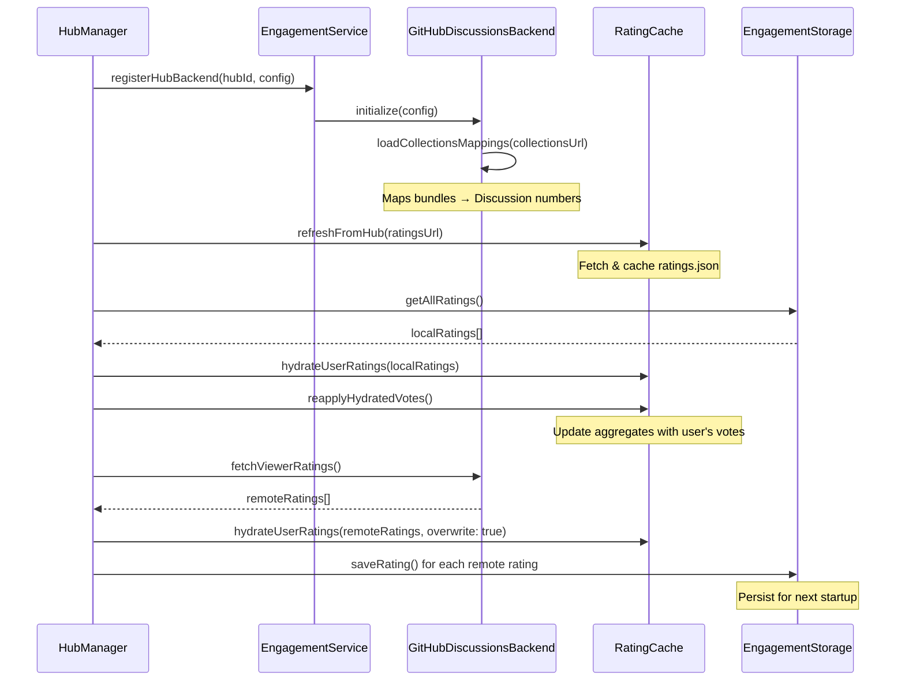
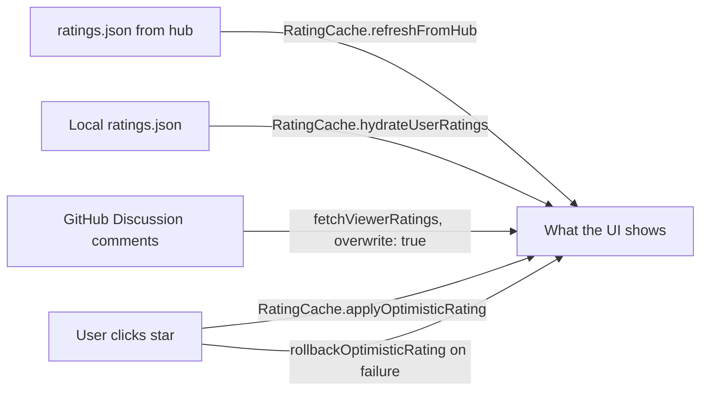
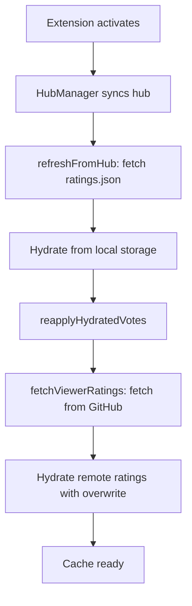
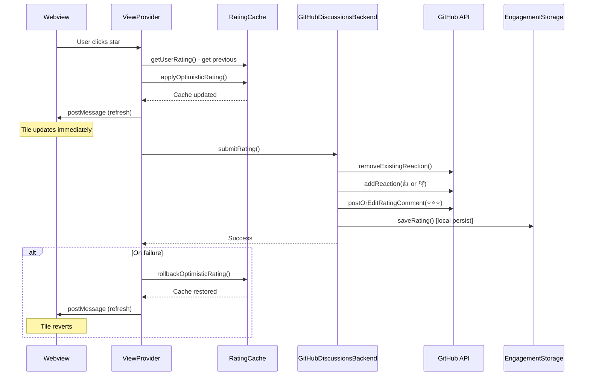

# Engagement System

The engagement system enables users to rate and provide feedback on bundles via GitHub Discussions. Ratings are aggregated offline and cached for fast UI access.

---

## Purpose

- **User ratings**: 1-5 star ratings submitted as GitHub Discussion reactions and comments
- **Feedback**: Written comments attached to ratings
- **Aggregation**: Pre-computed ratings.json file updated periodically via CLI
- **Caching**: In-memory cache provides synchronous access for UI components

---

## Components

### RatingCache

In-memory cache providing synchronous access to bundle ratings.

**Responsibilities:**
- Stores aggregate ratings (starRating, voteCount, wilsonScore, confidence)
- Stores user's own ratings for "already rated" detection
- Optimistic updates: apply user rating immediately, roll back on failure
- Hydration: restore user ratings from local storage or remote on startup
- Source ID mapping: tracks configId ↔ adapterId mappings

**Key methods:**
- `getRating(sourceId, bundleId)`: Get aggregate rating
- `getUserRating(sourceId, bundleId)`: Get user's own rating
- `refreshFromHub(hubId, ratingsUrl, sourceIdMap)`: Fetch ratings.json
- `applyOptimisticRating()`: Optimistic UI update
- `rollbackOptimisticRating()`: Undo on failure
- `hydrateUserRatings()`: Load user ratings from local/remote
- `reapplyHydratedVotes()`: Update aggregates with hydrated votes

### GitHubDiscussionsBackend

Backend implementation using GitHub Discussions API.

**Write path (voting):**
1. Remove existing reaction (👍/👎) via GraphQL
2. Add new reaction via GraphQL (👍 for 4-5 stars, 👎 for 1-2 stars)
3. Post or edit rating comment with exact star count (`Rating: ⭐⭐⭐⭐⭐`)
4. Cache vote locally for cross-session hydration

**Read path (aggregate ratings):**
- Fetches pre-computed ratings.json from hub (via RatingService)
- Does NOT compute aggregates from live Discussion data

**Mapping:**
- `loadCollectionsMappings()`: Loads collections.yaml to map bundles → Discussion numbers
- Fallback: tries API contents endpoint for internal/private repos

**Comment format:**
```
Rating: ⭐⭐⭐⭐⭐
Feedback: Optional comment text
---
Version: 1.0.0
```

### EngagementService

Singleton facade coordinating all engagement features.

**Responsibilities:**
- Backend selection (file backend vs GitHub Discussions)
- Hub-specific backend registration via `registerHubBackend(hubId, config)`
- Event emitters: `onRatingSubmitted`, `onFeedbackSubmitted`
- Local storage delegation via EngagementStorage

**Backend types:**
- `file`: Local JSON storage (default)
- `github-discussions`: GitHub Discussions + local storage fallback

### EngagementStorage

File-based persistence for local ratings and pending feedback.

**Storage structure:**
```
globalStorage/engagement/
├── ratings.json          # User's ratings (local + remote)
├── feedback.json         # User's feedback
└── pending-feedback.json # Unsynced feedback entries
```

**Use cases:**
- Cross-session hydration of user ratings
- Local fallback when GitHub API fails
- Pending feedback queue

### HubManager Orchestration

Coordinates engagement initialization on hub import/sync.

**Order of operations (critical):**



**Why order matters:**
1. **refreshFromHub first**: Loads aggregate ratings from ratings.json
2. **Hydrate local**: Restores user ratings from previous session (instant)
3. **reapplyHydratedVotes**: Updates aggregates to reflect user's current vote (handles stale ratings.json)
4. **fetchViewerRatings last**: Authoritative source, overwrites local cache (cross-machine sync)

---

## Where Ratings Live (and Who Wins)

A user's rating passes through several places before showing up in the UI. When debugging "why does my rating show X?", check them in this order:

| # | Where | File / Class | What it holds | Lifetime |
|---|-------|-------------|---------------|----------|
| 1 | In-memory cache | `src/services/engagement/rating-cache.ts` | What the UI displays right now | Current session |
| 2 | Local JSON | `globalStorage/engagement/ratings.json` via `src/storage/engagement-storage.ts` | Saved copy so ratings survive restarts | Until user clears data |
| 3 | GitHub Discussion comment | Posted by `GitHubDiscussionsBackend.postOrEditRatingComment()` | The user's star emoji comment | Permanent |
| 4 | Static hub file | `ratings.json` fetched via `RatingService.fetchRatings()` | Community averages, rebuilt by CI | Until next `compute-ratings` run |

**Priority when they disagree (highest → lowest):**

```
User just clicked a star  >  Fetched from GitHub  >  Restored from local file  >  Community average
```



**How conflicts are handled:**

1. **User clicks a star** — `RatingCache.applyOptimisticRating()` updates the UI instantly. If `GitHubDiscussionsBackend.submitRating()` fails, `rollbackOptimisticRating()` reverts the display.

2. **On startup** — `EngagementHydrator.hydrate()` runs the following sequence:
   - Fetches `ratings.json` (community averages)
   - Restores user's own ratings from `EngagementStorage` (fast, local)
   - Fetches the user's comments from GitHub via `fetchViewerRatings()` (slower, but authoritative — overwrites local)
   - In-session clicks are never overwritten (tracked via `optimisticKeys` set in `RatingCache`)

3. **Stale community averages** — `ratings.json` only updates when CI runs `compute-ratings`. The user's own vote is re-injected on top of stale averages (see `RatingCache.doRefresh()` loop over `optimisticKeys`) so their star count always looks correct.

---

## Source ID Mapping

### Problem

Bundles are identified by two different IDs:
- **configId**: Stable, human-readable ID from hub config (e.g., `"awesome-copilot"`)
- **adapterId**: Hash-based ID generated by extension (e.g., `"github-owner-repo-abc123"`)

Ratings.json uses configId. RatingCache keys are `adapterId:bundleId`. Need mapping between them.

### Solution

**sourceIdMap** (configId → adapterId):
- Passed to `refreshFromHub()`
- Built by HubManager during hub sync
- Maps ratings.json sourceId to actual extension sourceId

**reverseSourceIdMap** (adapterId → configId):
- Built by RatingCache from sourceIdMap
- Used by `getConfigSourceId()` when persisting ratings
- Ensures ratings survive source hash changes

---

## Hydration Flow

### Cold Start (Startup)



**Fast path**: Local hydration provides instant ratings (lines 628-646 in hub-manager.ts)

**Authoritative path**: Remote hydration overwrites with server truth (lines 649-691)

### Re-rating (User Changes Rating)

**Before optimistic update:**
```typescript
const previousRating = RatingCache.getUserRating(sourceId, bundleId);
```

**Optimistic update:**
```typescript
RatingCache.applyOptimisticRating(sourceId, bundleId, newScore);
// UI updates immediately
```

**Backend submit:**
```typescript
try {
  await backend.submitRating(rating);
  // Success: optimistic update stays
} catch (error) {
  // Failure: roll back
  RatingCache.rollbackOptimisticRating(sourceId, bundleId, newScore, previousRating);
}
```

**Aggregate calculation:**
- First-time vote: `voteCount++`, recalculate average
- Re-rating: swap old vote for new (voteCount unchanged)

---

## Write Path



---

## compute-ratings CLI

Standalone CLI that reads Discussion comments and produces ratings.json.

**Location:** `lib/bin/compute-ratings.js`

**Usage:**
```bash
GITHUB_TOKEN=$(gh auth token) node lib/bin/compute-ratings.js \
  --config path/to/collections.yaml \
  --output path/to/ratings.json
```

**What it does:**
1. Reads collections.yaml (bundle → Discussion number mappings)
2. Fetches Discussion comments via GitHub API
3. Parses `Rating: ⭐⭐⭐⭐⭐` lines from comments
4. Aggregates star ratings (average, wilson score, vote count)
5. Writes ratings.json

**Not automatic**: Must be run manually or via CI/CD. Extension reads the pre-computed file.

---

## See Also

- [Engagement API Reference](../../reference/engagement-api.md) — Public API documentation
- [UI Components](./ui-components.md) — Webview integration
