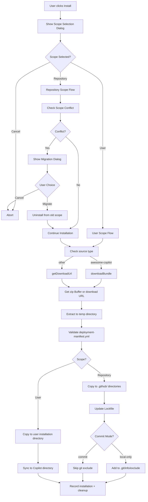
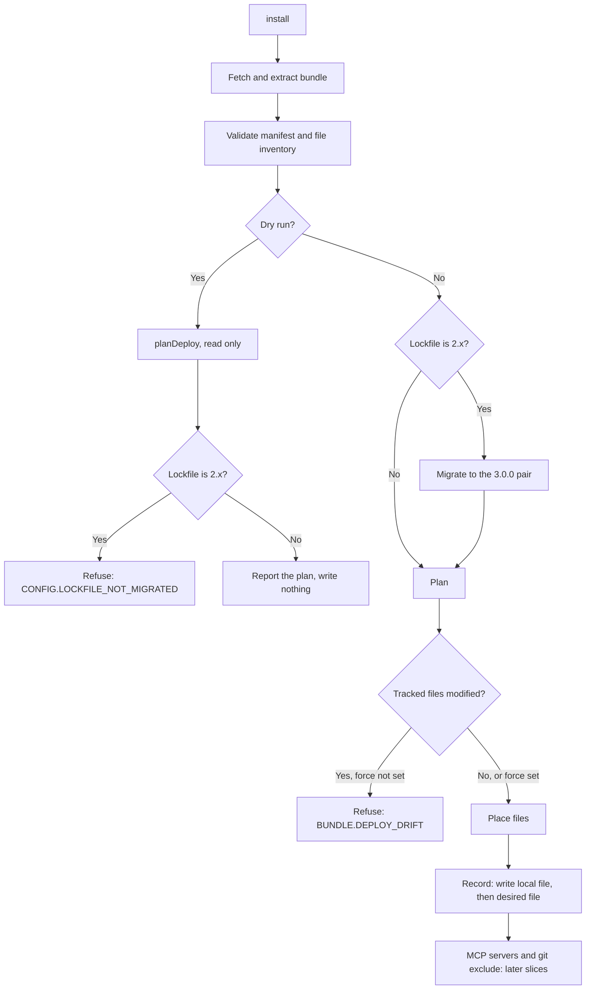
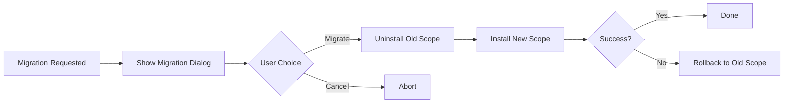
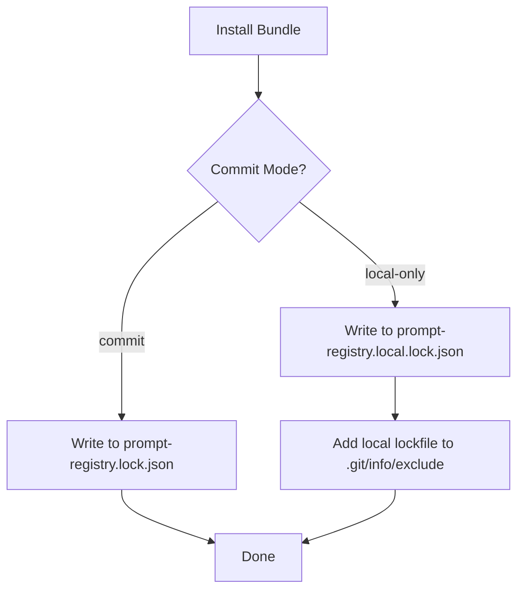
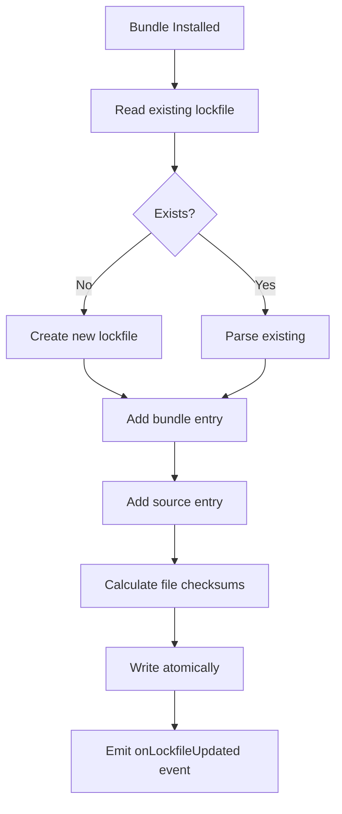
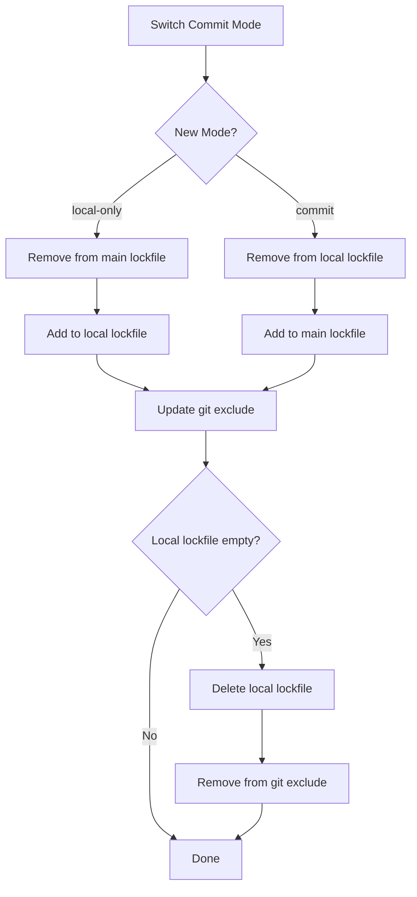
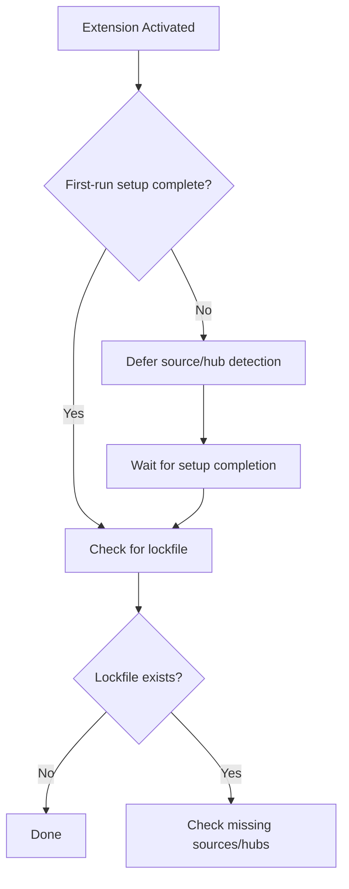
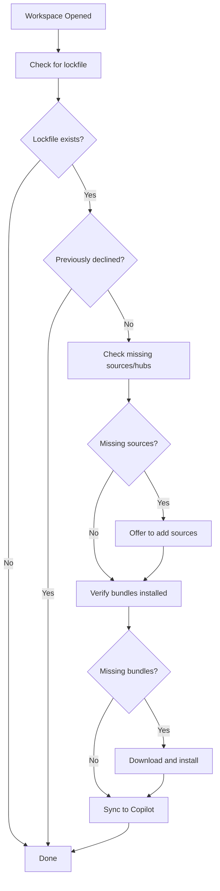

# Installation Flow

## Directory Structure

### User Scope

```
Extension Storage/
├── bundles/                          # Installed bundles
│   └── testing-automation/
│       ├── deployment-manifest.yml
│       └── prompts/
│           └── testing-prompt.prompt.md
└── registry.json                     # Sources and records

Copilot Directory (macOS)/
~/Library/Application Support/Code/User/prompts/
└── testing-automation/
    └── testing-prompt.prompt.md
```

### Repository Scope

```
your-repo/
├── .github/
│   ├── prompts/
│   │   └── my-prompt.prompt.md
│   ├── agents/
│   │   └── my-agent.agent.md
│   ├── instructions/
│   │   └── my-instructions.instructions.md
│   └── skills/
│       └── my-skill/
│           └── skill.md
├── .vscode/
│   └── mcp.json                      # MCP server configurations
├── prompt-registry.lock.json         # Main lockfile for committed bundles
└── prompt-registry.local.lock.json   # Local lockfile for local-only bundles (git-excluded)
```

## Installation Steps



## Unified Deploy (User Scope, Behind a Flag)

The flows above describe the extension and the legacy CLI path. A second path, the shared deploy pipeline in `packages/app/src/deploy/` (`planDeploy`, `deployBundle`, `undeployBundle`), is reachable from the CLI `install` and `uninstall` commands when a feature flag is enabled. See [ADR-0008](./adr/0008-unified-bundle-deploy-and-lockfile-v3.md) for the decision.

**The flag is off by default, and the legacy path is unchanged.** With the flag unset, no command reads or writes the `3.0.0` lockfiles described here, and every command behaves as before. The VS Code extension does not use this path yet: its `promptregistry.unifiedDeploy` setting is wired in a later slice and is not available.

### Enabling the flag

Set `AI_PRIMITIVES_HUB_UNIFIED_DEPLOY` in the environment of the CLI process:

| Value | Meaning |
|-------|---------|
| `1`, `true`, `yes` | Enabled (case-insensitive) |
| `0`, `false`, `no`, unset, empty | Disabled (the default) |
| anything else | Rejected as an error; the command does not run |

The source-aware authentication variables in [Source Authentication](./authentication.md) are specific to GitHub credentials; this flag is unrelated to them.

### Supported scope and targets

- **User scope only.** An absent scope is treated as user, as the legacy path does. Any other scope, repository included, is refused with `BUNDLE.UNSUPPORTED_SCOPE` before the bundle, the network or any lockfile is read. The hint is to unset the variable. Repository scope arrives in a later slice, and a half-migrated repository is the one state that cannot converge, so it is refused rather than approximated.
- **Targets.** Any target type whose layout resolves can be used. The verified, tested target in this slice is `vscode`, whose user-scope base directory is `~/.copilot` (`prompts/`, `instructions/`, `agents/`, `skills/`, and so on).
- **Commands.** `install` (`--from <dir>`, a remote `<bundle> --source <owner/repo>`, and `--lockfile` replay) and `uninstall` (`--bundle`, `--all`). `uninstall --lockfile` and a bare `uninstall`, which auto-detects a lockfile, are refused with `BUNDLE.UNSUPPORTED_SCOPE` because they operate on lockfile files that may be repository state.

### Pipeline



Notes on the order:

- **Record before MCP.** The record is written before any MCP configuration edit, so a crash between them leaves a tracked entry with no server and never a live server with no owner (design §6.7, §9.2). MCP and git-exclude steps do not exist in this slice; the order is fixed now so a later slice inserts them after the record rather than reordering.
- **Overwrites happen last**, after the bundle is extracted, validated and planned, so the common failures never reach existing files.
- **Migration** runs before the plan, on a real run only. A dry run never migrates and never writes.

### Placement

- **Manifest-driven.** A file is named from the normalized manifest id and routed by the kind the manifest declares for it, not by its path prefix. A manifest item `reviewer` of kind `agent` stored at `agents/code-reviewer.agent.md` is installed as `agents/reviewer.agent.md`. An item declared `instructions` under `prompts/` lands in `instructions/`.
- **Only declared items.** `README.md` and any file that is not a manifest item are never installed.
- **Regular files, not links.** Each file is written, then read back and compared against the bytes intended (see [Binary Safety](#binary-safety-and-integrity-verification)).
- **Skipped items** are reported with a reason: `unsupported-by-target`, `invalid-kind` or `filtered`.

### Collisions, drift and `--force`

| Situation | Without `--force` | With `--force` |
|-----------|-------------------|----------------|
| A file destination exists, has no record, and its bytes differ. For a skill, plugin or power directory: the directory exists and has no record | Reported under `collisions` and skipped. The install still exits `0`, with status `warning` | Overwritten |
| A file destination exists, has no record, and is byte-identical to what would be written | `satisfied`: nothing is written, and the record is still created. This is what lets a retry converge | Same |
| A destination has a record, and its bytes no longer match the recorded `installedChecksum` (locally modified) | The deploy is refused with `BUNDLE.DEPLOY_DRIFT`, naming the files | Overwritten |

`--force` exists on `install` only and has no effect on `uninstall`. It is also inert when the flag is off.

### Failure and retry

Deploys are not transactional (design §9.2):

- If a failure happens after an existing file was overwritten, the installation can contain mixed content. The overwritten bytes are not restored.
- Files that the failed call created are removed.
- Re-running the same command converges, because a byte-identical untracked file is `satisfied`.
- The pair is written local first, then desired. If the desired write fails after the local write, a local record remains, and the retry converges.
- An untracked skill, plugin or power directory is always reported as a collision, even when its contents are identical, so such a retry needs `--force`.

### Records on disk

At user scope the state is two files under the XDG config root, `${XDG_CONFIG_HOME:-~/.config}/ai-primitives-hub/`. Both carry `version: "3.0.0"` and are described by `lockfile-v3.schema.json`.

| File | Role | Contents |
|------|------|----------|
| `ai-primitives-hub.lock.json` | Desired state, shareable | `$schema`, `version`, `bundles` keyed by `{sourceId}/{manifestId}` (`version`, `sourceId`, optional `archiveSha`), `sources` (`type`, `url`, optional `branch`, `collectionsPath`), optional `hubs`, `profiles`. No `targets`, `generatedAt`, `generatedBy`, `installedAt`, `baseDir` or per-file records |
| `ai-primitives-hub.local.lock.json` | Materialization on this machine | `version`, `generatedAt`, `generatedBy`, optional `migration.lockfileV3`, and `targets[name]` with `targetType`, `scope`, `baseDir` and `bundles[key]` (`version`, `sourceId`, `installedAt`, optional `state` and `unmanagedReason`, and `files[]`) |

Each `files[]` entry has a `path` relative to `baseDir` in POSIX form, a `checksum` of the bytes in the archive, and an `installedChecksum` of the bytes actually written, which differs when a transformer changed the content. Remote installs do not record `archiveSha` yet.

```json
{
  "$schema": "https://github.com/AmadeusITGroup/ai-primitives-hub/schemas/lockfile-v3.schema.json",
  "version": "3.0.0",
  "bundles": { "local-web-dev/web-dev": { "version": "1.0.0", "sourceId": "local-web-dev" } },
  "sources": { "local-web-dev": { "type": "local", "url": "/path/to/web-dev" } }
}
```

The repository-scope files keep their `prompt-registry.*` names and the `2.0.0` schema until a later slice (see [Lockfile Management](#lockfile-management)).

### Uninstall

`uninstall --bundle <id|sourceId/bundleId> --target <name>` and `uninstall --all --target <name>`:

- **Resolution.** A bare id resolves to the logical key `{sourceId}/{bundleId}` among that target's records. If two sources offer the same id, the command is refused with `BUNDLE.AMBIGUOUS_ID`, naming both keys; pass the full key. A bundle that is not installed produces a warning, exit code `0`, and writes nothing.
- **Removal follows the record.** Only the recorded on-disk paths are removed, and nothing is recomputed from the manifest. Files the user wrote next to them are left alone. A recorded path that is absolute or escapes the base directory is skipped, never removed. Empty directories may remain.
- **Desired state** for a key is dropped only when no other target still holds that bundle.
- **`--all`** removes every bundle the target records. It never drops entries that are desired but not installed on the target; it lists them as `desiredOnly`. A named uninstall of such a key drops the desired entry. If a bundle fails midway, the output lists the bundles completed and a `failure` (`key`, `reason`), the later bundles are not attempted, and the exit code is non-zero.
- **Unmanaged record.** If the target's record for the key is `state: 'unmanaged'`, uninstall drops the record, leaves its files in place, and reports the `unmanagedReason`.

### `install --lockfile` replay

With the flag on, `install --lockfile` accepts only the user desired file, compared as a resolved path. A repository lockfile, any other path, and a bare `install` that auto-detects a project `prompt-registry.lock.json` are refused with `BUNDLE.UNSUPPORTED_SCOPE`.

Each desired entry is deployed from the source descriptor recorded under `sources`, at exactly the pinned version. If that version is absent from the source, the entry fails; the latest version is never substituted. The other entries continue, failures are reported as `failures: [{ key, reason }]`, and the exit code is `1` if any entry failed. `--dry-run` plans every entry and writes nothing.

### Migration from a 2.x user lockfile

An existing `2.x` file at `ai-primitives-hub.lock.json` is converted to the `3.0.0` pair on the first flag-on write, install or uninstall. The local half is written first, then the desired half, and `migration.lockfileV3: 'complete'` is written last, so an interrupted migration resumes by running the command again (design §8.3, §8.4).

In this slice the migration does not try to prove where a legacy record's files went. Every migrated bundle, other than the one the triggering install is about to record afresh, is kept under the reserved `unmanaged` target as `state: 'unmanaged'`, with an `unmanagedReason` and its original file paths. Flag-on commands never delete those files. Uninstall works within one named target and these records are not under a configured target, so no uninstall in this slice reaches them. The migration report (`migration.migrated`, and `migration.unmanaged[]` with `key` and `reason`) is shown in JSON and text output.

### Output

`install` reports `target`, `bundle`, `written`, `skipped` and `lockfile`, plus `collisions`, `satisfied` and `migration`. The text output says `Updated <path>` only when a lockfile changed, and `Lockfile unchanged` otherwise.

### Known limits in this slice

- Deploys are not transactional (above).
- Remote installs do not persist `archiveSha`.
- The replay loop of `install --lockfile` and the `--all` loop of `uninstall` live in the CLI and move toward `app` later.
- `uninstall --lockfile` and a bare `uninstall` are unsupported until repository scope lands.
- Only `vscode` is a verified target.
- `status`, `update` and any command without a flag-on path cannot read `3.0.0` state; see [Troubleshooting](../../user-guide/troubleshooting.md#cli-says-a-lockfile-was-written-by-a-newer-version).

## Binary Safety and Integrity Verification

Bundle files are copied to the target byte-for-byte and verified after every write:

- **Binary-safe writes** — writers use the `FileSystem` port's `readFileBytes`/`writeFileBytes` for all payloads. Text payloads (strict UTF-8) may additionally pass through a target-specific `ResourceTransformer`; binary payloads (images, archives, office documents) are never decoded as text — a lossy UTF-8 round-trip replaces invalid sequences with U+FFFD and corrupts them.
- **Post-write verification** — after each write, the installed file is re-read and compared against the bytes the writer intended to write (`verifyWrittenBytes` in `core`'s `domain/install/integrity`). A mismatch throws `FileIntegrityError` (`BUNDLE.INTEGRITY_MISMATCH`) instead of leaving a silently corrupted artifact.
- **Upstream layers already verified** — zip entry CRC-32 is checked during extraction, and governed (`formatVersion: 1`) deployment manifests carry per-file `size` + `sha256` validated against the extracted bytes.
- **Lockfile checksums** — `checksumFiles` hashes the extracted (archive) bytes, not the optionally transformed on-disk result. For untransformed files those values match; for transformed files a later user-modification check that compares on-disk hashes to the lockfile will currently report a mismatch. Recording a separate `installedChecksum` in `LockfileFileEntry` is a follow-up (issue #357 Stage 2) and is not part of this binary-safety change.

## Scope Selection

When a user initiates installation, a QuickPick dialog presents three options:

| Option | Scope | Commit Mode | Description |
|--------|-------|-------------|-------------|
| Repository - Commit to Git (Recommended) | `repository` | `commit` | Tracked in version control |
| Repository - Local Only | `repository` | `local-only` | Excluded via `.git/info/exclude` |
| User Profile | `user` | N/A | Available everywhere |

Repository options are disabled when no workspace is open.

## Scope Conflict Resolution

A bundle cannot exist at both user and repository scope simultaneously. When a scope migration is requested:

1. **Dialog**: User is prompted to migrate or cancel
2. **Migration**: `ScopeConflictResolver.migrateBundle()` uninstalls from the old scope and installs at the new scope
3. **Rollback**: If installation at the new scope fails, the resolver automatically attempts to restore the bundle at the original scope



## Repository Scope Installation

### File Placement

Files are placed in `.github/` subdirectories based on type:

| File Type | Target Directory |
|-----------|------------------|
| Prompts (`.prompt.md`) | `.github/prompts/` |
| Instructions (`.instructions.md`) | `.github/instructions/` |
| Agents (`.agent.md`) | `.github/agents/` |
| Skills | `.github/skills/<skill-name>/` |
| MCP Servers | `.vscode/mcp.json` |

### Git Exclude Management

For local-only mode, paths are added to `.git/info/exclude`:

```
# Prompt Registry (local)
.github/prompts/my-prompt.prompt.md
.github/agents/my-agent.agent.md
prompt-registry.local.lock.json
```

The local lockfile (`prompt-registry.local.lock.json`) is automatically added to `.git/info/exclude` when created and removed when deleted.

This file is local to the user's machine and not committed to Git.

## Lockfile Management

The `LockfileManager` singleton manages repository-scoped bundles using a dual-lockfile architecture:

| Lockfile | Purpose | Git Tracking |
|----------|---------|--------------|
| `prompt-registry.lock.json` | Committed bundles | Tracked (commit to Git) |
| `prompt-registry.local.lock.json` | Local-only bundles | Excluded via `.git/info/exclude` |

### Dual-Lockfile Architecture

Bundles are stored in separate lockfiles based on their commit mode:

- **Committed bundles** → `prompt-registry.lock.json` (shared with team)
- **Local-only bundles** → `prompt-registry.local.lock.json` (personal, git-excluded)

The commit mode is **implicit** based on which lockfile contains the bundle—no `commitMode` field is stored in bundle entries.



### Single Source of Truth

The lockfile is the **single source of truth** for repository-scoped bundles:

- `RegistryManager.listInstalledBundles('repository')` queries both lockfiles
- Repository-scoped installations only update the appropriate lockfile, not `RegistryStorage`
- User/workspace-scoped bundles continue to use `RegistryStorage`
- When listing bundles, `LockfileManager` merges entries from both lockfiles and annotates each with its commit mode

This prevents inconsistencies when lockfile or bundle files are manually deleted.

### File Existence Validation

When listing repository bundles, the extension validates that bundle files exist:

- If files are missing, the bundle is marked with `filesMissing: true`
- The UI shows a warning indicator for bundles with missing files
- Use the "Clean Up Stale Repository Bundles" command to remove stale entries

### Creation/Update



### Atomic Write

Lockfile writes use a temp file + rename pattern to prevent corruption:

1. Write to `prompt-registry.lock.json.tmp`
2. Rename to `prompt-registry.lock.json`

### Lockfile Schema

Both lockfiles use the same schema structure. The `commitMode` field is deprecated—commit mode is now implicit based on file location:

```json
{
  "$schema": "...",
  "version": "1.0.0",
  "generatedAt": "2026-01-14T10:30:00.000Z",
  "generatedBy": "prompt-registry@1.0.0",
  "bundles": {
    "bundle-id": {
      "version": "1.0.0",
      "sourceId": "github-a1b2c3d4e5f6",
      "sourceType": "github",
      "installedAt": "...",
      "files": [
        { "path": ".github/prompts/...", "checksum": "sha256..." }
      ]
    }
  },
  "sources": {
    "github-a1b2c3d4e5f6": { "type": "github", "url": "..." }
  },
  "hubs": {
    "b5c6d7e8a9f0": { "name": "My Hub", "url": "https://example.com/hub.json" }
  }
}
```

> **Note:** Existing lockfiles with `commitMode` field continue to work for backward compatibility. The field is ignored on read (file location determines mode) and not included in new entries.

### SourceId Generation

SourceIds uniquely identify sources in the lockfile. The format depends on the source origin:

| Source Origin | Format | Example |
|---------------|--------|---------|
| Hub source | `{type}-{12-char-hash}` | `github-a1b2c3d4e5f6` |
| Non-hub source | `{source.id}` | `my-local-source` |

For hub sources, the sourceId is generated using `generateHubSourceId(type, url)` from `src/utils/sourceIdUtils.ts`:

1. Normalize the URL (lowercase, remove protocol, remove trailing slashes)
2. Hash `{type}:{normalizedUrl}` using SHA256
3. Take the first 12 characters of the hex digest
4. Format as `{type}-{hash}`

This ensures:
- **Determinism**: Same source always produces the same ID
- **Portability**: SourceIds don't depend on hub configuration
- **Collision resistance**: 12 hex chars (48 bits) provides sufficient uniqueness

**Legacy format**: Older lockfiles may contain hub-prefixed sourceIds (`hub-{hubId}-{sourceId}`). These continue to work for backward compatibility—sources are resolved by matching the sourceId in the `sources` section.

**Case normalization (v2)**: Source IDs generated after this version use fully case-insensitive URL normalization (host + path lowercased). Older source IDs preserved path case. The extension uses dual-read: when matching source IDs, it checks both current and legacy formats. Lockfile entries with old-format IDs continue to work and migrate organically when bundles are updated. Local data (config.json, cache) is migrated automatically on activation via `MigrationRegistry`. All migration-related code is tagged with `@migration-cleanup(sourceId-normalization-v2)` for future removal.

### Orphaned Hub Source Pruning

Because a hub source's sourceId is derived from its URL, renaming a collection's repository URL produces a *new* sourceId while the old source lingers—causing the same collection to appear twice in the registry.

When syncing a hub, `loadHubSources` (in `@ai-primitives-hub/app`, `registry/load-hub-sources.ts`) tracks which existing sources are still represented in the current hub config (added, updated, or matched as a duplicate). Any source whose `hubId` matches the hub being loaded but is absent from that set is treated as orphaned. Manually-added sources (no `hubId`) and sources contributed by other hubs are never touched. The returned `LoadHubSourcesResult` includes a `removed` count alongside `added`/`updated`/`skipped`.

Orphan handling depends on whether installed bundles reference the orphan:

- **No consumers:** the orphan is removed via `HubSourceSync.removeSource`.
- **Has consumers + `remapBundleSource` provided:** lockfile entries and installation records are remapped to the replacement source (the new sourceId from the renamed URL), then the orphan is removed. This ensures bundles continue receiving updates from the new source seamlessly.
- **Has consumers + no `remapBundleSource`:** the orphan is kept alive with a warning, preventing bundles from becoming unmanaged.
- **Any `addSource` failure this sync:** pruning is skipped entirely to avoid deleting an old source before its replacement lands.

### Hub Key Generation

Hub entries in the lockfile use URL-based keys instead of user-defined hub IDs:

```json
"hubs": {
  "b5c6d7e8a9f0": { "name": "My Hub", "url": "https://example.com/hub.json" }
}
```

The key is generated using `generateHubKey(url, branch?)`:
- Hash the normalized URL using SHA256
- Take the first 12 characters
- Append `-{branch}` if branch is not `main` or `master`

This makes lockfiles portable across different hub configurations.

### Commit Mode Switching

When switching a bundle between commit and local-only modes:



All bundle metadata (version, sourceId, files, etc.) is preserved during the move.

### Backward Compatibility and Migration

The dual-lockfile architecture maintains backward compatibility with existing lockfiles:

| Scenario | Behavior |
|----------|----------|
| Read lockfile with `commitMode` field | Field is ignored; file location determines mode |
| Write new bundle entry | `commitMode` field is not included |
| Update existing entry | Entry is rewritten without `commitMode` field |
| Local-only bundle in main lockfile | Continues to work; migrates on next modification |

**Migration path for existing lockfiles:**

1. Existing lockfiles with `commitMode` field continue to function normally
2. When a bundle is modified (updated, mode switched), the entry is rewritten without `commitMode`
3. Local-only bundles in the main lockfile remain there until explicitly switched to local-only mode
4. No automatic migration is performed—changes happen gradually as bundles are modified

**Conflict detection:**

If a bundle ID exists in both lockfiles (should not happen in normal operation), `LockfileManager.getInstalledBundles()` displays an error to the user and skips the duplicate entry from the local lockfile.

## Repository Activation

When a workspace with a lockfile is opened, the extension checks for missing sources and hubs. This detection is **deferred until first-run setup is complete** to avoid confusing users with source configuration prompts before they've configured the extension.

### Setup Timing



The `RepositoryActivationService` accepts a `SetupStateManager` dependency:
- If setup is incomplete, detection is deferred and logged
- If `SetupStateManager` is unavailable, detection proceeds (fail-open behavior)
- After setup completes, detection is triggered automatically

### Activation Flow



## AwesomeCopilot Flow

1. Fetch `collection.yml` from GitHub
2. Parse collection items
3. Fetch each prompt file (with auth)
4. Create `deployment-manifest.yml` (YAML)
5. Build zip archive in memory
6. Return Buffer to BundleInstaller

## Bundle Manifest

```yaml
# deployment-manifest.yml
version: "1.0"
id: "my-bundle"
name: "My Bundle"
prompts:
  - id: "my-prompt"
    name: "My Prompt"
    type: "prompt"
    file: "prompts/my-prompt.prompt.md"
    tags: ["example"]
```

## Key Components

| Component | Responsibility |
|-----------|----------------|
| `ScopeServiceFactory` | Returns appropriate scope service based on `InstallationScope` |
| `UserScopeService` | Handles user-level file placement and Copilot sync |
| `RepositoryScopeService` | Handles repository-level file placement and git exclude |
| `LockfileManager` | Manages lockfile CRUD operations |
| `ScopeConflictResolver` | Detects and handles scope conflicts |
| `RepositoryActivationService` | Handles lockfile detection on workspace open |
| `LocalModificationWarningService` | Detects local file changes before updates |
| `BundleScopeCommands` | Context menu commands for scope management |

## See Also

- [Adapters](./adapters.md) — URL vs Buffer installation
- [MCP Integration](./mcp-integration.md) — MCP server installation
- [Update System](./update-system.md) — Update checking and application
- [ADR-0008: Unified Bundle Deploy and Lockfile 3.0.0](./adr/0008-unified-bundle-deploy-and-lockfile-v3.md) — Decision behind the flag-on path
- [Source Authentication](./authentication.md) — Credentials used when fetching bundles
