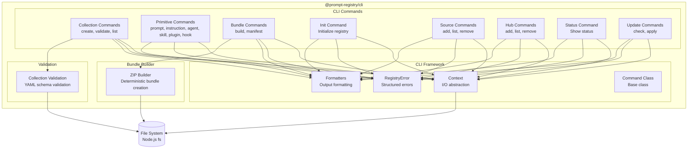
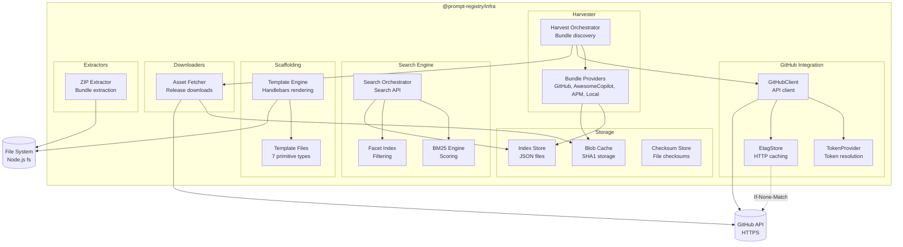
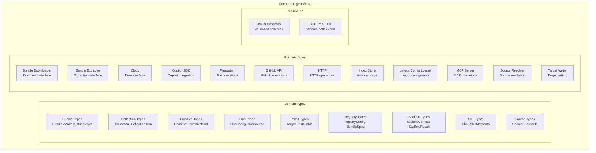
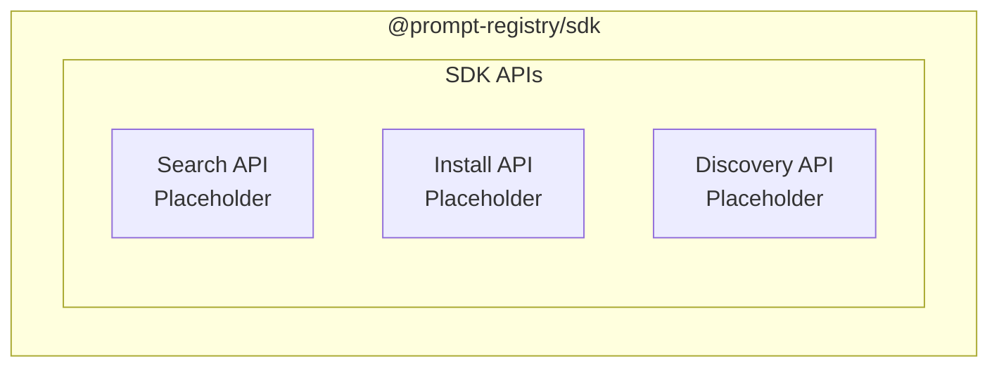
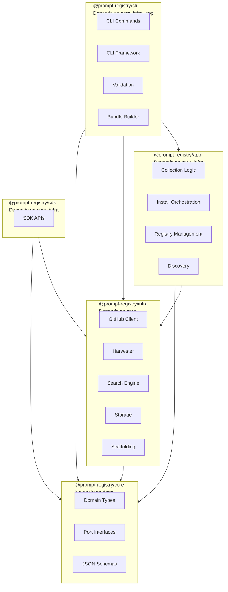

# Component Diagrams (Level 3)

Detailed component diagrams for key subsystems within each package.

## CLI Package Components

### Key Components

| Component | Responsibility | Key Files |
|-----------|----------------|-----------|
| Collection Commands | Collection scaffolding and validation | `collection-create.ts`, `collection-validate.ts`, `collection-list.ts` |
| Primitive Commands | Primitive scaffolding (7 types) | `prompt-create.ts`, `instruction-create.ts`, `agent-create.ts`, `skill-create.ts`, `plugin-create.ts`, `hook-create.ts` |
| Bundle Commands | Bundle building and manifest generation | `bundle-build.ts`, `bundle-manifest.ts` |
| Init Command | Registry initialization | `init.ts` |
| Source Commands | Source management | `source.ts` |
| Hub Commands | Hub management | `hub.ts` |
| Status Command | Status display | `status.ts` |
| Update Commands | Update checking and application | `update.ts` |
| CLI Framework | I/O abstraction, error handling, output formatting, command base class | `framework/context.ts`, `framework/error.ts`, `framework/output.ts`, `framework/command-class.ts` |
| Collection Validation | YAML schema validation | `validate.ts` |
| Bundle Builder | Deterministic ZIP creation | `bundle-build.ts` |

---

## Infra Package Components

### Key Components

| Component | Responsibility | Key Files |
|-----------|----------------|-----------|
| GitHubClient | API operations with rate limiting | `github/client.ts` |
| TokenProvider | Auth token resolution | `github/token.ts` |
| EtagStore | HTTP caching for 304 responses | `github/etag-store.ts` |
| Bundle Providers | Source implementations | `harvest/bundle-providers/` |
| Harvest Orchestrator | Bundle discovery orchestration | `harvest/harvester.ts` |
| BM25 Engine | Full-text search scoring | `search/bm25-engine.ts` |
| Primitive Index | Search API with faceting | `search/primitive-index.ts` |
| Index Store | JSON file storage | `stores/` |
| Blob Cache | Content-addressed SHA1 storage | `github/blob-cache.ts` |
| Template Engine | Handlebars template rendering | `scaffolding/template-engine.ts` |
| Template Files | Templates for 7 primitive types | `scaffolding/templates/` |
| Asset Fetcher | Release asset downloading | `github/asset-fetcher.ts` |
| ZIP Extractor | Bundle extraction | `harvest/extractor.ts` |

---

## App Package Components

```mermaid
flowchart TB
    subgraph App["@prompt-registry/app"]
        subgraph Collection["Collection Logic"]
            readColl[Read Collection<br/>Parse and validate]
            genSkill[Generate Skill<br/>Skill generation]
        end

        subgraph Install["Install Orchestration"]
            installBundle[Install Bundle<br/>Installation logic]
            uninstallBundle[Uninstall Bundle<br/>Uninstallation logic]
            installPipeline[Install Pipeline<br/>Orchestration]
            uninstallPipeline[Uninstall Pipeline<br/>Orchestration]
            layoutResolver[Layout Resolver<br/>Layout configuration]
        end

        subgraph Registry["Registry Management"]
            hubMgr[Hub Manager<br/>Hub configuration]
            profileActivator[Profile Activator<br/>Profile logic]
            userConfigPaths[User Config Paths<br/>Configuration paths]
        end

        subgraph ContextDetection["Context Detection"]
            detector[Detector<br/>Repository detection]
        end
    end

    FS[(File System<br/>Node.js fs)]

    readColl --> FS
    genSkill --> FS

    installBundle --> FS
    uninstallBundle --> FS
    installPipeline --> FS
    uninstallPipeline --> FS
    layoutResolver --> FS

    hubMgr --> FS
    profileActivator --> FS
    userConfigPaths --> FS

    detector --> FS
```

### Key Components

| Component | Responsibility | Key Files |
|-----------|----------------|-----------|
| Read Collection | Parse and validate collection YAML | `collection/read-collection.ts` |
| Generate Skill | Generate skill from collection | `collection/generate-skill.ts` |
| Install Bundle | Bundle installation logic | `install/install-bundle.ts` |
| Uninstall Bundle | Bundle uninstallation logic | `install/uninstall-bundle.ts` |
| Install Pipeline | Installation orchestration | `install/pipeline.ts` |
| Uninstall Pipeline | Uninstallation orchestration | `install/uninstall-pipeline.ts` |
| Layout Resolver | Layout configuration resolution | `install/layout-resolver.ts` |
| Hub Manager | Hub configuration management | `registry/hub-manager.ts` |
| Profile Activator | Profile activation logic | `registry/profile-activator.ts` |
| User Config Paths | User configuration paths | `registry/user-config-paths.ts` |
| Context Detector | Repository context detection | `context-detection/detector.ts` |

---

## Core Package Components

### Key Components

| Component | Responsibility | Key Files |
|-----------|----------------|-----------|
| Bundle Types | Bundle metadata and references | `domain/bundle/` |
| Collection Types | Collection structure and items | `domain/collection/` |
| Primitive Types | Primitive union and kinds | `domain/primitive/` |
| Hub Types | Hub configuration | `domain/hub/` |
| Install Types | Installation targets | `domain/install/` |
| Registry Types | Registry configuration | `domain/registry/` |
| Scaffold Types | Scaffolding context and results | `domain/scaffold/` |
| Skill Types | Skill metadata | `domain/skill/` |
| Source Types | Source definitions | `domain/source/` |
| Source ID | Source ID utilities | `domain/source-id.ts` |
| Spec Parser | Specification parsing | `domain/spec-parser.ts` |
| Port Interfaces | Abstractions for implementations | `ports/` |
| JSON Schemas | Validation schemas | `public/schemas/` |
| SCHEMA_DIR | Exported schema path | `index.ts` |

---

## SDK Package Components

### Key Components

| Component | Responsibility | Status |
|-----------|----------------|--------|
| Search API | High-level search interface | Placeholder |
| Install API | High-level installation interface | Placeholder |
| Discovery API | High-level discovery interface | Placeholder |

**Note**: SDK is currently a minimal placeholder for future integration APIs.

---

## Component Dependencies

**Key Rule**: Core has no package dependencies. Infra depends only on Core. App depends on Core and Infra. CLI depends on Core, Infra, and App. SDK depends on Core and Infra.

## See Also

- [Codemap](./codemap.md) — Package structure and dependencies
- [System Context](./system-context.md) — External relationships
- [Container Diagram](./container.md) — High-level containers
