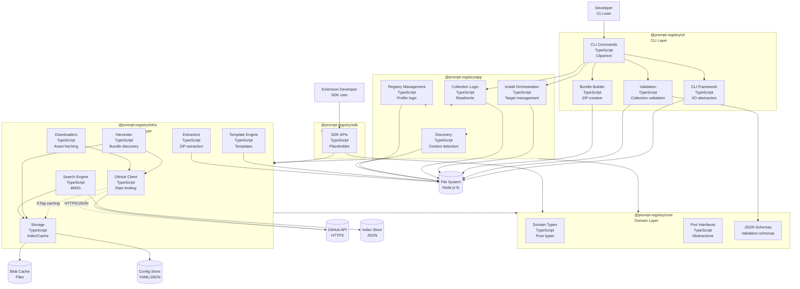

# Container Diagram (Level 2)

The Container diagram shows the high-level technology choices and how responsibilities are distributed across packages.

## Diagram

## Container Descriptions

### @prompt-registry/core (Domain Layer)
Pure domain types and interfaces with no external dependencies:
- **Domain Types**: Bundle, Collection, Primitive, Hub, Install, Registry types
- **Port Interfaces**: Abstractions for external implementations
- **JSON Schemas**: Validation schemas for collections and hubs
- **Exports**: `SCHEMA_DIR` for schema path access

**Technology**: TypeScript, js-yaml (for schema parsing only)

### @prompt-registry/infra (Infrastructure Layer)
Infrastructure implementations for external integrations:
- **GitHub Client**: API integration with rate limiting and ETag caching
- **Harvester**: Bundle discovery from GitHub, AwesomeCopilot, APM, Local sources
- **Search Engine**: BM25 full-text search with faceted filtering
- **Storage**: Index store (JSON), blob cache (SHA1), ETag store
- **Template Engine**: Scaffolding templates for all primitive types
- **Downloaders**: Asset downloading from GitHub releases
- **Extractors**: ZIP bundle extraction
- **Exports**: `TEMPLATE_ROOT` and `TEMPLATE_PATHS` for template access

**Technology**: TypeScript, axios, js-yaml, yauzl

### @prompt-registry/app (Application Layer)
Orchestration of business logic:
- **Collection Logic**: Reading and writing collection files
- **Install Orchestration**: Target management and bundle installation
- **Registry Management**: Profile and registry configuration
- **Discovery**: Repository context detection

**Technology**: TypeScript, js-yaml

### @prompt-registry/cli (CLI Layer)
User-facing CLI interface using Clipanion framework:
- **CLI Commands**: collection, bundle, init, source, hub, status, update, and scaffolding commands
- **CLI Framework**: I/O abstraction, error handling, output formatting
- **Validation**: Collection YAML validation
- **Bundle Builder**: Deterministic ZIP bundle creation

**Technology**: TypeScript, Clipanion, inquirer, archiver, semver, typanion, yauzl, js-yaml

### @prompt-registry/sdk (SDK Layer)
High-level APIs for integrations (placeholder):
- **SDK APIs**: Placeholder for future integration APIs

**Technology**: TypeScript

## Container Relationships

| From | To | Relationship |
|------|-----|--------------|
| CLI | Framework | Uses for I/O abstraction |
| CLI | Validation | Validates collections |
| CLI | Builder | Creates bundles |
| CLI | App | Uses for business logic |
| CLI | Core | Uses for domain types |
| CLI | Infra | Uses for infrastructure |
| App | Infra | Uses for infrastructure implementations |
| App | Core | Uses for domain types |
| SDK | Infra | Uses for infrastructure implementations |
| SDK | Core | Uses for domain types |
| Infra | Core | Uses for domain types |
| Harvester | GitHub | Fetches content |
| Search | Stores | Uses for index/cache |
| GitHub | Stores | Uses for ETag caching |

## Technology Choices

| Component | Technology | Rationale |
|-----------|-----------|-----------|
| Language | TypeScript | Type safety, VS Code ecosystem |
| Runtime | Node.js 18+ | Matches VS Code's Node version |
| CLI Framework | Clipanion | Modern CLI framework with TypeScript support |
| Search | Hand-rolled BM25 | Zero deps, deterministic, inspectable |
| HTTP | axios | Familiar, interceptors for retry |
| YAML | js-yaml | Already a dependency |
| ZIP | yauzl | Pure JS, no native deps |
| Validation | JSON Schema | Standard validation with AJV |
| Testing | Vitest | Modern test framework with coverage |

## Package Dependencies

| Package | Dependencies |
|---------|-------------|
| @prompt-registry/core | js-yaml |
| @prompt-registry/infra | @prompt-registry/core, axios, js-yaml, yauzl |
| @prompt-registry/app | @prompt-registry/core, @prompt-registry/infra, js-yaml |
| @prompt-registry/cli | @prompt-registry/core, @prompt-registry/infra, @prompt-registry/app, clipanion, inquirer, archiver, semver, typanion, yauzl, js-yaml |
| @prompt-registry/sdk | @prompt-registry/core, @prompt-registry/infra |

## See Also

- [Codemap](./codemap.md) — Package structure and dependencies
- [System Context](./system-context.md) — External relationships
- [Component Diagrams](./component.md) — Detailed internals
