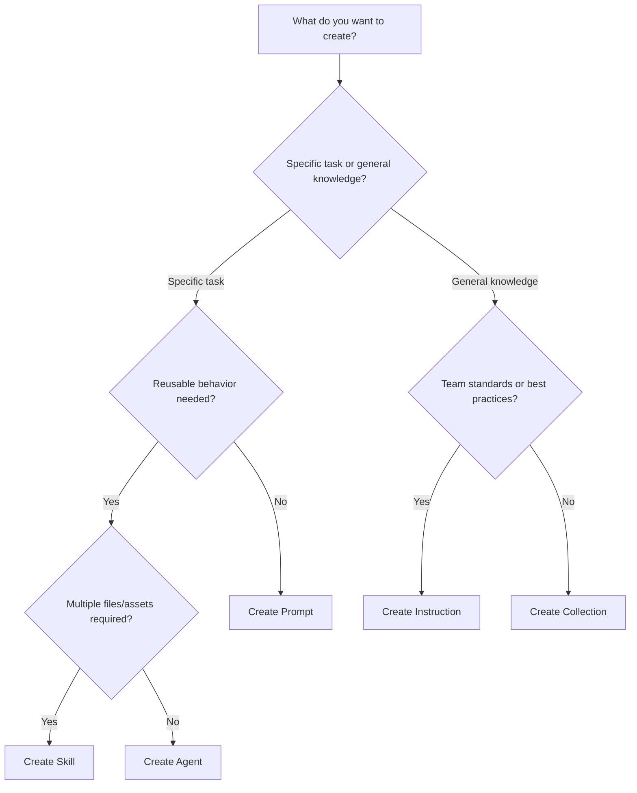

# {{projectName}}

Welcome to your prompt collection! This repository contains prompts, instructions, agents, skills, and collections to enhance your GitHub Copilot experience.

## 📖 Repository Structure

```
├── prompts/              # Task-specific prompts (.prompt.md)
├── instructions/         # Coding standards and best practices (.instructions.md)
├── agents/               # AI personas and specialized modes (.agent.md)
├── skills/               # Agent skills with bundled assets (SKILL.md)
├── collections/          # Curated collections (.collection.yml)
├── mcp-server/           # Optional: MCP server configuration
├── scripts/              # Validation and creation utilities
├── .vscode/              # VS Code settings and extensions
└── package.json          # Node.js dependencies
```

## 🔗 About Prompt Registry

This repository is part of the **Prompt Registry** ecosystem - a VS Code extension and framework for managing AI prompt collections for GitHub Copilot.

### What is Prompt Registry?

Prompt Registry is a comprehensive platform that enables:
- **Discovery**: Browse and install prompt collections from various sources
- **Management**: Organize prompts, instructions, agents, and skills in one place
- **Collaboration**: Share collections within your team or organization
- **Version Control**: Track changes and maintain consistency across projects

### Key Features

- 🚀 **Marketplace UI**: Visual browsing and installation of collections
- 📦 **Bundle Management**: Install, update, and uninstall prompt bundles
- 👥 **Team Collaboration**: Shared profiles and favorites
- 🔧 **Development Tools**: Scaffolding, validation, and publishing workflows
- 🌐 **Multi-Source Support**: GitHub repositories, local files, and custom sources

### Getting Started with Prompt Registry

1. **Install the Extension**: Search "Prompt Registry" in the VS Code Marketplace
2. **Browse Collections**: Use the Registry Explorer to discover available content
3. **Install & Use**: One-click installation makes prompts available in Copilot Chat

📖 **Learn More**: [Prompt Registry Documentation](https://github.com/AmadeusITGroup/prompt-registry)

## 🚀 Quick Start

### 1. Install Dependencies

This project uses `@prompt-registry/collection-scripts` from npmjs.com.

```bash
# Install dependencies
npm install
```

### 2. Validate Your Collections

```bash
npm run validate
```

Checks:
- ✅ Required fields (id, name, description)
- ✅ ID format (lowercase, hyphens only)
- ✅ File references exist
- ✅ Valid YAML syntax

### 4. Validate Your Skills

```bash
npm run skill:validate
```

Checks:
- ✅ SKILL.md frontmatter (name, description)
- ✅ Name matches folder name
- ✅ No duplicate skill names
- ✅ Bundled asset size limits (max 5MB per file)

### 5. Use with VS Code

The scaffold includes VS Code configuration:

**Recommended Extensions** (auto-prompted on first open):
- `redhat.vscode-yaml` - YAML language support with schema validation

**Auto-configured Features**:
- YAML schema validation for `.collection.yml` files
- IntelliSense for collection properties
- Real-time validation errors

### 6. Ensure that the GitHub runner label is correctly configured

- open `workflows/publish.yml`
- look for `runs-on: {{githubRunner}}`
- ensure you are using the runner label as per recommendations of your organisation
- update the `githubRunner` value in your project's configuration if needed

### 7. (Optional) Enable MCP Servers

**What is MCP?** Model Context Protocol allows your collection to provide custom tools and context to GitHub Copilot.

**Quick Setup:**
1. Edit your `collections/*.collection.yml` file
2. Uncomment the `mcp` section
3. Choose from pre-built servers (time, filesystem, memory) or create your own

See `mcp-server/README.md` for detailed instructions.

### 8. Publish to GitHub

```bash
# Initialize git (if needed)
git init
git add .
git commit -m "Initial commit"

# Create repo on GitHub, then:
git remote add origin https://github.com/YOUR_USERNAME/YOUR_REPO.git
git branch -M main
git push -u origin main
```

### 9. Use with Prompt Registry Extension

**Option A: Add as Source**
1. Open VS Code Command Palette (`Ctrl+Shift+P`)
2. Run: "Prompt Registry: Add Source"
3. Select "Github Releases" or "Collection from GitHub repository"
4. Enter your repo URL: `https://github.com/YOUR_USERNAME/YOUR_REPO`

**Option B: Pre-configured Default**
The Prompt Registry extension automatically includes the official [github/awesome-copilot](https://github.com/github/awesome-copilot) source. Once published, your collection will be available similarly.

## 🌐 Publishing to Hub and Profiles

### What are Hubs and Profiles?

**Hubs** are centralized configurations that group related prompt sources. They provide:
- **Curated Content**: Pre-selected collections for specific teams or domains
- **Easy Access**: One-click installation of entire content sets
- **Organization**: Logical grouping by department, technology, or purpose

**Profiles** are subsets of hub content that users can activate:
- **Shared Profiles**: Curated by hub maintainers for common use cases
- **Favorites**: Personal selections for daily work
- **Context Switching**: Quick activation based on current task

### Publishing Your Collection to a Hub

#### Step 1: Prepare Your Collection

Ensure your collection is ready for sharing:
```bash
# Validate everything
npm run validate
npm run skill:validate

# Test installation locally
# (Use Prompt Registry extension to add your repo as a source)
```

#### Step 2: Contact Hub Maintainers

1. **Identify the Right Hub**: Find a hub that matches your content domain
2. **Review Hub Guidelines**: Check contribution requirements and standards
3. **Submit Your Collection**: Share your repository URL and collection details

#### Step 3: Hub Integration Process

Hub maintainers will:
- **Review Content**: Check quality, relevance, and compliance
- **Test Integration**: Verify installation and functionality
- **Add to Hub**: Include your collection in the hub configuration
- **Create Profile**: Optionally add to curated profiles

#### Step 4: User Access

Once published, users can:
1. **Install the Hub**: Add the hub to their Prompt Registry
2. **Browse Collections**: Find your content in the hub catalog
3. **Install Collections**: One-click install to their Copilot environment
4. **Use Profiles**: Activate curated profiles containing your content

### Creating Your Own Hub

For teams wanting to create private hubs:

1. **Hub Configuration**: Create a `hub-config.yml` file
2. **Source Management**: Add approved repositories and collections
3. **Profile Curation**: Create profiles for different use cases
4. **Distribution**: Share hub URL with team members

📖 **Learn More**: [Hub Configuration Guide](https://github.com/AmadeusITGroup/prompt-registry/blob/main/docs/reference/hub-config.md)

## 🎯 Choosing the Right Agentic Primitive

When creating content for your collection, it's important to choose the right type of agentic primitive for your use case. Each primitive serves a specific purpose and has different characteristics.

### Quick Decision Guide

- **🎯 Single Task?** → Use a **Prompt** for specific, reusable instructions
- **📚 Team Standards?** → Use **Instructions** for sharing best practices  
- **🤖 Specialized Expertise?** → Use an **Agent** for consistent AI personas
- **🛠️ Complex Workflows?** → Use a **Skill** for multi-file functionality
- **📦 Related Content?** → Use a **Collection** to organize primitives

### Detailed Comparison

| Primitive | Best For | Complexity | Example |
|-----------|-----------|------------|---------|
| **Prompt** | Quick, specific tasks | Low | "Generate unit tests" |
| **Instruction** | Team standards & guidelines | Medium | "React coding standards" |
| **Agent** | Specialized AI roles | Medium-High | "Security auditor persona" |
| **Skill** | Complex capabilities with assets | High | "API documentation generator" |
| **Collection** | Organizing related content | Variable | "React development kit" |

### Interactive Decision Tree



📖 **Complete Guide**: [Agentic Primitives Documentation](https://github.com/AmadeusITGroup/prompt-registry/blob/main/docs/author-guide/agentic-primitives-guide.md)

## 📝 Creating Content

### Prompts (`prompts/*.prompt.md`)

Task-specific instructions for Copilot.

```markdown
# Generate Unit Tests

Create comprehensive unit tests for the current file.

## Instructions

1. Analyze the code structure
2. Generate test cases for all public methods
3. Include edge cases and error scenarios
4. Use the project's testing framework

## Tags

#testing #quality #automation
```

### Instructions (`instructions/*.instructions.md`)

Coding standards that apply automatically.

```markdown
# TypeScript Best Practices

## Guidelines

- Use explicit types, avoid `any`
- Prefer `const` over `let`
- Document public APIs with JSDoc

## Applies To

- `**/*.ts`
- `**/*.tsx`
```

### Agents (`agents/*.agent.md`)

Agents are conversational AI assistants that define specialized personas for GitHub Copilot Chat. Each agent has specific expertise and guidelines for how it should respond.

```markdown
# Code Reviewer

You are a senior code reviewer focused on quality and best practices.

## Expertise

- Code quality and maintainability
- Security vulnerabilities
- Performance optimization

## Guidelines

- Provide constructive feedback
- Suggest specific improvements
- Explain the reasoning
```

### Agent Skills (`skills/<name>/SKILL.md`)

Domain-specific capabilities for Copilot following the [Agent Skills specification](https://agentskills.io/specification).

**Creating a New Skill:**

```bash
npm run skill:create
```

This runs an interactive wizard that prompts for:
- **Name**: lowercase letters, numbers, and hyphens (e.g., `code-review`)
- **Description**: 10-1024 characters explaining what the skill does

**Skill Structure:**

```
skills/
└── my-skill/
    ├── SKILL.md        # Required: skill definition with frontmatter
    ├── example.py      # Optional: bundled asset
    └── schema.json     # Optional: bundled asset
```

**SKILL.md Format:**

```markdown
---
name: my-skill
description: "A concise description of what this skill enables (10-1024 chars)"
---

# My Skill

Detailed instructions for how Copilot should use this skill.

## Capabilities

What this skill enables Copilot to do.

## Usage

When and how Copilot should apply this skill.
```

**Bundled Assets:**
- Include supporting files (templates, schemas, examples) alongside SKILL.md
- Maximum 5MB per file
- Referenced in the markdown body

**Validation:**

```bash
npm run skill:validate
```

### Collections (`collections/*.collection.yml`)

Group related items together.

```yaml
id: typescript-development
name: TypeScript Development
description: Essential prompts and instructions for TypeScript projects
tags:
  - typescript
  - development
items:
  - path: prompts/generate-tests.prompt.md
    kind: prompt
  - path: instructions/typescript-style.instructions.md
    kind: instruction
  - path: skills/code-review/SKILL.md
    kind: skill
```

**Validation Rules**:
- `id`: lowercase, hyphens/numbers only
- `name`: 1-100 characters
- `description`: 1-500 characters
- `items`: 1-50 items, paths must exist
- `kind`: `prompt`, `instruction`, `chat-mode`, `agent`, or `skill`

### MCP Servers (Optional)

Add Model Context Protocol servers to provide custom tools:

```yaml
# In collections/*.collection.yml
mcp:
  items:
    # Pre-built server (recommended)
    time:
      command: npx
      args:
        - -y
        - "@modelcontextprotocol/server-sequential-thinking"
    
    # Custom server (advanced)
    custom:
      command: node
      args:
        - ${bundlePath}/mcp-server/server.js
```

See `mcp-server/README.md` for available servers and custom implementation guides.

## 🧪 Testing Workflow

### Local Validation

```bash
# Run all validation
npm run validate
npm run skill:validate

# Or with Node directly
node validate-collections.js
node scripts/validate-skills.js
```

### CI/CD (GitHub Actions)

The included workflow (`.github/workflows/validate-collections.yml`) runs automatically:

- ✅ On every push to `main`/`develop`
- ✅ On pull requests
- ✅ Reports validation errors
- ✅ Blocks merge if validation fails

### Manual Testing

1. **In Copilot Chat**: Use `/` to access prompts
2. **With Prompt Registry**: Browse and install collections
3. **Validate Files**: Check YAML syntax and file references
4. **Validate Skills**: Verify SKILL.md frontmatter
5. **MCP Servers** (if enabled): Verify server appears in VS Code MCP settings

## 📋 Quality Checklist

Before committing:

- [ ] `npm install` completed successfully
- [ ] `npm run validate` passes with no errors
- [ ] `npm run skill:validate` passes with no errors
- [ ] File naming follows conventions
- [ ] All collection paths exist
- [ ] YAML syntax is valid
- [ ] VS Code shows no schema errors
- [ ] MCP configuration tested (if enabled)

## 📚 Resources

- [GitHub Copilot Documentation](https://docs.github.com/en/copilot)
- [Awesome Copilot Repository](https://github.com/github/awesome-copilot)
- [Collection Template](https://github.com/github/awesome-copilot/blob/main/collections/TEMPLATE.md)
- [Agent Skills Specification](https://agentskills.io/specification)
- [Prompt Engineering Guide](https://www.promptingguide.ai/)
- [Model Context Protocol](https://modelcontextprotocol.io/)
- [MCP Server Examples](https://github.com/modelcontextprotocol/servers)

## 🛠️ Extension Commands

Available when using Prompt Registry extension:

- `Prompt Registry: Validate Collections` - Validate all collections
- `Prompt Registry: Create New Collection` - Interactive collection wizard
- `Prompt Registry: List All Collections` - View collection metadata
- `Prompt Registry: Add Resource` - Add prompt/instruction/agent/skill

## 📄 License

Apache License 2.0 - see [LICENSE](LICENSE)

## 🙏 Acknowledgments

Based on [github/awesome-copilot](https://github.com/github/awesome-copilot) structure and best practices.

---

**Next Steps**: Review examples → Run `npm install` → Run `npm run validate` → Run `npm run skill:validate` → Create your first collection! 🚀
